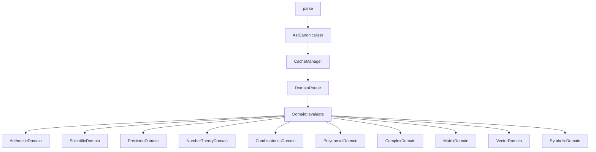

<p align="center">
  
</p>

<div align="center">

[](https://github.com/kirky-x/calnexus/releases)[](./LICENSE)[](https://github.com/kirky-x/calnexus)[](https://github.com/kirky-x/calnexus)

</div>

一个具备 11 个计算域、符号微积分、REPL 与批量处理的命令行数学表达式求值器。

| 项目信息 | 内容 |
| --- | --- |
| 版本 | 0.1.2 |
| 许可证 | MIT |
| 作者 | Kirky.X |
| 仓库 | https://github.com/kirky-x/calnexus |

---

## 目录

- [项目简介](#项目简介)
- [功能特性](#功能特性)
  - [11 个计算域](#11-个计算域)
  - [三种模式](#三种模式)
- [架构](#架构)
- [快速开始](#快速开始)
  - [前置条件](#前置条件)
  - [安装](#安装)
  - [使用示例](#使用示例)
- [配置](#配置)
- [API 文档](#api-文档)
- [测试](#测试)
- [WebAssembly (wasm32) 支持](#webassembly-wasm32-支持)
- [贡献](#贡献)
- [路线图](#路线图)
- [许可证](#许可证)
- [致谢](#致谢)

---

## 项目简介

**CalNexus** 是一个用 Rust 编写的命令行数学表达式求值器，将 11 个计算域 —— 从算术、统计到符号微积分与线性代数 —— 统一在单一解析器与按优先级路由的计算域调度器之后。它提供三种执行模式（单表达式、交互式 REPL、并行批量），并配备 LRU 缓存、任意精度算术与面向管道集成的 JSON 输出。

### 适用场景

- 场景 A：命令行快速求值与符号演算（`calnexus 'diff(x^2, x)'`）
- 场景 B：交互式探索与变量绑定（`calnexus --repl`，支持 Tab 补全）
- 场景 C：批量脚本化处理（`calnexus --batch exprs.txt`，rayon 并行）
- 场景 D：嵌入到数据管道中（`--json` 输出结构化结果）

---

## 功能特性

| 特性 | 说明 |
| --- | --- |
| 11 计算域 | 算术、科学函数、统计、精度、数论、组合、多项式、复数、矩阵、向量、符号演算 |
| 符号微积分 | `diff`、`integrate`、`simplify`、`limit`、`taylor` |
| 任意精度 | `precision(N, expr)` 基于 BigRational 的任意精度计算 |
| 数值线性代数 | `lu`、`qr`、`eig`、`svd`、`solve`（`numerical` feature，nalgebra f64 近似） |
| 三种模式 | 单表达式、REPL（Tab 补全 + 变量绑定）、批量并行（rayon） |
| 高性能缓存 | Moka L1 缓存（10000 条目，BLAKE3 哈希，线程安全） |
| 隐式乘法 | `2x`、`3(x+1)` 等数学惯用写法自动识别 |
| JSON 输出 | `--json` 输出 `result/domain/cache` 结构，便于管道集成 |
| 工业级测试 | 1856 个测试，覆盖率 97.27%，release 零警告 |

### 11 个计算域

| 计算域 | 优先级 | 函数 |
| --- | --- | --- |
| **Arithmetic** | 10 | `+`, `-`, `*`, `/`, `^`, `factorial`, `mod`, `abs` |
| **Scientific** | 20 | `sin`, `cos`, `tan`, `asin`, `acos`, `atan`, `ln`, `log`, `exp`, `sinh`, `cosh`, `tanh`, `gamma`, `erf` |
| **Statistics** | 20 | `mean`, `median`, `variance`, `stddev`, `sum`, `min`, `max` |
| **Precision** | 25 | `precision(N, expr)` — BigRational 任意精度 |
| **NumberTheory** | 25 | `gcd`, `lcm`, `is_prime`, `prime_sieve`, `mod_inverse`, `mod_pow`, `euler_phi` |
| **Combinatorics** | 25 | `P`, `C`, `catalan`, `stirling` |
| **Polynomial** | 25 | `poly_add`, `poly_sub`, `poly_mul`, `poly_div`, `poly_eval`, `poly_diff`, `poly_integrate`, `roots`, `factor` |
| **Complex** | 30 | `complex(a,b)`, `re`, `im`, `conj`, `magnitude`, `phase` |
| **Matrix** | 30 | `det`, `transpose`, `inverse`, `identity`, `lu`/`qr`/`eig`/`svd`/`solve`（`numerical` feature） |
| **Vector** | 30 | `dot`, `cross`, `norm`, `angle`, `normalize`, `scalar_triple` |
| **Symbolic** | 30 | `diff`, `integrate`, `simplify`, `limit`, `taylor` |

### 三种模式

1. **单表达式** — `calnexus '2+3*4'`
2. **REPL** — `calnexus --repl`（交互式，支持 Tab 补全与变量绑定）
3. **批量** — `calnexus --batch exprs.txt`（rayon 并行求值）

---

## 架构



核心模块说明：

- **Parser**：基于 mathexpr，支持隐式乘法与复数预处理
- **Canonicalizer**：常量折叠、可交换排序、S-表达式规范形式
- **Cache**：Moka L1 缓存（10000 条目，BLAKE3 键哈希，线程安全）
- **Router**：按优先级排序的计算域调度（首个 `supports()` 命中即路由）

---

## 快速开始

### 前置条件

运行本项目前，请确保环境满足以下要求：

| 依赖 | 版本 | 说明 |
| --- | --- | --- |
| Rust | >= 1.70 | 工具链（推荐使用 `rustup` 安装） |
| Cargo | 随 Rust | 构建与包管理 |
| `cli` feature | 可选 | 启用 CLI / REPL / batch（含 `clap`、`rustyline`、`rayon`） |
| `numerical` feature | 可选 | 启用数值线性代数分解（`lu`/`qr`/`eig`/`svd`/`solve`，含 `nalgebra`） |

### 安装

```bash
# 1. 克隆仓库
git clone https://github.com/kirky-x/calnexus.git
cd calnexus

# 2. 安装到 ~/.cargo/bin
cargo install --path . --features cli

# 或者仅本地构建
cargo build --release --features cli
```

### 使用示例

#### 单表达式

```bash
$ calnexus '2+3*4'
14

$ calnexus 'sin(pi/2)'
1

$ calnexus 'gcd(12, 18)'
6

$ calnexus 'factorial(5)'
120

$ calnexus --var x=3 'x^2 + 2*x + 1'
16
```

#### 任意精度

```bash
$ calnexus --precision 50 '1/3'
0.33333333333333331482961625624739099293947219848632
```

#### JSON 输出

```bash
$ calnexus --json '2+3'
{"result":5,"domain":"arithmetic","cache":"miss"}
```

#### 符号微积分

```bash
$ calnexus 'diff(x^2, x)'
2*x

$ calnexus 'simplify(x+0)'
x

$ calnexus 'limit(sin(x)/x, x, 0)'
1

$ calnexus 'taylor(exp(x), x, 3)'
1+x+0.5*x^2+0.16666666666666666*x^3
```

#### 数值线性代数

需以 `--features numerical` 编译（`cargo build --release --features cli,numerical`）。5 类数值分解返回 JSON（`lu`/`qr`/`eig`/`svd`）或向量（`solve`），结果为 nalgebra f64 近似：

```bash
$ calnexus 'solve([[2,1],[1,3]],[3,5])'
[0.8,1.4]

$ calnexus 'lu([[4,3],[6,3]])'
{"L":[[1.0,0.0],[0.6666666666666666,1.0]],"P":[[0.0,1.0],[1.0,0.0]],"U":[[6.0,3.0],[0.0,1.0]]}

$ calnexus 'eig([[2,1],[1,2]])'
{"values":[1.0,3.0],"vectors":[[-0.7071067811865475,0.7071067811865475],[0.7071067811865475,0.7071067811865475]]}
```

> `precision(N, ...)` 不适用于这些函数（返回 f64 近似），包裹会得到明确错误。

#### REPL 模式

```bash
$ calnexus --repl
CalNexus REPL — type :help for commands, :quit to exit
calnexus> :let x = 10
calnexus> x*2
= 20  [arithmetic]
calnexus> diff(x^2, x)
= 2*x  [symbolic]
calnexus> :vars
x = 10
calnexus> :quit
bye
```

REPL 支持的命令：`:let` 绑定变量、`:vars` 查看变量、`:quit` 退出。

#### 批量处理

```bash
$ cat exprs.txt
2+3
sin(0)
# This is a comment
diff(x^2, x)

$ calnexus --batch exprs.txt
line 1: 2+3 = 5  [arithmetic]
line 2: sin(0) = 0  [scientific]
line 4: diff(x^2, x) = 2*x  [symbolic]
summary: 3 total, 3 ok, 0 errors, 0 cache hits, 1.2ms
```

#### 隐式乘法

```bash
$ calnexus --var x=3 '2x'
6

$ calnexus --var x=3 '3(x+1)'
12
```

---

## 配置

CalNexus 通过命令行参数进行配置，无需配置文件：

| 参数 | 说明 |
| --- | --- |
| 位置参数 `'2+3*4'` | 单表达式求值，直接对表达式求值并打印结果 |
| `--repl` | 启动交互式 REPL，支持 `:let`、`:vars`、`:quit` |
| `--batch <file>` | 并行求值文件中每行表达式（rayon） |
| `--var x=3` | 为表达式预绑定变量 |
| `--precision <N>` | 以 N 位小数 BigRational 求值 |
| `--json` | 输出 `result/domain/cache` 结构 |
| `--latex` | 以 LaTeX 形式输出（与 `--json`/`--repl`/`--batch`/`--precision` 互斥） |
| `--canonical` | 输出规范形式（与 `--json`/`--repl`/`--batch`/`--precision` 互斥） |
| `--steps` | 输出求解步骤（与 `--json`/`--repl`/`--batch`/`--precision` 互斥） |
| `--explain` | 输出详细的错误解释（与 `--json` 互斥） |
| `--lang <en\|zh>` | 错误消息语言（默认 `en`） |
| `--serve-http` | 启动 HTTP 服务（需 `server` feature） |
| `--serve-mcp` | 启动 MCP 服务（需 `server` feature） |
| `--help` | 显示帮助信息 |

完整 CLI 子命令与参数可通过 `calnexus --help` 查看。

---

## API 文档

CalNexus 是一个 Rust 库 + CLI 二进制项目，接口文档可通过以下方式查看：

- **本地 rustdoc**：执行 `cargo doc --features cli --open` 后访问 `http://localhost:port`
- **核心入口**：`calnexus::parse()` → `AstCanonicalizer` → `CacheManager` → `DomainRouter`
- **Domain trait**：各计算域实现 `Domain::evaluate()`，通过 `supports()` 路由
- **CLI 帮助**：`calnexus --help` / `calnexus --repl` 内 `:help`

---

## 测试

```bash
# 运行全部测试（1856+ 测试）
cargo test --features cli

# Release 构建（零警告）
cargo build --release --features cli

# 代码格式化与静态检查
cargo fmt --all
cargo clippy --features cli --all-targets
```

测试规模：1856 个测试（1553 lib + 122 CLI + 132 集成 + 6 REPL + 13 安全 + 12 属性 + 10 快照 + 6 性能），覆盖率 97.27%，release 构建零警告。

---

## WebAssembly (wasm32) 支持

CalNexus 通过 `--no-default-features`（排除 CLI / REPL / batch）面向 `wasm32-unknown-unknown` 目标构建。

**已知限制**：`oxcache` 依赖 `tokio`，而 `tokio` 依赖 `mio` —— `mio` 不支持 `wasm32-unknown-unknown`。要启用 wasm32，需将缓存层重构为 wasm 兼容的后端（计划于 v0.2.0 完成）。在此之前，wasm32 构建会在 `mio` 编译步骤失败。

```bash
# 尝试构建（当前因 tokio/mio 失败）：
cargo build --target wasm32-unknown-unknown --no-default-features
```

`cli` feature 门控（`#[cfg(feature = "cli")]`）正确隔离了 `clap`/`rustyline`/`rayon` 以及所有文件 I/O（`std::fs`、`batch.rs` 中的 `std::time::Instant`）。仅缓存的 `tokio` 依赖阻碍了 wasm32 编译。

---

## 贡献

我们欢迎所有形式的贡献！详细流程请参阅 [docs/CONTRIBUTING.md](./docs/CONTRIBUTING.md)。

### 提交 Issue

- 描述问题时请提供复现步骤、`calnexus` 版本与操作系统信息
- 符号演算 / 精度相关 bug 请附上最小复现表达式

### 提交 PR

1. Fork 本仓库
2. 创建特性分支（`git checkout -b feature/amazing-feature`）
3. 遵循 **Conventional Commits** 规范：`feat:` / `fix:` / `docs:` / `refactor:` / `test:` / `chore:`
4. 提交更改（`git commit -m 'feat: add new domain'`）
5. 确保通过测试与格式化：

```bash
cargo test --features cli      # 全部测试通过
cargo fmt --all                # 代码格式化
cargo clippy --features cli    # 无警告
```

6. 推送分支（`git push origin feature/amazing-feature`）
7. 创建 Pull Request

项目相关文档位于 `docs/` 目录：

- [CHANGELOG.md](./docs/CHANGELOG.md)
- [CONTRIBUTING.md](./docs/CONTRIBUTING.md)
- [CODE_OF_CONDUCT.md](./docs/CODE_OF_CONDUCT.md)
- [SECURITY.md](./docs/SECURITY.md)

---

## 路线图

- [x] v0.1.0 - 11 计算域、符号微积分、REPL、批量处理、任意精度、JSON 输出、隐式乘法
- [ ] v0.2.0 - wasm32 支持（重构缓存层，移除 tokio/mio 依赖）

---

## 许可证

本项目基于 [MIT License](./LICENSE) 开源。

---

## 致谢

感谢以下项目为本项目提供的支撑：

- [mathexpr](https://crates.io/crates/mathexpr) — 表达式解析基础
- [Moka](https://crates.io/crates/moka) — 高性能并发缓存
- [clap](https://crates.io/crates/clap) — CLI 参数解析
- [rustyline](https://crates.io/crates/rustyline) — REPL 行编辑与 Tab 补全
- [rayon](https://crates.io/crates/rayon) — 数据并行批量求值
