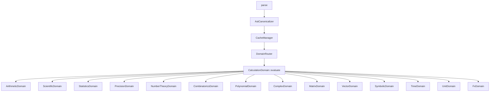
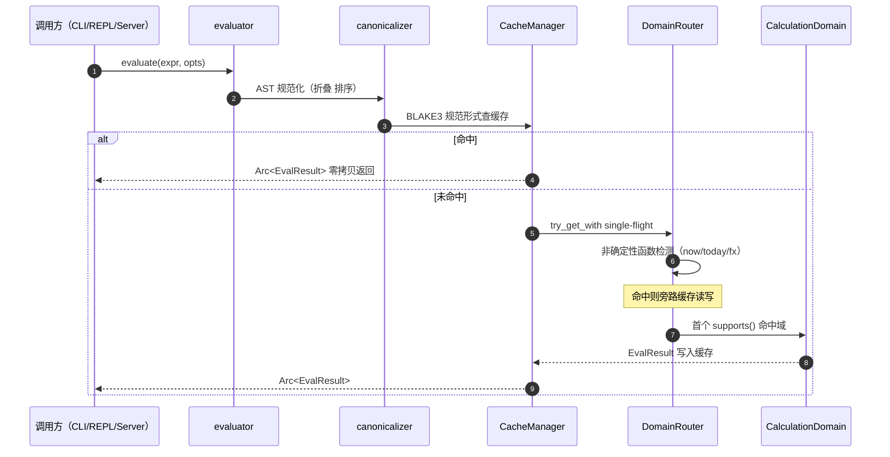

<div align="center">


[](https://github.com/kirky-x/calnexus/actions/workflows/ci.yml) [](https://crates.io/crates/calnexus) [](https://docs.rs/calnexus) [](https://crates.io/crates/calnexus) [](LICENSE) [](https://www.rust-lang.org/) [-brightgreen)](https://github.com/kirky-x/calnexus)

**中文** | [English](README_EN.md)

**生产级 Rust 命令行数学表达式求值器，14 个计算域一个入口**

[✨ 功能特性](#-功能特性) • [🚀 快速开始](#-快速开始) • [📚 文档](#-文档) • [💻 示例](#-示例) • [🤝 参与贡献](#-参与贡献)

</div>

---

<div align="center" style="padding: 32px; margin: 24px 0">

### 🎯 一个解析器，全部数学

从算术四则到符号微积分与数值线性代数，统一在单一解析器与按优先级路由的计算域调度器之后：

<table style="width:100%; border-collapse: collapse">
<tr>
<td align="center" width="25%" style="padding: 12px">🧮<br><b>14 个计算域</b><br><span style="color:#64748B">11 核心 + 3 可选 优先级路由</span></td>
<td align="center" width="25%" style="padding: 12px">🧠<br><b>符号微积分</b><br><span style="color:#64748B">微分 积分 化简 极限 泰勒</span></td>
<td align="center" width="25%" style="padding: 12px">⚡<br><b>高性能缓存</b><br><span style="color:#64748B">single-flight 零拷贝命中</span></td>
<td align="center" width="25%" style="padding: 12px">🌐<br><b>HTTP + MCP 双协议</b><br><span style="color:#64748B">REST 服务 AI 客户端集成</span></td>
</tr>
</table>

</div>

---

## 📋 目录

<details open>
<summary>📑 目录</summary>

- [✨ 功能特性](#-功能特性)
- [🚀 快速开始](#-快速开始)
- [🎨 特性标志](#-特性标志)
- [📚 文档](#-文档)
- [💻 示例](#-示例)
- [🌐 服务模式](#-服务模式)
- [🏗️ 架构](#️-架构)
- [🧪 测试](#-测试)
- [📊 性能](#-性能)
- [🔒 安全](#-安全)
- [🗺️ 开发路线图](#️-开发路线图)
- [🤝 参与贡献](#-参与贡献)
- [📋 更新日志](#-更新日志)
- [📄 许可证](#-许可证)
- [🙏 致谢](#-致谢)
- [📞 联系与支持](#-联系与支持)
- [⭐ Star 历史](#-star-历史)

</details>

---

## ✨ 功能特性

<table style="width:100%; border-collapse: collapse">
<tr>
<td width="50%" style="vertical-align:top; padding: 12px">🧮 <b>11 核心计算域 + 3 可选域</b><br><span style="color:#64748B">算术、科学函数、统计、精度、数论、组合、多项式、复数、矩阵、向量、符号演算；可选：时间 / 单位 / 汇率（feature 门控）</span></td>
<td width="50%" style="vertical-align:top; padding: 12px">🧠 <b>符号微积分</b><br><span style="color:#64748B"><code>diff</code>、<code>integrate</code>、<code>simplify</code>、<code>limit</code>、<code>taylor</code></span></td>
</tr>
<tr>
<td width="50%" style="vertical-align:top; padding: 12px">🔢 <b>任意精度</b><br><span style="color:#64748B"><code>precision(N, expr)</code> 基于 BigRational 的任意精度计算</span></td>
<td width="50%" style="vertical-align:top; padding: 12px">📐 <b>数值线性代数</b><br><span style="color:#64748B"><code>lu</code>、<code>qr</code>、<code>eig</code>、<code>svd</code>、<code>solve</code>（<code>numerical</code> feature，nalgebra f64 近似）</span></td>
</tr>
<tr>
<td width="50%" style="vertical-align:top; padding: 12px">🖥️ <b>三种执行模式</b><br><span style="color:#64748B">单表达式、REPL（Tab 补全 + 变量绑定）、批量并行（rayon）</span></td>
<td width="50%" style="vertical-align:top; padding: 12px">⚡ <b>高性能缓存</b><br><span style="color:#64748B">oxcache 同步字节权重缓存（64MB 字节预算 + 256KB 大结果准入阈值），BLAKE3 单次哈希键，<code>try_get_with</code> 生产级 single-flight 去重</span></td>
</tr>
<tr>
<td width="50%" style="vertical-align:top; padding: 12px">🌐 <b>HTTP + MCP 双协议服务</b><br><span style="color:#64748B">REST API、健康探针、指标导出、优雅关闭；MCP stdio 服务对接 AI 客户端</span></td>
<td width="50%" style="vertical-align:top; padding: 12px">✖️ <b>隐式乘法</b><br><span style="color:#64748B"><code>2x</code>、<code>3(x+1)</code> 等数学惯用写法自动识别</span></td>
</tr>
<tr>
<td width="50%" style="vertical-align:top; padding: 12px">🗂️ <b>JSON 输出契约</b><br><span style="color:#64748B"><code>--json</code> 输出版本化结构（<code>"v":1</code>，附 JSON Schema），便于管道集成</span></td>
<td width="50%" style="vertical-align:top; padding: 12px">🧱 <b>零依赖核心库</b><br><span style="color:#64748B"><code>default = []</code>，可作为嵌入式计算引擎被其他 crate 引用</span></td>
</tr>
</table>

除上述核心能力外，LaTeX / 步骤 / 规范形式三种格式化输出、中英双语错误消息（ICU4X）、运行时函数目录（`--list-functions`）、多平台预编译二进制与容器镜像等能力也随版本持续提供；逐项能力与 `Cargo.toml` 的 `[features]` 对应关系见 [🎨 特性标志](#-特性标志) 一节。

---

## 🚀 快速开始

### 📦 安装

```bash
cargo install calnexus --features cli
```

要求 Rust 1.97.1 及以上（MSRV，与 CI MSRV 任务一致）。核心库 `default = []` 零依赖；CLI 体验需启用 `cli`。

| 组合 | 安装方式 | 适用场景 |
|------|----------|----------|
| 最小库 | `cargo add calnexus` | 嵌入式计算引擎，零额外依赖 |
| CLI | `cargo install calnexus --features cli` | 日常命令行求值 / REPL / 批量 |
| CLI 全域 | `cargo install calnexus --features cli,time,unit,fx` | 加时间 / 单位 / 汇率域 |
| CLI + 数值 | `cargo install calnexus --features cli,numerical` | 数值线性代数分解 |
| HTTP 服务 | `cargo install calnexus --features server` | REST + MCP 双协议服务 |

也可以从 [GitHub Releases](https://github.com/kirky-x/calnexus/releases) 下载多平台预编译二进制（linux x86_64/aarch64 musl 静态、macOS x86_64/aarch64、windows x86_64，附 SHA256SUMS），或从源码构建：

```bash
git clone https://github.com/kirky-x/calnexus.git
cd calnexus
cargo install --path . --features cli
```

### 💡 最小示例

```bash
$ calnexus '2+3*4'
14

$ calnexus 'diff(x^2, x)'
2*x

$ calnexus --json '2+3'
{"cache":"miss","domain":"arithmetic","result":5.0,"v":1}
```

### 🧭 核心概念

- **计算域路由**：14 个计算域各实现 `CalculationDomain` trait，`DomainRouter` 按优先级调度，首个 `supports()` 命中即路由。
- **求值流水线**：`parse → canonicalize → cache → route → evaluate` 五阶段；规范化 AST 的 BLAKE3 哈希作为缓存键。
- **三种模式**：单表达式、REPL（`:let` / `:vars` / `:quit`，Tab 补全）、批量（`--batch`，rayon 并行）。
- **特性门控**：可选计算域与服务端能力均为独立 feature，编译产物只包含启用的部分，核心库可零依赖。
- **版本化 JSON 契约**：`--json` 输出携带 `"v":1`，Schema 见 [`docs/schema/result-v1.json`](docs/schema/result-v1.json)。

---

## 🎨 特性标志

### 📦 推荐组合

| 组合 | 包含特性 | 适用场景 |
|------|----------|----------|
| 最小库 | `default = []` | 嵌入式引擎，零额外依赖 |
| CLI | `cli` | 命令行 / REPL / 批量 |
| CLI 全域 | `cli` + `time` + `unit` + `fx` | 加三个可选计算域 |
| CLI + 数值 | `cli` + `numerical` | 数值线性代数 |
| 双语 CLI | `cli` + `icu` | ICU4X 本地化错误消息 |
| HTTP 服务 | `server` | REST + MCP 服务 |
| 生产服务 | `server` + `ratelimit` + `observability` | 限流 + 结构化日志 |
| 全量 | `--all-features` | 完整能力集 |

### 📋 功能矩阵

下表逐项对应 `Cargo.toml` 的 `[features]` 定义，`default = []`。

<table style="width:100%; border-collapse: collapse">
<tr><th style="text-align:left">特性</th><th style="text-align:center">默认</th><th style="text-align:left">说明</th></tr>
<tr><td colspan="3" style="background:#F8FAFC"><b>核心库</b></td></tr>
<tr><td><code>default</code></td><td align="center">✅</td><td>零依赖核心：解析、规范化、14 域路由、缓存，可作嵌入式引擎</td></tr>
<tr><td><code>icu</code></td><td align="center">❌</td><td>ICU4X 国际化错误消息（中英双语）</td></tr>
<tr><td colspan="3" style="background:#F8FAFC"><b>CLI 与交互</b></td></tr>
<tr><td><code>cli</code></td><td align="center">❌</td><td>CLI / REPL / 批量（clap、rustyline、rayon，经 sdforge/cli 间接启用）</td></tr>
<tr><td colspan="3" style="background:#F8FAFC"><b>可选计算域</b></td></tr>
<tr><td><code>time</code></td><td align="center">❌</td><td>时间计算域，jiff 0.2 + 内嵌 IANA tzdb，14 个函数</td></tr>
<tr><td><code>unit</code></td><td align="center">❌</td><td>物理单位换算域，8 量纲 + 温度仿射</td></tr>
<tr><td><code>fx</code></td><td align="center">❌</td><td>汇率换算域，frankfurter.dev API + 三级缓存 + 网络熔断</td></tr>
<tr><td><code>numerical</code></td><td align="center">❌</td><td>数值线性代数分解（lu/qr/eig/svd/solve/matrix_exp，nalgebra f64）</td></tr>
<tr><td colspan="3" style="background:#F8FAFC"><b>服务端</b></td></tr>
<tr><td><code>http</code></td><td align="center">❌</td><td>HTTP API（sdforge http/graceful/health/context，axum）</td></tr>
<tr><td><code>mcp</code></td><td align="center">❌</td><td>MCP stdio 服务（sdforge/mcp）</td></tr>
<tr><td><code>server</code></td><td align="center">❌</td><td><code>http</code> + <code>mcp</code> 聚合</td></tr>
<tr><td><code>ratelimit</code></td><td align="center">❌</td><td>HTTP 限流中间件（固定窗口 per-IP，<code>CALNEXUS_RATELIMIT_*</code> 可配，探针豁免）</td></tr>
<tr><td><code>docs</code></td><td align="center">❌</td><td>OpenAPI + Swagger UI（<code>/swagger-ui</code>）</td></tr>
<tr><td><code>observability</code></td><td align="center">❌</td><td>tracing 结构化日志（EnvFilter 消费 <code>RUST_LOG</code>）</td></tr>
</table>

---

## 📚 文档

| 文档 | 说明 |
|------|------|
| [📖 用户指南](docs/USER_GUIDE.md) | 从安装到进阶的完整使用教程 |
| [📘 API 参考](docs/API_REFERENCE.md) | 表达式求值 API 与直接 API（`CalNexus` 门面）的详细说明 |
| [🏗️ 架构文档](docs/ARCHITECTURE.md) | 设计原则、模块划分与数据流 |
| [📈 性能指南](docs/PERFORMANCE.md) | 基准数据、性能口径与优化建议 |
| [🔒 安全文档](docs/SECURITY.md) | 安全设计、最佳实践与漏洞处理流程 |
| [❓ FAQ](docs/FAQ.md) | 常见问题解答 |
| [🖥️ 服务模式指南](docs/SERVER.md) | HTTP 部署、可观测性与 MCP 接入 |
| [📋 更新日志](docs/CHANGELOG.md) | 每个版本的变更记录 |
| [🤝 贡献指南](docs/CONTRIBUTING.md) | 如何参与项目开发 |
| [📦 在线 API 文档](https://docs.rs/calnexus) | docs.rs 自动生成的最新文档 |
| [📦 crates.io](https://crates.io/crates/calnexus) | 发布页面 |

设计与过程文档：[行为准则](docs/CODE_OF_CONDUCT.md) · [历史过程文档归档](docs/archive/)（PRD、前沿研究分析）

---

## 💻 示例

### 🧭 使用场景

| 场景 | 命令 | 说明 |
|------|------|------|
| 单表达式 | `calnexus '2+3*4'` | 快速求值 |
| 变量绑定 | `calnexus --var x=3 'x^2 + 2*x + 1'` | 预绑定变量 |
| 交互探索 | `calnexus --repl` | REPL，Tab 补全 + `:let` |
| 批量处理 | `calnexus --batch exprs.txt` | rayon 并行，逐行输出与汇总 |
| 管道集成 | `calnexus --json '2+3'` | 版本化 JSON 结构 |

### 🖥️ 求值示例

```bash
# 基础与科学函数
$ calnexus 'sin(pi/2)'
1
$ calnexus 'gcd(12, 18)'
6

# 任意精度（BigRational）
$ calnexus 'precision(50, 1/3)'
0.33333333333333333333333333333333333333333333333333

# 符号微积分
$ calnexus 'limit(sin(x)/x, x, 0)'
1
$ calnexus 'taylor(exp(x), x, 3)'
1+x+0.5*x^2+0.16666666666666666*x^3

# 隐式乘法
$ calnexus --var x=3 '2x'
6
```

REPL 交互：

```text
$ calnexus --repl
CalNexus REPL — type :help for commands, :quit to exit
calnexus> :let x = 10
calnexus> x*2
= 20  [arithmetic]
calnexus> diff(x^2, x)
= 2*x  [symbolic]
calnexus> :quit
bye
```

批量处理：

```text
$ calnexus --batch exprs.txt
line 1: 2+3 = 5  [arithmetic]
line 2: sin(0) = 0  [scientific]
line 4: diff(x^2, x) = 2*x  [symbolic]
summary: 3 total, 3 ok, 0 errors, 0 cache hits, 1.2ms
```

> 完整教程（全部输出格式、可选域用法、环境变量、错误码约定）见 [📖 用户指南](docs/USER_GUIDE.md)。

### 🧰 CLI 速查

| 参数 | 说明 |
|------|------|
| 位置参数 `'2+3*4'` | 单表达式求值 |
| `--repl` | 启动交互式 REPL |
| `--batch <file>` | 并行求值文件中每行表达式（rayon） |
| `--var x=3` | 预绑定变量（可多次） |
| `--precision <N>` | 以 N 位小数精度求值（BigRational 模式；全精度请用 `precision(N, expr)`） |
| `--timeout <secs>` | 求值超时（`CALNEXUS_TIMEOUT` 环境变量回退） |
| `--cache-size <n>` | 缓存条目预算（`CALNEXUS_CACHE_SIZE` 回退，条目 × 4KB 近似） |
| `--json` | 输出版本化 JSON（`"v":1`） |
| `--latex` / `--canonical` / `--steps` | LaTeX / 规范形式 / 求解步骤输出（与 `--json` 等互斥） |
| `--explain` | 输出详细错误解释（与 `--json` 互斥） |
| `--lang <en\|zh>` | 错误消息语言（默认 `en`） |
| `--list-functions` | 输出当前构建的函数目录 |
| `--serve-http` / `--serve-mcp` | 启动 HTTP / MCP 服务（需 `server`） |
| `--bind <addr>` | 服务监听地址（`CALNEXUS_BIND_ADDR` 回退） |

完整参数可通过 `calnexus --help` 查看。

---

## 🌐 服务模式

需以 `--features server` 启用（`server = http + mcp`）。启动后提供 REST API 与运维端点：

```bash
calnexus --serve-http                    # 默认 127.0.0.1:3000
calnexus --serve-http --bind 0.0.0.0:8080
```

| 端点 | 方法 | 说明 |
|------|------|------|
| `/api/v1/evaluate` | POST | 表达式求值（JSON 请求/响应） |
| `/api/v1/list_functions` | POST | 运行时函数目录（含 feature 门控域可见性） |
| `/health` | GET | 综合健康检查（含 L1 缓存状态） |
| `/live` | GET | 存活探针（liveness，纯进程存活语义） |
| `/ready` | GET | 就绪探针（readiness，依赖就绪语义） |
| `/metrics` | GET | 指标导出（Prometheus 文本，`?format=json` 返回 JSON） |

**语言协商**：请求体可选 `lang` 字段（BCP-47，如 `"en"` / `"zh-CN"`）。缺省或未知值回退英文（协议默认）；`"zh"` 时错误消息与 fx 风险提示等人类可读文案切换中文，机器可读字段保持英文契约：

```bash
curl -X POST localhost:3000/api/v1/evaluate -H 'content-type: application/json' \
  -d '{"expr": "foo + 1", "lang": "zh"}'
# → {"type":"InvalidInput","message":"求值错误: 未绑定变量: foo",...}
```

**MCP 服务**：`calnexus --serve-mcp` 以 stdio 传输暴露 `evaluate`、`list_functions` 工具（`fx` 构建额外注册 `fx_budget` / `fx_pricing`），可直接接入 Claude Desktop、Cursor 等客户端，客户端配置见 [🖥️ 服务模式指南](docs/SERVER.md)。

**错误语义（SLO 友好）**：400 `InvalidInput`（求值/解析失败）、422 `ValidationError`（请求体参数超限，求值前拦截）、503 `ServiceUnavailable`（超时或 fx 上游不可达，带 `Retry-After`）；CLI 退出码：1 = 计算错误、2 = 用法错误、3 = 超时/不可用。

可选 feature 增强：

| Feature | 说明 |
|---------|------|
| `ratelimit` | HTTP 限流中间件（固定窗口 per-IP；`CALNEXUS_RATELIMIT_LIMIT` 默认 120、`CALNEXUS_RATELIMIT_WINDOW_SECS` 默认 60，探针/metrics 豁免） |
| `docs` | Swagger UI（`/swagger-ui`，OpenAPI 文档） |
| `observability` | OpenTelemetry 风格可观测性（tracing + `RUST_LOG`） |

优雅关闭随 `http` feature 内建（SIGTERM/Ctrl+C → drain 最长 30s → 强退，K8s `terminationGracePeriodSeconds` 建议 ≥ 45）。部署细节见 [🖥️ 服务模式指南](docs/SERVER.md)。

```bash
# 启用全部 HTTP 增强
cargo build --release --features server,ratelimit,docs,observability
```

---

## 🏗️ 架构

CalNexus 采用五层分层架构（入口层 → 编排层 → 计算域层 → 数学函数层 → 核心基础层），依赖方向严格自上而下；`default` 无特性时核心库零依赖，可作嵌入式引擎。核心求值通路为：mathexpr 解析（支持隐式乘法与复数预处理）→ `AstCanonicalizer` 规范化（常量折叠、可交换排序、S-表达式规范形式）→ `CacheManager` 缓存查询（BLAKE3 单次哈希键）→ `DomainRouter` 按优先级路由 → 对应 `CalculationDomain` 求值。


```mermaid
graph TD
    A[parse] --> B[AstCanonicalizer]
    B --> C[CacheManager]
    C --> D[DomainRouter]
    D --> E[CalculationDomain::evaluate]
    E --> F[ArithmeticDomain]
    E --> G[ScientificDomain]
    E --> H[StatisticsDomain]
    E --> I[PrecisionDomain]
    E --> J[NumberTheoryDomain]
    E --> K[CombinatoricsDomain]
    E --> L[PolynomialDomain]
    E --> M[ComplexDomain]
    E --> N[MatrixDomain]
    E --> O[VectorDomain]
    E --> P[SymbolicDomain]
    E --> Q[TimeDomain]
    E --> R[UnitDomain]
    E --> S[FxDomain]
```

核心模块说明：

- **Parser**：基于 mathexpr，支持隐式乘法与复数预处理
- **Canonicalizer**：常量折叠、可交换排序、S-表达式规范形式
- **Cache**：oxcache `byte-weight` 同步字节权重缓存（字节预算默认 64MB，`--cache-size` 可配；`try_get_with` 生产级 single-flight；大结果 >256KB 不入缓存）
- **Router**：按优先级排序的计算域调度（首个 `supports()` 命中即路由）

> 完整的模块划分与依赖方向说明见 [🏗️ 架构文档](docs/ARCHITECTURE.md)。

### 🔄 核心流程

以下时序图展示单次求值的真实执行路径（对照 `src/core/evaluator.rs` 与 `src/core/cache.rs`）：


```mermaid
sequenceDiagram
    autonumber
    participant App as 调用方（CLI/REPL/Server）
    participant E as evaluator
    participant C as canonicalizer
    participant K as CacheManager
    participant R as DomainRouter
    participant D as CalculationDomain

    App->>E: evaluate(expr, opts)
    E->>C: AST 规范化（折叠 排序）
    C->>K: BLAKE3 规范形式查缓存
    alt 命中
        K-->>App: Arc<EvalResult> 零拷贝返回
    else 未命中
        K->>R: try_get_with single-flight
        R->>R: 非确定性函数检测（now/today/fx）
        Note over R: 命中则旁路缓存读写
        R->>D: 首个 supports() 命中域
        D-->>K: EvalResult 写入缓存
        K-->>App: Arc<EvalResult>
    end
```

并发场景下，相同表达式的多个请求经 `try_get_with` 合并为一次真实求值（single-flight），其余等待方共享同一 `Arc<EvalResult>`。

---

## 🧪 测试

### 🎯 测试策略

| 层级 | 位置 / 工具 | 说明 |
|------|------------|------|
| 单元测试 | `src/` 内联 `#[cfg(test)]` 模块 | 覆盖各模块与 feature 门控下的核心逻辑 |
| 集成测试 | `tests/`（integration、cli_integration、repl_integration、server_http_integration、server_mcp_integration、api_integration、time_unit_fx_integration） | assert_cmd 子进程、expectrl 交互、tower oneshot |
| 属性测试 | `tests/property_tests.rs`（proptest） | 随机化不变量验证 |
| 快照测试 | `tests/snapshot_tests.rs`（insta） | 全部 CLI 可达输出变体快照 |
| 安全测试 | `tests/security_tests.rs` | DoS 向量与边界攻击 |
| 模糊测试 | `fuzz/`（7 个 cargo-fuzz 目标） | parser、ast_depth、list_depth、canonicalizer、cache_key、numeric_boundary、matrix_dim |
| 基准测试 | `benches/`（4 组 Criterion 基准） | parser、cache、domain、api |
| 文档测试 | 公开 API rustdoc 示例 | 随 `cargo test` 执行 |

### ▶️ 运行命令（与 CI 一致）

```bash
# 全量测试（CI 矩阵六条腿：cli / cli,time,unit,fx / cli,server / cli,server,fx / cli,numerical / all）
cargo test --all-features

# 分腿运行
cargo test --features cli,time,unit,fx    # 含可选域全量
cargo test --features server              # HTTP/MCP 集成
cargo test --features "cli,numerical"     # 数值线性代数

# Lint 与格式门禁（clippy 矩阵：cli / cli,server / all）
cargo clippy --all-features --all-targets -- -D warnings
cargo fmt --all -- --check

# 覆盖率门禁：行覆盖率不低于 90%（llvm-cov）
cargo llvm-cov --features "cli,time,unit,fx" --fail-under-lines 90 --summary-only

# 基准测试
cargo bench --features cli

# 模糊测试（在 fuzz/ 目录下）
cargo fuzz run parser
```

### 📊 测试规模

> 规模为 `#[test]` / `#[tokio::test]` 函数的 grep 统计。分解数字随版本演进会漂移，权威口径以 `grep -rE "#\[(tokio::)?test\]" src/ tests/ | wc -l` 为准。

| 类别 | 数量 |
|------|------|
| 单元测试（`src/` 内联） | 2432 |
| 集成与 E2E（`tests/`） | 388 |
| 模糊测试目标 | 7 |
| Criterion 基准 | 4 组 |

覆盖率门禁为行覆盖率不低于 90%（llvm-cov，`--features cli,time,unit,fx` 口径，实测 90.4%），CI 执行。

---

## 📊 性能

> 口径见 [📈 性能指南](docs/PERFORMANCE.md)：基线在开发机（WSL2、linux 6.6）本地采集，数值为 criterion 区间估计的 median，实际性能取决于表达式复杂度与硬件，可运行 `cargo bench --features cli` 复现。

<table style="width:100%; border-collapse: collapse">
<tr><th style="text-align:left">路径</th><th style="text-align:left">用例</th><th style="text-align:left">耗时</th></tr>
<tr><td>缓存命中</td><td><code>cache_hit / 2+3</code></td><td>约 1.29 µs</td></tr>
<tr><td>缓存命中</td><td><code>cache_hit / sin(1.5)+cos(0.5)</code></td><td>约 3.4 µs</td></tr>
<tr><td>全流水线</td><td><code>cache_miss / 2+3</code>（解析+规范化+求值+入缓存）</td><td>约 13.1 µs</td></tr>
<tr><td>全流水线</td><td><code>cache_miss / matrix([[1,2],[3,4]])</code></td><td>约 15.9 µs</td></tr>
<tr><td>解析</td><td><code>parser / 2+3</code></td><td>约 286 ns</td></tr>
<tr><td>解析</td><td><code>parser / sum([1,2,3,4,5])</code></td><td>约 2.0 µs</td></tr>
<tr><td>规范化</td><td><code>canonicalizer / x^2+2*x+1</code></td><td>约 417 ns</td></tr>
</table>

性能设计要点：缓存命中返回 `Arc<EvalResult>` 零拷贝，命中路径无 JSON 序列化与临时 runtime；`try_get_with` single-flight 使并发相同表达式只求值一次；字节权重预算（默认 64MB）+ 256KB 大结果准入阈值防止缓存膨胀；非确定性函数（`now` / `today` / `fx`）旁路缓存避免结果污染。更多优化建议见 [📈 性能指南](docs/PERFORMANCE.md)。

---

## 🔒 安全

### 🛡️ 安全设计

CalNexus 是无网络（`fx` 上游除外）、无不可信文件 I/O、无插件加载的求值器，攻击面极小。主动防护包括：递归深度防护闭环（`MAX_AST_DEPTH=256` + mathexpr 前迭代预检 + 括号字面量 RAII 守卫，堵住嵌套列表/矩阵字面量绕过）、请求资源上限（expr ≤ 4096 字符、vars ≤ 1024 键、precision ≤ 10000 位）、解析错误信息脱敏（不泄漏解析器内部结构）、fx 上游 `https_only` + 响应体 1MB 上限 + 磁盘缓存原子写（0600）、错误三分类语义（客户端错误与服务端/上游故障严格区分）。代码级细节见 [🏗️ 架构文档](docs/ARCHITECTURE.md)，安全配置最佳实践与漏洞处理流程见 [🔒 安全文档](docs/SECURITY.md)。

### ⛓️ 供应链与门禁

- `cargo audit`：RustSec 安全公告扫描（[周度定时工作流](https://github.com/kirky-x/calnexus/actions/workflows/audit.yml) + 发布前门禁）。
- `cargo deny check`：许可证、禁用依赖与来源校验（`deny.toml`）。
- CodeQL 静态安全分析（周度）。
- pre-commit 钩子 9 项检查：fmt、clippy（deny warnings）、全量测试、release 零警告构建、版权头、调试输出、TODO/FIXME、Cargo.lock 追踪、文件体积。

### 🚨 报告安全漏洞

请勿通过公开 issue 报告安全漏洞。请发送邮件至 **security@calnexus.dev** 私密披露。项目承诺 48 小时内确认、7 天内给出初步评估。完整政策见 [SECURITY.md](docs/SECURITY.md)。

---

## 🗺️ 开发路线图

<table style="width:100%; border-collapse: collapse">
<tr><th style="text-align:center">状态</th><th style="text-align:left">方向</th><th style="text-align:left">条目</th></tr>
<tr><td align="center">✅</td><td>核心引擎（v0.1.0）</td><td>11 计算域、符号微积分、REPL、批量处理、任意精度、JSON 输出、隐式乘法</td></tr>
<tr><td align="center">✅</td><td>可选域与服务化（v0.1.3-v0.1.5）</td><td>时间 / 单位 / 汇率域、HTTP + MCP 双协议、探针分离、限流、可观测性、多平台发布与容器镜像</td></tr>
<tr><td align="center">✅</td><td>缓存引擎现代化</td><td>moka::sync 直连、single-flight、字节权重预算、BLAKE3 键、大结果准入阈值</td></tr>
<tr><td align="center">🚧</td><td>WebAssembly (wasm32) 支持</td><td><code>tokio::rt</code>（server 引入）不支持 wasm32；CLI-only 形态理论上可编译，未验证。在此之前 wasm32 构建<strong>不受 CI 门禁保护、不承诺可用</strong>：<code>cargo build --target wasm32-unknown-unknown --no-default-features</code></td></tr>
<tr><td align="center">📋</td><td>数值能力增强</td><td>前沿算法跟踪与功能缺口收敛（见 <a href="docs/archive/RESEARCH_ANALYSIS.md">研究分析</a>）</td></tr>
</table>

---

## 🤝 参与贡献

详细的贡献流程与代码规范请参阅 [🤝 贡献指南](docs/CONTRIBUTING.md)。

### 🛠️ 开发环境

| 项 | 要求 |
|----|------|
| 工具链 | Rust 1.97.1+（CI MSRV 任务锁定基线） |
| 格式与 Lint | `cargo fmt --all -- --check`、`cargo clippy --all-targets --all-features -- -D warnings` |
| Git 钩子 | `.githooks/pre-commit`（9 项检查），`git config core.hooksPath .githooks` 启用 |
| 提交信息 | Conventional Commits（`feat`、`fix`、`docs` 等） |

### 💖 贡献方式

<table style="width:100%; border-collapse: collapse">
<tr>
<td width="33%" align="center" style="padding: 16px">

### 🐛 报告 Bug

发现问题？<br>
<a href="https://github.com/kirky-x/calnexus/issues/new">创建 Issue</a>

</td>
<td width="33%" align="center" style="padding: 16px">

### 💡 功能建议

有好想法？<br>
<a href="https://github.com/kirky-x/calnexus/issues/new">发起讨论</a>

</td>
<td width="33%" align="center" style="padding: 16px">

### 🔧 提交 PR

想贡献代码？<br>
<a href="https://github.com/kirky-x/calnexus/pulls">Fork 并提交 PR</a>

</td>
</tr>
</table>

提交 Issue 时请附复现步骤、`calnexus` 版本与操作系统信息；符号演算 / 精度相关 bug 请附最小复现表达式。

---

## 📋 更新日志

完整版本历史见 [📋 更新日志](docs/CHANGELOG.md)（遵循 [Keep a Changelog](https://keepachangelog.com/en/1.1.0/) 格式，语义化版本）。

| 版本 | 日期 | 要点 |
|------|------|------|
| 0.1.4 | 2026-07-26 | Release pipeline 闭环：`cargo publish` 自动化 + 发布前安全门禁（`cargo audit`、版本校验、dry-run 验证） |
| 0.1.3 | 2026-07-26 | 新增时间 / 单位 / 汇率三个可选计算域与 8 个向量运算；非确定性函数缓存旁路 |
| 0.1.2 | 2026-07-21 | 20 项文档-代码一致性修复；解析与规范化边界行为修复（NaN 全序、`0^0`、连续运算符校验） |

---

## 📄 许可证

本项目基于 [MIT License](LICENSE) 开源。

---

## 🙏 致谢

### 🌟 核心依赖

CalNexus 站在以下优秀开源项目的肩膀上：

| 依赖 | 用途 |
|------|------|
| [mathexpr](https://crates.io/crates/mathexpr) | 表达式解析基础 |
| [oxcache](https://crates.io/crates/oxcache) | 自研高性能缓存库（`byte-weight` 同步字节权重缓存，机制层封装 moka::sync） |
| [clap](https://github.com/clap-rs/clap) | CLI 参数解析（经 sdforge/cli 间接启用） |
| [rustyline](https://github.com/kkawakam/rustyline) | REPL 行编辑与 Tab 补全 |
| [rayon](https://github.com/rayon-rs/rayon) | 数据并行批量求值 |
| [jiff](https://github.com/BurntSushi/jiff) | 日期时间与 IANA 时区（`time` feature） |
| [nalgebra](https://github.com/dimforge/nalgebra) | 数值线性代数（`numerical` feature） |
| [sdforge](https://crates.io/crates/sdforge) | CLI / HTTP / MCP 接口封装层 |
| [criterion](https://github.com/bheisler/criterion.rs) | 基准测试 |

### 💝 特别感谢

感谢 Rust 社区与所有 [贡献者](https://github.com/kirky-x/calnexus/graphs/contributors)。

---

## 📞 联系与支持

<table style="width:100%; max-width: 600px">
<tr>
<td align="center" width="33%">
<a href="https://github.com/kirky-x/calnexus/issues"><b style="color:#991B1B">Issues</b></a><br>
<span style="color:#64748B">报告问题和 Bug</span>
</td>
<td align="center" width="33%">
<a href="https://github.com/kirky-x/calnexus/discussions"><b style="color:#1E40AF">讨论区</b></a><br>
<span style="color:#64748B">提问和分享想法</span>
</td>
<td align="center" width="33%">
<a href="https://github.com/kirky-x/calnexus"><b style="color:#1E293B">GitHub</b></a><br>
<span style="color:#64748B">查看源代码</span>
</td>
</tr>
</table>

---

## ⭐ Star 历史

[](https://star-history.com/#kirky-x/calnexus&Date)

如果这个项目对您有帮助，请考虑给它一个 ⭐️！

**由 Kirky.X 构建**

---

<sub>© 2026 Kirky.X. 保留所有权利。</sub>
