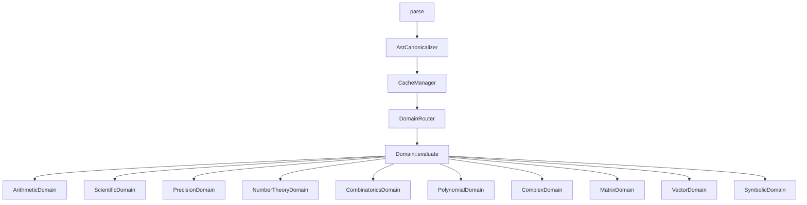

<p align="center">
  
</p>

[](https://github.com/kirky-x/calnexus/releases)[](./LICENSE)[](https://github.com/kirky-x/calnexus)[](https://github.com/kirky-x/calnexus)

A command-line math expression evaluator with 11 computation domains, symbolic calculus, REPL, and batch processing.

| Project Info | Value |
| --- | --- |
| Version | 0.1.2 |
| License | MIT |
| Author | Kirky.X |
| Repository | https://github.com/kirky-x/calnexus |

---

## Table of Contents

- [Overview](#overview)
- [Features](#features)
  - [11 Computation Domains](#11-computation-domains)
  - [Three Modes](#three-modes)
- [Architecture](#architecture)
- [Quick Start](#quick-start)
  - [Prerequisites](#prerequisites)
  - [Installation](#installation)
  - [Usage](#usage)
- [Configuration](#configuration)
- [API Documentation](#api-documentation)
- [Testing](#testing)
- [WebAssembly (wasm32) Support](#webassembly-wasm32-support)
- [Contributing](#contributing)
- [Roadmap](#roadmap)
- [License](#license)
- [Acknowledgments](#acknowledgments)

---

## Overview

**CalNexus** is a Rust-native command-line math expression evaluator that unifies 11 computation domains — from arithmetic and statistics to symbolic calculus and linear algebra — behind a single parser and a priority-routed domain dispatcher. It offers three execution modes (single expression, interactive REPL, and parallel batch) with an LRU cache, arbitrary-precision arithmetic, and JSON output for pipeline integration.

### Use Cases

- Case A: Quick command-line evaluation and symbolic calculus (`calnexus 'diff(x^2, x)'`)
- Case B: Interactive exploration and variable binding (`calnexus --repl`, with Tab completion)
- Case C: Batch scripting (`calnexus --batch exprs.txt`, rayon-parallel)
- Case D: Embedding into data pipelines (`--json` structured output)

---

## Features

| Feature | Description |
| --- | --- |
| 11 computation domains | Arithmetic, scientific functions, statistics, precision, number theory, combinatorics, polynomial, complex, matrix, vector, symbolic calculus |
| Symbolic calculus | `diff`, `integrate`, `simplify`, `limit`, `taylor` |
| Arbitrary precision | `precision(N, expr)` BigRational-based arbitrary precision |
| Numerical linear algebra | `lu`, `qr`, `eig`, `svd`, `solve` (`numerical` feature, nalgebra f64 approximation) |
| Three modes | Single expression, REPL (Tab completion + variable binding), parallel batch (rayon) |
| High-performance cache | Moka L1 cache (10000 entries, BLAKE3 hash, thread-safe) |
| Implicit multiplication | Auto-recognition of math idioms like `2x`, `3(x+1)` |
| JSON output | `--json` emits a `result/domain/cache` structure for pipeline integration |
| Industrial-grade testing | 1856 tests, 97.27% coverage, release build with zero warnings |

### 11 Computation Domains

| Domain | Priority | Functions |
| --- | --- | --- |
| **Arithmetic** | 10 | `+`, `-`, `*`, `/`, `^`, `factorial`, `mod`, `abs` |
| **Scientific** | 20 | `sin`, `cos`, `tan`, `asin`, `acos`, `atan`, `ln`, `log`, `exp`, `sinh`, `cosh`, `tanh`, `gamma`, `erf` |
| **Statistics** | 20 | `mean`, `median`, `variance`, `stddev`, `sum`, `min`, `max` |
| **Precision** | 25 | `precision(N, expr)` — BigRational arbitrary precision |
| **NumberTheory** | 25 | `gcd`, `lcm`, `is_prime`, `prime_sieve`, `mod_inverse`, `mod_pow`, `euler_phi` |
| **Combinatorics** | 25 | `P`, `C`, `catalan`, `stirling` |
| **Polynomial** | 25 | `poly_add`, `poly_sub`, `poly_mul`, `poly_div`, `poly_eval`, `poly_diff`, `poly_integrate`, `roots`, `factor` |
| **Complex** | 30 | `complex(a,b)`, `re`, `im`, `conj`, `magnitude`, `phase` |
| **Matrix** | 30 | `det`, `transpose`, `inverse`, `identity`, `lu`/`qr`/`eig`/`svd`/`solve` (`numerical` feature) |
| **Vector** | 30 | `dot`, `cross`, `norm`, `angle`, `normalize`, `scalar_triple` |
| **Symbolic** | 30 | `diff`, `integrate`, `simplify`, `limit`, `taylor` |

### Three Modes

1. **Single expression** — `calnexus '2+3*4'`
2. **REPL** — `calnexus --repl` (interactive, with Tab completion and variable binding)
3. **Batch** — `calnexus --batch exprs.txt` (parallel evaluation with rayon)

---

## Architecture



Core module notes:

- **Parser**: mathexpr-based, with implicit multiplication and complex number preprocessing
- **Canonicalizer**: constant folding, commutative sorting, S-expression canonical form
- **Cache**: Moka L1 cache (10000 entries, BLAKE3 key hash, thread-safe)
- **Router**: Priority-sorted domain dispatch (first `supports()` wins)

---

## Quick Start

### Prerequisites

Ensure your environment meets the following requirements before running this project:

| Dependency | Version | Notes |
| --- | --- | --- |
| Rust | >= 1.70 | Toolchain (install via `rustup` recommended) |
| Cargo | bundled with Rust | Build and package manager |
| `cli` feature | optional | Enables CLI / REPL / batch (includes `clap`, `rustyline`, `rayon`) |
| `numerical` feature | optional | Enables numerical linear algebra decomposition (`lu`/`qr`/`eig`/`svd`/`solve`, includes `nalgebra`) |

### Installation

```bash
# 1. Clone the repository
git clone https://github.com/kirky-x/calnexus.git
cd calnexus

# 2. Install to ~/.cargo/bin
cargo install --path . --features cli

# Or build locally only
cargo build --release --features cli
```

### Usage

#### Single Expression

```bash
$ calnexus '2+3*4'
14

$ calnexus 'sin(pi/2)'
1

$ calnexus 'gcd(12, 18)'
6

$ calnexus 'factorial(5)'
120

$ calnexus --var x=3 'x^2 + 2*x + 1'
16
```

#### Arbitrary Precision

```bash
$ calnexus --precision 50 '1/3'
0.33333333333333333333333333333333333333333333333333
```

#### JSON Output

```bash
$ calnexus --json '2+3'
{"result":5,"domain":"arithmetic","cache":"miss"}
```

#### Symbolic Calculus

```bash
$ calnexus 'diff(x^2, x)'
2*x

$ calnexus 'simplify(x+0)'
x

$ calnexus 'limit(sin(x)/x, x, 0)'
1

$ calnexus 'taylor(exp(x), x, 3)'
1+x+0.5*x^2+0.16666666666666666*x^3
```

#### Numerical Linear Algebra

Requires compiling with `--features numerical` (`cargo build --release --features cli,numerical`). Five numerical decompositions return JSON (`lu`/`qr`/`eig`/`svd`) or a vector (`solve`); results are nalgebra f64 approximations:

```bash
$ calnexus 'solve([[2,1],[1,3]],[3,5])'
[0.8,1.4]

$ calnexus 'lu([[4,3],[6,3]])'
{"L":[[1.0,0.0],[0.6666666666666666,1.0]],"P":[[0.0,1.0],[1.0,0.0]],"U":[[6.0,3.0],[0.0,1.0]]}

$ calnexus 'eig([[2,1],[1,2]])'
{"values":[1.0,3.0],"vectors":[[-0.7071067811865475,0.7071067811865475],[0.7071067811865475,0.7071067811865475]]}
```

> `precision(N, ...)` does not apply to these functions (f64 approximations); wrapping yields an explicit error.

#### REPL Mode

```bash
$ calnexus --repl
CalNexus REPL — type :help for commands, :quit to exit
calnexus> :let x = 10
calnexus> x*2
= 20  [arithmetic]
calnexus> diff(x^2, x)
= 2*x  [symbolic]
calnexus> :vars
x = 10
calnexus> :quit
bye
```

REPL commands: `:let` binds a variable, `:vars` lists variables, `:quit` exits.

#### Batch Processing

```bash
$ cat exprs.txt
2+3
sin(0)
# This is a comment
diff(x^2, x)

$ calnexus --batch exprs.txt
line 1: 2+3 = 5  [arithmetic]
line 2: sin(0) = 0  [scientific]
line 4: diff(x^2, x) = 2*x  [symbolic]
summary: 3 total, 3 ok, 0 errors, 0 cache hits, 1.2ms
```

#### Implicit Multiplication

```bash
$ calnexus --var x=3 '2x'
6

$ calnexus --var x=3 '3(x+1)'
12
```

---

## Configuration

CalNexus is configured entirely via command-line flags; no config file is required:

| Flag | Description |
| --- | --- |
| Positional arg `'2+3*4'` | Single expression evaluation; evaluates and prints the result |
| `--repl` | Starts an interactive REPL, supports `:let`, `:vars`, `:quit` |
| `--batch <file>` | Parallel evaluation of each line in the file (rayon) |
| `--var x=3` | Pre-binds variables for the expression |
| `--precision <N>` | Evaluates with N-digit BigRational precision |
| `--json` | Emits a `result/domain/cache` structure |
| `--latex` | Outputs in LaTeX form (mutually exclusive with `--json`/`--repl`/`--batch`/`--precision`) |
| `--canonical` | Outputs the canonical form (mutually exclusive with `--json`/`--repl`/`--batch`/`--precision`) |
| `--steps` | Outputs solving steps (mutually exclusive with `--json`/`--repl`/`--batch`/`--precision`) |
| `--help` | Shows help information |

The full set of CLI subcommands and flags is available via `calnexus --help`.

---

## API Documentation

CalNexus is a Rust library + CLI binary project; the interface docs can be viewed via:

- **Local rustdoc**: run `cargo doc --features cli --open` and visit `http://localhost:port`
- **Core entry**: `calnexus::parse()` → `AstCanonicalizer` → `CacheManager` → `DomainRouter`
- **Domain trait**: each domain implements `Domain::evaluate()` and is routed via `supports()`
- **CLI help**: `calnexus --help` / `:help` inside `calnexus --repl`

---

## Testing

```bash
# Run all tests (1856+ tests)
cargo test --features cli

# Release build (zero warnings)
cargo build --release --features cli

# Formatting and static analysis
cargo fmt --all
cargo clippy --features cli --all-targets
```

Test scale: 1856 tests (1553 lib + 122 CLI + 132 integration + 6 REPL + 13 security + 12 property + 10 snapshot + 6 performance), 97.27% coverage, release build with zero warnings.

---

## WebAssembly (wasm32) Support

CalNexus targets `wasm32-unknown-unknown` with `--no-default-features` (excludes CLI / REPL / batch).

**Known limitation**: The `oxcache` dependency uses `tokio`, which depends on `mio` — `mio` does not support `wasm32-unknown-unknown`. To enable wasm32, the cache layer needs to be refactored to use a wasm-compatible backend (planned for v0.2.0). Until then, wasm32 builds fail at the `mio` compilation step.

```bash
# Attempted build (currently fails due to tokio/mio):
cargo build --target wasm32-unknown-unknown --no-default-features
```

The `cli` feature gate (`#[cfg(feature = "cli")]`) correctly isolates `clap`/`rustyline`/`rayon` and all file I/O (`std::fs`, `std::time::Instant` in `batch.rs`). Only the cache's `tokio` dependency prevents wasm32 compilation.

---

## Contributing

Contributions of all kinds are welcome! See [docs/CONTRIBUTING.md](./docs/CONTRIBUTING.md) for the detailed workflow.

### Filing Issues

- When describing a problem, provide reproduction steps, the `calnexus` version, and OS information
- For symbolic calculus / precision bugs, attach a minimal reproducing expression

### Submitting a PR

1. Fork this repository
2. Create a feature branch (`git checkout -b feature/amazing-feature`)
3. Follow the **Conventional Commits** spec: `feat:` / `fix:` / `docs:` / `refactor:` / `test:` / `chore:`
4. Commit your changes (`git commit -m 'feat: add new domain'`)
5. Ensure tests and formatting pass:

```bash
cargo test --features cli      # all tests pass
cargo fmt --all                # code formatting
cargo clippy --features cli    # no warnings
```

6. Push the branch (`git push origin feature/amazing-feature`)
7. Open a Pull Request

Project documents live in the `docs/` directory:

- [CHANGELOG.md](./docs/CHANGELOG.md)
- [CONTRIBUTING.md](./docs/CONTRIBUTING.md)
- [CODE_OF_CONDUCT.md](./docs/CODE_OF_CONDUCT.md)
- [SECURITY.md](./docs/SECURITY.md)

---

## Roadmap

- [x] v0.1.0 - 11 computation domains, symbolic calculus, REPL, batch processing, arbitrary precision, JSON output, implicit multiplication
- [ ] v0.2.0 - wasm32 support (refactor cache layer, remove tokio/mio dependency)

---

## License

This project is open-sourced under the [MIT License](./LICENSE).

---

## Acknowledgments

Thanks to the following projects that support this work:

- [mathexpr](https://crates.io/crates/mathexpr) — expression parsing foundation
- [Moka](https://crates.io/crates/moka) — high-performance concurrent cache
- [clap](https://crates.io/crates/clap) — CLI argument parsing
- [rustyline](https://crates.io/crates/rustyline) — REPL line editing and Tab completion
- [rayon](https://crates.io/crates/rayon) — data-parallel batch evaluation
