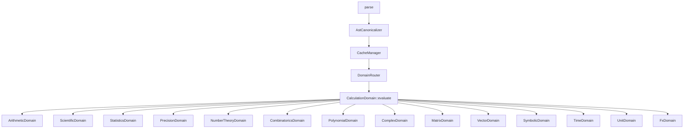
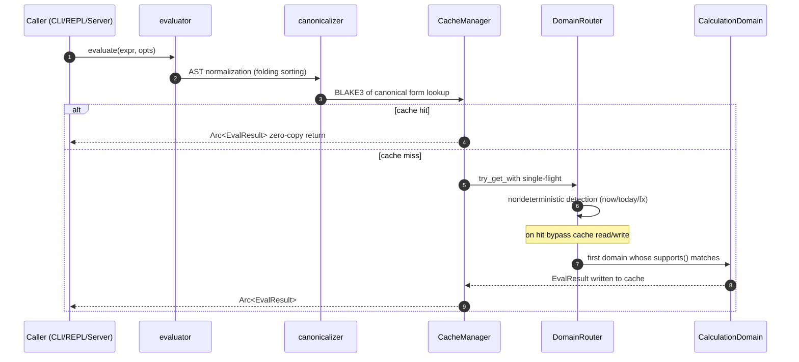

<div align="center">


[](https://github.com/kirky-x/calnexus/actions/workflows/ci.yml) [](https://crates.io/crates/calnexus) [](https://docs.rs/calnexus) [](https://crates.io/crates/calnexus) [](LICENSE) [](https://www.rust-lang.org/) [-brightgreen)](https://github.com/kirky-x/calnexus)

[中文](README.md) | **English**

**Production-grade command-line math expression evaluator in Rust — 14 computation domains behind one entry point**

[✨ Features](#-features) • [🚀 Quick Start](#-quick-start) • [📚 Documentation](#-documentation) • [💻 Examples](#-examples) • [🤝 Contributing](#-contributing)

</div>

---

<div align="center" style="padding: 32px; margin: 24px 0">

### 🎯 One parser, all of math

From arithmetic to symbolic calculus and numerical linear algebra, unified behind a single parser and a priority-routed domain dispatcher:

<table style="width:100%; border-collapse: collapse">
<tr>
<td align="center" width="25%" style="padding: 12px">🧮<br><b>14 Computation Domains</b><br><span style="color:#64748B">11 core + 3 optional priority routing</span></td>
<td align="center" width="25%" style="padding: 12px">🧠<br><b>Symbolic Calculus</b><br><span style="color:#64748B">diff integrate simplify limit taylor</span></td>
<td align="center" width="25%" style="padding: 12px">⚡<br><b>High-Performance Cache</b><br><span style="color:#64748B">single-flight zero-copy hits</span></td>
<td align="center" width="25%" style="padding: 12px">🌐<br><b>HTTP + MCP Dual Protocol</b><br><span style="color:#64748B">REST service AI client integration</span></td>
</tr>
</table>

</div>

---

## 📋 Table of Contents

<details open>
<summary>📑 Table of Contents</summary>

- [✨ Features](#-features)
- [🚀 Quick Start](#-quick-start)
- [🎨 Feature Flags](#-feature-flags)
- [📚 Documentation](#-documentation)
- [💻 Examples](#-examples)
- [🌐 Server Mode](#-server-mode)
- [🏗️ Architecture](#️-architecture)
- [🧪 Testing](#-testing)
- [📊 Performance](#-performance)
- [🔒 Security](#-security)
- [🗺️ Roadmap](#️-roadmap)
- [🤝 Contributing](#-contributing)
- [📋 Changelog](#-changelog)
- [📄 License](#-license)
- [🙏 Acknowledgments](#-acknowledgments)
- [📞 Contact & Support](#-contact--support)
- [⭐ Star History](#-star-history)

</details>

---

## ✨ Features

<table style="width:100%; border-collapse: collapse">
<tr>
<td width="50%" style="vertical-align:top; padding: 12px">🧮 <b>11 Core Domains + 3 Optional</b><br><span style="color:#64748B">Arithmetic, scientific functions, statistics, precision, number theory, combinatorics, polynomial, complex, matrix, vector, symbolic calculus; optional: time / unit / fx (feature-gated)</span></td>
<td width="50%" style="vertical-align:top; padding: 12px">🧠 <b>Symbolic Calculus</b><br><span style="color:#64748B"><code>diff</code>, <code>integrate</code>, <code>simplify</code>, <code>limit</code>, <code>taylor</code></span></td>
</tr>
<tr>
<td width="50%" style="vertical-align:top; padding: 12px">🔢 <b>Arbitrary Precision</b><br><span style="color:#64748B"><code>precision(N, expr)</code> BigRational-based arbitrary precision</span></td>
<td width="50%" style="vertical-align:top; padding: 12px">📐 <b>Numerical Linear Algebra</b><br><span style="color:#64748B"><code>lu</code>, <code>qr</code>, <code>eig</code>, <code>svd</code>, <code>solve</code> (<code>numerical</code> feature, nalgebra f64 approximation)</span></td>
</tr>
<tr>
<td width="50%" style="vertical-align:top; padding: 12px">🖥️ <b>Three Execution Modes</b><br><span style="color:#64748B">Single expression, REPL (Tab completion + variable binding), parallel batch (rayon)</span></td>
<td width="50%" style="vertical-align:top; padding: 12px">⚡ <b>High-Performance Cache</b><br><span style="color:#64748B">oxcache sync byte-weight cache (64MB byte budget + 256KB large-result admission threshold), single-pass BLAKE3 keys, <code>try_get_with</code> production single-flight dedup</span></td>
</tr>
<tr>
<td width="50%" style="vertical-align:top; padding: 12px">🌐 <b>HTTP + MCP Dual Protocol</b><br><span style="color:#64748B">REST API, health probes, metrics export, graceful shutdown; MCP stdio server for AI clients</span></td>
<td width="50%" style="vertical-align:top; padding: 12px">✖️ <b>Implicit Multiplication</b><br><span style="color:#64748B">Auto-recognition of math idioms like <code>2x</code>, <code>3(x+1)</code></span></td>
</tr>
<tr>
<td width="50%" style="vertical-align:top; padding: 12px">🗂️ <b>Versioned JSON Contract</b><br><span style="color:#64748B"><code>--json</code> emits a versioned structure (<code>"v":1</code>, with JSON Schema) for pipeline integration</span></td>
<td width="50%" style="vertical-align:top; padding: 12px">🧱 <b>Zero-Dependency Core</b><br><span style="color:#64748B"><code>default = []</code> — usable as an embedded computation engine by other crates</span></td>
</tr>
</table>

Beyond the core capabilities listed above, LaTeX / steps / canonical formatters, bilingual (EN/ZH) error messages via ICU4X, a runtime function catalog (`--list-functions`), multi-platform prebuilt binaries, and container images are also available; see the [🎨 Feature Flags](#-feature-flags) section for the full mapping to `Cargo.toml`'s `[features]`.

---

## 🚀 Quick Start

### 📦 Installation

```bash
cargo install calnexus --features cli
```

Requires Rust 1.97.1 or later (MSRV, matching the CI MSRV job). The core library has `default = []` with zero dependencies; enable `cli` for the command-line experience.

| Combo | Install | Use case |
|-------|---------|----------|
| Minimal library | `cargo add calnexus` | Embedded computation engine, zero extra deps |
| CLI | `cargo install calnexus --features cli` | Everyday CLI evaluation / REPL / batch |
| CLI + all domains | `cargo install calnexus --features cli,time,unit,fx` | Adds time / unit / fx domains |
| CLI + numerical | `cargo install calnexus --features cli,numerical` | Numerical linear algebra |
| HTTP server | `cargo install calnexus --features server` | REST + MCP dual-protocol service |

Prebuilt multi-platform binaries (linux x86_64/aarch64 musl static, macOS x86_64/aarch64, windows x86_64, with SHA256SUMS) are available from [GitHub Releases](https://github.com/kirky-x/calnexus/releases), or build from source:

```bash
git clone https://github.com/kirky-x/calnexus.git
cd calnexus
cargo install --path . --features cli
```

### 💡 Minimal Example

```bash
$ calnexus '2+3*4'
14

$ calnexus 'diff(x^2, x)'
2*x

$ calnexus --json '2+3'
{"cache":"miss","domain":"arithmetic","result":5.0,"v":1}
```

### 🧭 Core Concepts

- **Domain routing**: each of the 14 computation domains implements the `CalculationDomain` trait; `DomainRouter` dispatches by priority — the first `supports()` hit wins.
- **Evaluation pipeline**: `parse → canonicalize → cache → route → evaluate`; the BLAKE3 hash of the canonicalized AST is the cache key.
- **Three modes**: single expression, REPL (`:let` / `:vars` / `:quit`, Tab completion), batch (`--batch`, rayon-parallel).
- **Feature gating**: optional domains and server capabilities are independent features; builds contain only what you enable, and the core library can be zero-dependency.
- **Versioned JSON contract**: `--json` output carries `"v":1`; see [`docs/schema/result-v1.json`](docs/schema/result-v1.json) for the schema.

---

## 🎨 Feature Flags

### 📦 Recommended Combos

| Combo | Features | Use case |
|-------|----------|----------|
| Minimal library | `default = []` | Embedded engine, zero extra deps |
| CLI | `cli` | Command line / REPL / batch |
| CLI + all domains | `cli` + `time` + `unit` + `fx` | Adds the three optional domains |
| CLI + numerical | `cli` + `numerical` | Numerical linear algebra |
| Bilingual CLI | `cli` + `icu` | ICU4X localized error messages |
| HTTP server | `server` | REST + MCP service |
| Production server | `server` + `ratelimit` + `observability` | Rate limiting + structured logs |
| Full | `--all-features` | Everything |

### 📋 Feature Matrix

The table below mirrors `Cargo.toml`'s `[features]` definition; `default = []`.

<table style="width:100%; border-collapse: collapse">
<tr><th style="text-align:left">Feature</th><th style="text-align:center">Default</th><th style="text-align:left">Description</th></tr>
<tr><td colspan="3" style="background:#F8FAFC"><b>Core library</b></td></tr>
<tr><td><code>default</code></td><td align="center">✅</td><td>Zero-dependency core: parsing, canonicalization, 14-domain routing, cache — usable as an embedded engine</td></tr>
<tr><td><code>icu</code></td><td align="center">❌</td><td>ICU4X internationalized error messages (EN/ZH)</td></tr>
<tr><td colspan="3" style="background:#F8FAFC"><b>CLI & interaction</b></td></tr>
<tr><td><code>cli</code></td><td align="center">❌</td><td>CLI / REPL / batch (clap, rustyline, rayon; enabled indirectly via sdforge/cli)</td></tr>
<tr><td colspan="3" style="background:#F8FAFC"><b>Optional computation domains</b></td></tr>
<tr><td><code>time</code></td><td align="center">❌</td><td>Time domain: jiff 0.2 with bundled IANA tzdb, 14 functions</td></tr>
<tr><td><code>unit</code></td><td align="center">❌</td><td>Physical unit conversion domain: 8 dimensions + affine temperature</td></tr>
<tr><td><code>fx</code></td><td align="center">❌</td><td>Currency conversion domain: frankfurter.dev API + 3-level cache + network circuit breaker</td></tr>
<tr><td><code>numerical</code></td><td align="center">❌</td><td>Numerical linear algebra decompositions (lu/qr/eig/svd/solve/matrix_exp, nalgebra f64)</td></tr>
<tr><td colspan="3" style="background:#F8FAFC"><b>Server</b></td></tr>
<tr><td><code>http</code></td><td align="center">❌</td><td>HTTP API (sdforge http/graceful/health/context, axum)</td></tr>
<tr><td><code>mcp</code></td><td align="center">❌</td><td>MCP stdio server (sdforge/mcp)</td></tr>
<tr><td><code>server</code></td><td align="center">❌</td><td>Aggregates <code>http</code> + <code>mcp</code></td></tr>
<tr><td><code>ratelimit</code></td><td align="center">❌</td><td>HTTP rate-limiting middleware (fixed window per-IP, <code>CALNEXUS_RATELIMIT_*</code> configurable, probes exempt)</td></tr>
<tr><td><code>docs</code></td><td align="center">❌</td><td>OpenAPI + Swagger UI (<code>/swagger-ui</code>)</td></tr>
<tr><td><code>observability</code></td><td align="center">❌</td><td>tracing structured logs (EnvFilter consuming <code>RUST_LOG</code>)</td></tr>
</table>

---

## 📚 Documentation

| Document | Description |
|----------|-------------|
| [📖 User Guide](docs/USER_GUIDE.md) | Complete tutorial from installation to advanced usage |
| [📘 API Reference](docs/API_REFERENCE.md) | Expression evaluation API and direct API (`CalNexus` facade) |
| [🏗️ Architecture](docs/ARCHITECTURE.md) | Design principles, module layout, and data flow |
| [📈 Performance Guide](docs/PERFORMANCE.md) | Benchmark data, measurement methodology, and tuning tips |
| [🔒 Security](docs/SECURITY.md) | Security design, best practices, and vulnerability handling |
| [❓ FAQ](docs/FAQ.md) | Frequently asked questions |
| [🖥️ Server Guide](docs/SERVER.md) | HTTP deployment, observability, and MCP integration |
| [📋 Changelog](docs/CHANGELOG.md) | Release notes for every version |
| [🤝 Contributing](docs/CONTRIBUTING.md) | How to contribute to the project |
| [📦 Online API docs](https://docs.rs/calnexus) | Latest docs.rs-generated documentation |
| [📦 crates.io](https://crates.io/crates/calnexus) | Publication page |

Design & process documents: [Code of Conduct](docs/CODE_OF_CONDUCT.md) · [archived process documents](docs/archive/) (PRD, research analysis)

---

## 💻 Examples

### 🧭 Usage Scenarios

| Scenario | Command | Description |
|----------|---------|-------------|
| Single expression | `calnexus '2+3*4'` | Quick evaluation |
| Variable binding | `calnexus --var x=3 'x^2 + 2*x + 1'` | Pre-bound variables |
| Interactive exploration | `calnexus --repl` | REPL with Tab completion and `:let` |
| Batch processing | `calnexus --batch exprs.txt` | rayon-parallel, per-line output and summary |
| Pipeline integration | `calnexus --json '2+3'` | Versioned JSON structure |

### 🖥️ Evaluation Examples

```bash
# Basics and scientific functions
$ calnexus 'sin(pi/2)'
1
$ calnexus 'gcd(12, 18)'
6

# Arbitrary precision (BigRational)
$ calnexus 'precision(50, 1/3)'
0.33333333333333333333333333333333333333333333333333

# Symbolic calculus
$ calnexus 'limit(sin(x)/x, x, 0)'
1
$ calnexus 'taylor(exp(x), x, 3)'
1+x+0.5*x^2+0.16666666666666666*x^3

# Implicit multiplication
$ calnexus --var x=3 '2x'
6
```

REPL session:

```text
$ calnexus --repl
CalNexus REPL — type :help for commands, :quit to exit
calnexus> :let x = 10
calnexus> x*2
= 20  [arithmetic]
calnexus> diff(x^2, x)
= 2*x  [symbolic]
calnexus> :quit
bye
```

Batch processing:

```text
$ calnexus --batch exprs.txt
line 1: 2+3 = 5  [arithmetic]
line 2: sin(0) = 0  [scientific]
line 4: diff(x^2, x) = 2*x  [symbolic]
summary: 3 total, 3 ok, 0 errors, 0 cache hits, 1.2ms
```

> For the full tutorial (all output formats, optional domain usage, environment variables, exit-code conventions) see the [📖 User Guide](docs/USER_GUIDE.md).

### 🧰 CLI Cheat Sheet

| Flag | Description |
|------|-------------|
| Positional `'2+3*4'` | Single expression evaluation |
| `--repl` | Starts an interactive REPL |
| `--batch <file>` | Parallel evaluation of each line in the file (rayon) |
| `--var x=3` | Pre-binds a variable (repeatable) |
| `--precision <N>` | Evaluates with N-digit precision (BigRational mode; use `precision(N, expr)` for full precision) |
| `--timeout <secs>` | Evaluation timeout (`CALNEXUS_TIMEOUT` env fallback) |
| `--cache-size <n>` | Cache entry budget (`CALNEXUS_CACHE_SIZE` fallback, approximated as entries × 4KB) |
| `--json` | Versioned JSON output (`"v":1`) |
| `--latex` / `--canonical` / `--steps` | LaTeX / canonical form / solving steps output (mutually exclusive with `--json` etc.) |
| `--explain` | Detailed error explanations (mutually exclusive with `--json`) |
| `--lang <en\|zh>` | Error message language (default: `en`) |
| `--list-functions` | Prints the function catalog of the current build |
| `--serve-http` / `--serve-mcp` | Starts the HTTP / MCP server (requires `server`) |
| `--bind <addr>` | Server bind address (`CALNEXUS_BIND_ADDR` fallback) |

The full set of flags is available via `calnexus --help`.

---

## 🌐 Server Mode

Requires `--features server` (`server = http + mcp`). Provides a REST API and operational endpoints:

```bash
calnexus --serve-http                    # default 127.0.0.1:3000
calnexus --serve-http --bind 0.0.0.0:8080
```

| Endpoint | Method | Description |
|----------|--------|-------------|
| `/api/v1/evaluate` | POST | Expression evaluation (JSON request/response) |
| `/api/v1/list_functions` | POST | Runtime function catalog (feature-gated domain visibility included) |
| `/health` | GET | Comprehensive health check (includes L1 cache status) |
| `/live` | GET | Liveness probe (pure process-alive semantics) |
| `/ready` | GET | Readiness probe (dependency-ready semantics) |
| `/metrics` | GET | Metrics export (Prometheus text, `?format=json` for JSON) |

**Language negotiation**: request bodies accept an optional `lang` field (BCP-47, e.g. `"en"` / `"zh-CN"`). Missing or unknown values fall back to English (the protocol default); `"zh"` switches human-readable content (error messages, FX risk note) to Chinese while machine-readable fields keep the English contract:

```bash
curl -X POST localhost:3000/api/v1/evaluate -H 'content-type: application/json' \
  -d '{"expr": "foo + 1", "lang": "zh"}'
# → {"type":"InvalidInput","message":"求值错误: 未绑定变量: foo",...}
```

**MCP server**: `calnexus --serve-mcp` exposes `evaluate` and `list_functions` tools over stdio (the `fx` build additionally registers `fx_budget` / `fx_pricing`), ready for Claude Desktop, Cursor, and other MCP clients — client configuration in the [🖥️ Server Guide](docs/SERVER.md).

**Error semantics (SLO-friendly)**: 400 `InvalidInput` (parse/evaluation failure), 422 `ValidationError` (request-body limit violations, rejected before evaluation), 503 `ServiceUnavailable` (timeout or fx upstream unreachable, with `Retry-After`); CLI exit codes: 1 = evaluation error, 2 = usage error, 3 = timeout/unavailable.

Optional feature enhancements:

| Feature | Description |
|---------|-------------|
| `ratelimit` | HTTP rate-limiting middleware (fixed window per-IP; `CALNEXUS_RATELIMIT_LIMIT` default 120, `CALNEXUS_RATELIMIT_WINDOW_SECS` default 60, probes/metrics exempt) |
| `docs` | Swagger UI (`/swagger-ui`, OpenAPI documentation) |
| `observability` | OpenTelemetry-style observability (tracing + `RUST_LOG`) |

Graceful shutdown is built into the `http` feature (SIGTERM/Ctrl+C → drain up to 30s → force abort; K8s `terminationGracePeriodSeconds` should be ≥ 45). See the [🖥️ Server Guide](docs/SERVER.md) for operational details.

```bash
# Enable all HTTP enhancements
cargo build --release --features server,ratelimit,docs,observability
```

---

## 🏗️ Architecture

CalNexus uses a five-layer architecture (entry → orchestration → computation domains → math functions → core infrastructure) with strictly top-down dependencies; with no features enabled the core library is dependency-free and embeddable. The core evaluation path: mathexpr parsing (implicit multiplication and complex preprocessing) → `AstCanonicalizer` normalization (constant folding, commutative sorting, S-expression canonical form) → `CacheManager` lookup (single-pass BLAKE3 key) → `DomainRouter` priority dispatch → the matching `CalculationDomain` evaluates.


```mermaid
graph TD
    A[parse] --> B[AstCanonicalizer]
    B --> C[CacheManager]
    C --> D[DomainRouter]
    D --> E[CalculationDomain::evaluate]
    E --> F[ArithmeticDomain]
    E --> G[ScientificDomain]
    E --> H[StatisticsDomain]
    E --> I[PrecisionDomain]
    E --> J[NumberTheoryDomain]
    E --> K[CombinatoricsDomain]
    E --> L[PolynomialDomain]
    E --> M[ComplexDomain]
    E --> N[MatrixDomain]
    E --> O[VectorDomain]
    E --> P[SymbolicDomain]
    E --> Q[TimeDomain]
    E --> R[UnitDomain]
    E --> S[FxDomain]
```

Core module notes:

- **Parser**: mathexpr-based, with implicit multiplication and complex number preprocessing
- **Canonicalizer**: constant folding, commutative sorting, S-expression canonical form
- **Cache**: oxcache `byte-weight` sync byte-weight cache (default 64MB byte budget, configurable via `--cache-size`; `try_get_with` production single-flight; results >256KB not cached)
- **Router**: priority-sorted domain dispatch (first `supports()` wins)

> For the full module layout and dependency rules see the [🏗️ Architecture Document](docs/ARCHITECTURE.md).

### 🔄 Core Flow

The sequence diagram below shows the real execution path of a single evaluation (see `src/core/evaluator.rs` and `src/core/cache.rs`):


```mermaid
sequenceDiagram
    autonumber
    participant App as Caller (CLI/REPL/Server)
    participant E as evaluator
    participant C as canonicalizer
    participant K as CacheManager
    participant R as DomainRouter
    participant D as CalculationDomain

    App->>E: evaluate(expr, opts)
    E->>C: AST normalization (folding sorting)
    C->>K: BLAKE3 of canonical form lookup
    alt cache hit
        K-->>App: Arc<EvalResult> zero-copy return
    else cache miss
        K->>R: try_get_with single-flight
        R->>R: nondeterministic detection (now/today/fx)
        Note over R: on hit bypass cache read/write
        R->>D: first domain whose supports() matches
        D-->>K: EvalResult written to cache
        K-->>App: Arc<EvalResult>
    end
```

Under concurrency, multiple requests for the same expression collapse into a single real evaluation via `try_get_with` (single-flight); the waiters share the same `Arc<EvalResult>`.

---

## 🧪 Testing

### 🎯 Test Strategy

| Layer | Location / Tooling | Description |
|-------|--------------------|-------------|
| Unit tests | inline `#[cfg(test)]` modules in `src/` | Core logic per module and feature gate |
| Integration tests | `tests/` (integration, cli_integration, repl_integration, server_http_integration, server_mcp_integration, api_integration, time_unit_fx_integration) | assert_cmd subprocess, expectrl interactive, tower oneshot |
| Property tests | `tests/property_tests.rs` (proptest) | Randomized invariant verification |
| Snapshot tests | `tests/snapshot_tests.rs` (insta) | Snapshots of every CLI-reachable output variant |
| Security tests | `tests/security_tests.rs` | DoS vectors and boundary attacks |
| Fuzz testing | `fuzz/` (7 cargo-fuzz targets) | parser, ast_depth, list_depth, canonicalizer, cache_key, numeric_boundary, matrix_dim |
| Benchmarks | `benches/` (4 Criterion suites) | parser, cache, domain, api |
| Doc tests | rustdoc examples of public APIs | Run with `cargo test` |

### ▶️ Run Commands (matching CI)

```bash
# Full test run (CI matrix has six legs: cli / cli,time,unit,fx / cli,server / cli,server,fx / cli,numerical / all)
cargo test --all-features

# Per-leg runs
cargo test --features cli,time,unit,fx    # full suite with optional domains
cargo test --features server              # HTTP/MCP integration
cargo test --features "cli,numerical"     # numerical linear algebra

# Lint and format gates (clippy matrix: cli / cli,server / all)
cargo clippy --all-features --all-targets -- -D warnings
cargo fmt --all -- --check

# Coverage gate: at least 90% line coverage (llvm-cov)
cargo llvm-cov --features "cli,time,unit,fx" --fail-under-lines 90 --summary-only

# Benchmarks
cargo bench --features cli

# Fuzz testing (from the fuzz/ directory)
cargo fuzz run parser
```

### 📊 Test Scale

> Counts are grep statistics of `#[test]` / `#[tokio::test]` functions. Per-suite numbers drift over time; the authoritative count is `grep -rE "#\[(tokio::)?test\]" src/ tests/ | wc -l`.

| Category | Count |
|----------|-------|
| Unit tests (inline in `src/`) | 2432 |
| Integration & E2E (`tests/`) | 388 |
| Fuzz targets | 7 |
| Criterion benchmark suites | 4 |

The coverage gate is at least 90% line coverage (llvm-cov, measured with `--features cli,time,unit,fx`; currently 90.4%), enforced in CI.

---

## 📊 Performance

> Methodology in the [📈 Performance Guide](docs/PERFORMANCE.md): baselines were collected locally on a development machine (WSL2, linux 6.6); values are criterion median estimates. Real-world performance depends on expression complexity and hardware — reproduce with `cargo bench --features cli`.

<table style="width:100%; border-collapse: collapse">
<tr><th style="text-align:left">Path</th><th style="text-align:left">Case</th><th style="text-align:left">Time</th></tr>
<tr><td>Cache hit</td><td><code>cache_hit / 2+3</code></td><td>≈ 1.29 µs</td></tr>
<tr><td>Cache hit</td><td><code>cache_hit / sin(1.5)+cos(0.5)</code></td><td>≈ 3.4 µs</td></tr>
<tr><td>Full pipeline</td><td><code>cache_miss / 2+3</code> (parse+canonicalize+evaluate+insert)</td><td>≈ 13.1 µs</td></tr>
<tr><td>Full pipeline</td><td><code>cache_miss / matrix([[1,2],[3,4]])</code></td><td>≈ 15.9 µs</td></tr>
<tr><td>Parsing</td><td><code>parser / 2+3</code></td><td>≈ 286 ns</td></tr>
<tr><td>Parsing</td><td><code>parser / sum([1,2,3,4,5])</code></td><td>≈ 2.0 µs</td></tr>
<tr><td>Canonicalization</td><td><code>canonicalizer / x^2+2*x+1</code></td><td>≈ 417 ns</td></tr>
</table>

Performance design points: cache hits return `Arc<EvalResult>` zero-copy with no JSON serialization or temporary runtime on the hot path; `try_get_with` single-flight ensures concurrent identical expressions are evaluated exactly once; the byte-weight budget (default 64MB) plus the 256KB large-result admission threshold keep the cache bounded; nondeterministic functions (`now` / `today` / `fx`) bypass the cache to avoid result pollution. For tuning advice see the [📈 Performance Guide](docs/PERFORMANCE.md).

---

## 🔒 Security

### 🛡️ Security Design

CalNexus is an evaluator with no network access (except the `fx` upstream), no untrusted file I/O, and no plugin loading — the practical attack surface is minimal. Active defenses include: a closed loop of recursion-depth protections (`MAX_AST_DEPTH=256` + iterative pre-check before mathexpr + RAII guard for bracket literals, closing the nested list/matrix-literal bypass), request resource limits (expr ≤ 4096 chars, vars ≤ 1024 keys, precision ≤ 10000 digits), parser error sanitization (no internal parser structures leak), fx upstream hardening (`https_only`, 1MB response cap, atomic 0600 disk cache), and tri-class error semantics that strictly separate client errors from server/upstream failures. Code-level details in the [🏗️ Architecture Document](docs/ARCHITECTURE.md); hardening best practices and the vulnerability process in the [🔒 Security Document](docs/SECURITY.md).

### ⛓️ Supply Chain & Gates

- `cargo audit`: RustSec advisory scanning ([weekly scheduled workflow](https://github.com/kirky-x/calnexus/actions/workflows/audit.yml) + pre-release gate).
- `cargo deny check`: license, banned-dependency, and source checks (`deny.toml`).
- CodeQL static security analysis (weekly).
- 9 pre-commit hook checks: fmt, clippy (deny warnings), full test run, zero-warning release build, copyright headers, debug prints, TODO/FIXME, Cargo.lock tracking, file size.

### 🚨 Reporting a Vulnerability

Please do **not** report security vulnerabilities through public issues. Email **security@calnexus.dev** for private disclosure. We commit to acknowledging within 48 hours and providing an initial assessment within 7 days. Full policy in [SECURITY.md](docs/SECURITY.md).

---

## 🗺️ Roadmap

<table style="width:100%; border-collapse: collapse">
<tr><th style="text-align:center">Status</th><th style="text-align:left">Direction</th><th style="text-align:left">Items</th></tr>
<tr><td align="center">✅</td><td>Core engine (v0.1.0)</td><td>11 computation domains, symbolic calculus, REPL, batch processing, arbitrary precision, JSON output, implicit multiplication</td></tr>
<tr><td align="center">✅</td><td>Optional domains & server (v0.1.3-v0.1.5)</td><td>Time / unit / fx domains, HTTP + MCP dual protocol, probe separation, rate limiting, observability, multi-platform releases & container images</td></tr>
<tr><td align="center">✅</td><td>Cache engine modernization</td><td>Direct moka::sync, single-flight, byte-weight budget, BLAKE3 keys, large-result admission threshold</td></tr>
<tr><td align="center">🚧</td><td>WebAssembly (wasm32) support</td><td><code>tokio::rt</code> (pulled in by server) does not support wasm32; the CLI-only shape is theoretically buildable but unverified. Until then wasm32 builds are <strong>not CI-gated and not guaranteed</strong>: <code>cargo build --target wasm32-unknown-unknown --no-default-features</code></td></tr>
<tr><td align="center">📋</td><td>Numerical capability growth</td><td>Frontier-algorithm tracking and gap closure (see the <a href="docs/archive/RESEARCH_ANALYSIS.md">research analysis</a>)</td></tr>
</table>

---

## 🤝 Contributing

For the detailed workflow and coding standards see the [🤝 Contributing Guide](docs/CONTRIBUTING.md).

### 🛠️ Development Environment

| Item | Requirement |
|------|-------------|
| Toolchain | Rust 1.97.1+ (baseline pinned by the CI MSRV job) |
| Format & lint | `cargo fmt --all -- --check`, `cargo clippy --all-targets --all-features -- -D warnings` |
| Git hooks | `.githooks/pre-commit` (9 checks); enable with `git config core.hooksPath .githooks` |
| Commit messages | Conventional Commits (`feat`, `fix`, `docs`, etc.) |

### 💖 Ways to Contribute

<table style="width:100%; border-collapse: collapse">
<tr>
<td width="33%" align="center" style="padding: 16px">

### 🐛 Report a Bug

Found a problem?<br>
<a href="https://github.com/kirky-x/calnexus/issues/new">Open an Issue</a>

</td>
<td width="33%" align="center" style="padding: 16px">

### 💡 Suggest a Feature

Have an idea?<br>
<a href="https://github.com/kirky-x/calnexus/issues/new">Start a Discussion</a>

</td>
<td width="33%" align="center" style="padding: 16px">

### 🔧 Submit a PR

Want to contribute code?<br>
<a href="https://github.com/kirky-x/calnexus/pulls">Fork & Open a PR</a>

</td>
</tr>
</table>

When filing an issue, please include reproduction steps, your `calnexus` version, and OS information; for symbolic-calculus / precision bugs attach a minimal reproducing expression.

---

## 📋 Changelog

Full version history in the [📋 Changelog](docs/CHANGELOG.md) (following [Keep a Changelog](https://keepachangelog.com/en/1.1.0/), semantic versioning).

| Version | Date | Highlights |
|---------|------|------------|
| 0.1.4 | 2026-07-26 | Release pipeline closed loop: automated `cargo publish` + pre-release security gates (`cargo audit`, version verification, dry-run validation) |
| 0.1.3 | 2026-07-26 | Added time / unit / fx optional domains and 8 vector operations; nondeterministic function cache bypass |
| 0.1.2 | 2026-07-21 | 20 doc-code consistency fixes; parser & canonicalizer boundary fixes (NaN total order, `0^0`, consecutive-operator validation) |

---

## 📄 License

This project is open-sourced under the [MIT License](LICENSE).

---

## 🙏 Acknowledgments

### 🌟 Core Dependencies

CalNexus stands on the shoulders of these excellent open-source projects:

| Dependency | Purpose |
|------------|---------|
| [mathexpr](https://crates.io/crates/mathexpr) | Expression parsing foundation |
| [oxcache](https://crates.io/crates/oxcache) | In-house high-performance cache library (`byte-weight` sync byte-weight cache, wrapping moka::sync) |
| [clap](https://github.com/clap-rs/clap) | CLI argument parsing (indirect via sdforge/cli) |
| [rustyline](https://github.com/kkawakam/rustyline) | REPL line editing and Tab completion |
| [rayon](https://github.com/rayon-rs/rayon) | Data-parallel batch evaluation |
| [jiff](https://github.com/BurntSushi/jiff) | Date/time and IANA time zones (`time` feature) |
| [nalgebra](https://github.com/dimforge/nalgebra) | Numerical linear algebra (`numerical` feature) |
| [sdforge](https://crates.io/crates/sdforge) | CLI / HTTP / MCP interface facade |
| [criterion](https://github.com/bheisler/criterion.rs) | Benchmarking |

### 💝 Special Thanks

Thanks to the Rust community and all [contributors](https://github.com/kirky-x/calnexus/graphs/contributors).

---

## 📞 Contact & Support

<table style="width:100%; max-width: 600px">
<tr>
<td align="center" width="33%">
<a href="https://github.com/kirky-x/calnexus/issues"><b style="color:#991B1B">Issues</b></a><br>
<span style="color:#64748B">Report problems and bugs</span>
</td>
<td align="center" width="33%">
<a href="https://github.com/kirky-x/calnexus/discussions"><b style="color:#1E40AF">Discussions</b></a><br>
<span style="color:#64748B">Ask questions and share ideas</span>
</td>
<td align="center" width="33%">
<a href="https://github.com/kirky-x/calnexus"><b style="color:#1E293B">GitHub</b></a><br>
<span style="color:#64748B">Browse the source</span>
</td>
</tr>
</table>

---

## ⭐ Star History

[](https://star-history.com/#kirky-x/calnexus&Date)

If this project helps you, please consider giving it a ⭐️!

**Built by Kirky.X**

---

<sub>© 2026 Kirky.X. All rights reserved.</sub>
