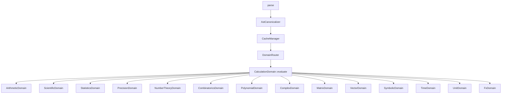

<a id="top"></a>

<p align="center">
  
</p>

<div align="center">

[](https://github.com/kirky-x/calnexus/releases) [](./LICENSE) [](https://github.com/kirky-x/calnexus) [-brightgreen)](https://github.com/kirky-x/calnexus)

</div>

<div align="center">

[中文](./README.md) | English

</div>

A command-line math expression evaluator with 11 core computation domains and 3 optional domains (time / unit / fx), symbolic calculus, REPL, and batch processing.

| Project Info | Value |
| --- | --- |
| Version | 0.1.4 |
| License | MIT |
| Author | Kirky.X |
| Repository | https://github.com/kirky-x/calnexus |

---

## Table of Contents

- [Overview](#overview)
- [Features](#features)
  - [11 Computation Domains](#11-computation-domains)
  - [Optional Domains](#optional-domains)
  - [Three Modes](#three-modes)
- [Architecture](#architecture)
- [Quick Start](#quick-start)
  - [Prerequisites](#prerequisites)
  - [Installation](#installation)
  - [Usage](#usage)
- [Configuration](#configuration)
- [API Documentation](#api-documentation)
- [Testing](#testing)
- [WebAssembly (wasm32) Support](#webassembly-wasm32-support)
- [Contributing](#contributing)
- [Roadmap](#roadmap)
- [License](#license)
- [Acknowledgments](#acknowledgments)

---

## Overview

**CalNexus** is a Rust-native command-line math expression evaluator that unifies 11 core computation domains — from arithmetic and statistics to symbolic calculus and linear algebra — plus 3 optional domains (time / unit / fx) behind a single parser and a priority-routed domain dispatcher. It offers three execution modes (single expression, interactive REPL, and parallel batch) with an LRU cache, arbitrary-precision arithmetic, and JSON output for pipeline integration.

### Use Cases

- Case A: Quick command-line evaluation and symbolic calculus (`calnexus 'diff(x^2, x)'`)
- Case B: Interactive exploration and variable binding (`calnexus --repl`, with Tab completion)
- Case C: Batch scripting (`calnexus --batch exprs.txt`, rayon-parallel)
- Case D: Embedding into data pipelines (`--json` structured output)

---

## Features

| Feature | Description |
| --- | --- |
| 11 core + 3 optional domains | Core: arithmetic, scientific functions, statistics, precision, number theory, combinatorics, polynomial, complex, matrix, vector, symbolic calculus; Optional: time / unit / fx (feature-gated) |
| Symbolic calculus | `diff`, `integrate`, `simplify`, `limit`, `taylor` |
| Arbitrary precision | `precision(N, expr)` BigRational-based arbitrary precision |
| Numerical linear algebra | `lu`, `qr`, `eig`, `svd`, `solve` (`numerical` feature, nalgebra f64 approximation) |
| Three modes | Single expression, REPL (Tab completion + variable binding), parallel batch (rayon) |
| High-performance cache | Direct moka::sync (64MB byte-weight budget + 256KB large-result admission threshold, single-pass BLAKE3 keys, try_get_with production single-flight dedup) |
| HTTP server | `--serve-http` REST service with health checks (`/health`), metrics export (`/metrics`), graceful shutdown |
| Implicit multiplication | Auto-recognition of math idioms like `2x`, `3(x+1)` |
| JSON output | `--json` emits a `result/domain/cache` structure for pipeline integration |
| Industrial-grade testing | 2820 tests (2432 inline lib + 388 integration), 90.4% line coverage (llvm-cov measured, CI gate >=90%), zero warnings across all feature combos |

### 11 Computation Domains

| Domain | Priority | Functions |
| --- | --- | --- |
| **Arithmetic** | 10 | `+`, `-`, `*`, `/`, `^`, `factorial`, `mod`, `abs` |
| **Scientific** | 20 | `sin`, `cos`, `tan`, `asin`, `acos`, `atan`, `ln`, `log10`, `log2`, `exp`, `sinh`, `cosh`, `tanh`, `gamma`, `erf` |
| **Statistics** | 20 | `mean`, `median`, `variance`, `std`, `sum`, `min`, `max`, `count` |
| **Precision** | 25 | `precision(N, expr)` — BigRational arbitrary precision |
| **NumberTheory** | 25 | `gcd`, `lcm`, `is_prime`, `prime_sieve`, `mod_inverse`, `mod_pow`, `euler_phi` |
| **Combinatorics** | 25 | `P`, `C`, `catalan`, `stirling` |
| **Polynomial** | 25 | `poly_add`, `poly_sub`, `poly_mul`, `poly_div`, `poly_eval`, `poly_diff`, `poly_integrate`, `roots`, `factor` |
| **Complex** | 30 | `complex(a,b)`, `conj`, `arg`, `abs`, `exp`, `ln` |
| **Matrix** | 30 | `det`, `transpose`, `inverse`, `identity`; numerical decompositions (`numerical` feature): `lu`/`qr`/`eig`/`svd`/`solve` |
| **Vector** | 30 | `dot`, `cross`, `norm`, `angle`, `normalize`, `scalar_triple`, `cosine_similarity`, `project`, `reflect`, `euclidean`, `manhattan`, `outer`, `lerp` + Hadamard product `[a,b]*[c,d]` |
| **Symbolic** | 30 | `diff`, `integrate`, `simplify`, `limit`, `taylor` |

### Optional Domains

The following 3 optional domains are gated by Cargo features and enabled with `--features time,unit,fx`:

| Domain | Feature | Functions | Notes |
| --- | --- | --- | --- |
| **TimeDomain** | `time` | `date` / `datetime` / `timestamp` / `from_timestamp` / `date_diff` / `date_add` / `parse_date` / `format_date` / `reformat_date` / `weekday` / `day_of_year` / `is_leap_year` / `now` / `today` | Built on jiff 0.2 with bundled IANA tzdb; supports cross-timezone date/time construction, arithmetic intervals, and multi-format auto-recognition (ISO 8601 / Chinese / English month names). `now` / `today` are nondeterministic and bypass the L1 cache on every evaluation. |
| **UnitDomain** | `unit` | `convert(value, "from", "to")` | Linear conversion across 8 dimensions (length / mass / volume / area / speed / data / time) plus affine temperature conversion (C/F/K/R). Unknown units receive Levenshtein ≤2 suggestions. |
| **FxDomain** | `fx` | `fx(value, "FROM", "TO")` / `fx_rate("FROM", "TO")` | Pulls European Central Bank reference rates from the frankfurter.dev open API with a 3-level cache (memory → file → network) plus a network circuit breaker (fast-fail after consecutive failures). Honors `CALNEXUS_FX_TTL_HOURS` (default 24), `CALNEXUS_FX_ALLOW_STALE` (whether to serve a stale snapshot on network failure) and `CALNEXUS_FX_BREAKER_THRESHOLD` / `CALNEXUS_FX_BREAKER_COOLDOWN_SECS` (breaker threshold / cooldown, default 3 / 30 s). `fx` / `fx_rate` are nondeterministic and bypass the cache. |

Enabling:

```bash
# Enable all optional domains
cargo build --release --features cli,time,unit,fx

# Enable only the time domain
cargo build --features time
```

> Exchange-rate data is sourced from frankfurter.dev (ECB reference rates) and is provided for reference only — not for trading decisions.

### Three Modes

1. **Single expression** — `calnexus '2+3*4'`
2. **REPL** — `calnexus --repl` (interactive, with Tab completion and variable binding)
3. **Batch** — `calnexus --batch exprs.txt` (parallel evaluation with rayon)

### HTTP Server Mode

Requires `--features server`. Provides REST API and operational endpoints:

```bash
calnexus --serve-http
```

| Endpoint | Method | Description |
| --- | --- | --- |
| `/api/v1/evaluate` | POST | Expression evaluation (JSON request/response) |
| `/health` | GET | Comprehensive health check (includes L1 cache status) |
| `/live` | GET | Liveness probe |
| `/ready` | GET | Readiness probe |
| `/metrics` | GET | Cache metrics export (Prometheus format by default, `?format=json` for JSON) |

**Language negotiation**: the `evaluate`, `fx_budget` and `fx_pricing` request bodies accept an optional `lang` field (BCP-47 tag, e.g. `"en"`/`"zh-CN"`). Missing or unknown values fall back to English (the protocol default); `"zh"` switches human-readable content (error messages, FX risk note) to Chinese while machine-readable fields (`type` protocol names) keep the English contract. MCP tool arguments support the same `lang` field.

```bash
curl -X POST localhost:8080/api/v1/evaluate -H 'content-type: application/json' \
  -d '{"expr": "foo + 1", "lang": "zh"}'
# → {"type":"InvalidInput","message":"求值错误: 未绑定变量: foo",...}
```

Optional feature enhancements:

| Feature | Description |
| --- | --- |
| `ratelimit` | HTTP rate limiting middleware (sdforge `RateLimitLayer` + fixed-window policy; `CALNEXUS_RATELIMIT_LIMIT` default 120, `CALNEXUS_RATELIMIT_WINDOW_SECS` default 60, probes/metrics exempt) |
| `docs` | Swagger UI (`/swagger-ui`, OpenAPI documentation) |
| `observability` | OpenTelemetry observability (tracing integration) |

Graceful shutdown is built into the `http` feature (based on sdforge `graceful`: SIGTERM/Ctrl+C → drain up to 30s → force abort, K8s terminationGracePeriod semantics).

```bash
# Enable all HTTP enhancements
cargo build --release --features cli,server,ratelimit,observability
```

---

## Architecture


```mermaid
graph TD
    A[parse] --> B[AstCanonicalizer]
    B --> C[CacheManager]
    C --> D[DomainRouter]
    D --> E[CalculationDomain::evaluate]
    E --> F[ArithmeticDomain]
    E --> G[ScientificDomain]
    E --> H[StatisticsDomain]
    E --> I[PrecisionDomain]
    E --> J[NumberTheoryDomain]
    E --> K[CombinatoricsDomain]
    E --> L[PolynomialDomain]
    E --> M[ComplexDomain]
    E --> N[MatrixDomain]
    E --> O[VectorDomain]
    E --> P[SymbolicDomain]
    E --> Q[TimeDomain]
    E --> R[UnitDomain]
    E --> S[FxDomain]
```

Core module notes:

- **Parser**: mathexpr-based, with implicit multiplication and complex number preprocessing
- **Canonicalizer**: constant folding, commutative sorting, S-expression canonical form
- **Cache**: direct moka::sync (default 64MB byte-weight budget, configurable via `--cache-size` at entries×4KB approximation; `try_get_with` production single-flight; results >256KB not cached)
- **Router**: Priority-sorted domain dispatch (first `supports()` wins)

---

## Quick Start

### Prerequisites

Ensure your environment meets the following requirements before running this project:

| Dependency | Version | Notes |
| --- | --- | --- |
| Rust | >= 1.97.1 | Toolchain (install via `rustup` recommended) |
| Cargo | bundled with Rust | Build and package manager |
| `cli` feature | optional | Enables CLI / REPL / batch (includes `clap`, `rustyline`, `rayon`) |
| `numerical` feature | optional | Enables numerical linear algebra decomposition (`lu`/`qr`/`eig`/`svd`/`solve`, includes `nalgebra`) |

### Installation

**Option 1: crates.io (recommended)**

```bash
cargo install calnexus --features cli
```

**Option 2: prebuilt binaries**

Download the archive for your platform (linux x86_64/aarch64 musl static,
macOS x86_64/aarch64, windows x86_64) from
[GitHub Releases](https://github.com/kirky-x/calnexus/releases),
verify the SHA256 checksum, and extract it into your PATH.

**Option 3: from source**

```bash
git clone https://github.com/kirky-x/calnexus.git
cd calnexus

# Install to ~/.cargo/bin
cargo install --path . --features cli

# Or build locally only
cargo build --release --features cli
```

### Usage

#### Single Expression

```bash
$ calnexus '2+3*4'
14

$ calnexus 'sin(pi/2)'
1

$ calnexus 'gcd(12, 18)'
6

$ calnexus 'factorial(5)'
120

$ calnexus --var x=3 'x^2 + 2*x + 1'
16
```

#### Arbitrary Precision

```bash
$ calnexus --precision 50 '1/3'
0.33333333333333331482961625624739099293947219848632
```

#### JSON Output

```bash
$ calnexus --json '2+3'
{"result":5,"domain":"arithmetic","cache":"miss"}
```

#### Symbolic Calculus

```bash
$ calnexus 'diff(x^2, x)'
2*x

$ calnexus 'simplify(x+0)'
x

$ calnexus 'limit(sin(x)/x, x, 0)'
1

$ calnexus 'taylor(exp(x), x, 3)'
1+x+0.5*x^2+0.16666666666666666*x^3
```

#### Numerical Linear Algebra

Requires compiling with `--features numerical` (`cargo build --release --features cli,numerical`). Five numerical decompositions return JSON (`lu`/`qr`/`eig`/`svd`) or a vector (`solve`); results are nalgebra f64 approximations:

```bash
$ calnexus 'solve([[2,1],[1,3]],[3,5])'
[0.8,1.4]

$ calnexus 'lu([[4,3],[6,3]])'
{"L":[[1.0,0.0],[0.6666666666666666,1.0]],"P":[[0.0,1.0],[1.0,0.0]],"U":[[6.0,3.0],[0.0,1.0]]}

$ calnexus 'eig([[2,1],[1,2]])'
{"values":[1.0,3.0],"vectors":[[-0.7071067811865475,0.7071067811865475],[0.7071067811865475,0.7071067811865475]]}
```

> `precision(N, ...)` does not apply to these functions (f64 approximations); wrapping yields an explicit error.

#### REPL Mode

```bash
$ calnexus --repl
CalNexus REPL — type :help for commands, :quit to exit
calnexus> :let x = 10
calnexus> x*2
= 20  [arithmetic]
calnexus> diff(x^2, x)
= 2*x  [symbolic]
calnexus> :vars
x = 10
calnexus> :quit
bye
```

REPL commands: `:let` binds a variable, `:vars` lists variables, `:quit` exits.

#### Batch Processing

```bash
$ cat exprs.txt
2+3
sin(0)
# This is a comment
diff(x^2, x)

$ calnexus --batch exprs.txt
line 1: 2+3 = 5  [arithmetic]
line 2: sin(0) = 0  [scientific]
line 4: diff(x^2, x) = 2*x  [symbolic]
summary: 3 total, 3 ok, 0 errors, 0 cache hits, 1.2ms
```

#### Implicit Multiplication

```bash
$ calnexus --var x=3 '2x'
6

$ calnexus --var x=3 '3(x+1)'
12
```

---

## Configuration

CalNexus is configured entirely via command-line flags; no config file is required:

| Flag | Description |
| --- | --- |
| Positional arg `'2+3*4'` | Single expression evaluation; evaluates and prints the result |
| `--repl` | Starts an interactive REPL, supports `:let`, `:vars`, `:quit` |
| `--batch <file>` | Parallel evaluation of each line in the file (rayon) |
| `--var x=3` | Pre-binds variables for the expression |
| `--precision <N>` | Evaluates with N-digit precision (BigRational mode; f64 parser precision may limit accuracy; use `precision(N, expr)` for full BigRational) |
| `--json` | Emits a `result/domain/cache` structure |
| `--latex` | Outputs in LaTeX form (mutually exclusive with `--json`/`--repl`/`--batch`/`--precision`) |
| `--canonical` | Outputs the canonical form (mutually exclusive with `--json`/`--repl`/`--batch`/`--precision`) |
| `--steps` | Outputs solving steps (mutually exclusive with `--json`/`--repl`/`--batch`/`--precision`) |
| `--explain` | Outputs detailed error explanations (mutually exclusive with `--json`) |
| `--lang <en\|zh>` | Language for error messages (default: `en`) |
| `--serve-http` | Starts HTTP server mode (requires `server` feature) |
| `--serve-mcp` | Starts MCP server mode (requires `server` feature) |
| `--help` | Shows help information |

The full set of CLI subcommands and flags is available via `calnexus --help`.

---

## API Documentation

CalNexus is a Rust library + CLI binary project; the interface docs can be viewed via:

- **Local rustdoc**: run `cargo doc --features cli --open` and visit `http://localhost:port`
- **Core entry**: `calnexus::parse()` → `AstCanonicalizer` → `CacheManager` → `DomainRouter`
- **CalculationDomain trait**: each domain implements `CalculationDomain::evaluate()` and is routed via `supports()`
- **CLI help**: `calnexus --help` / `:help` inside `calnexus --repl`

---

## Testing

```bash
# Run all tests (2820 tests; CI matrix additionally covers server / cli,numerical / all-features)
cargo test --features server                # HTTP/MCP integration (dedicated CI leg)
cargo test --features "cli,numerical"       # numerical linalg (dedicated CI leg)

# Full test suite with optional domains
cargo test --features cli,time,unit,fx

# Release build (zero warnings)
cargo build --release --features cli

# Formatting and static analysis
cargo fmt --all
cargo clippy --features cli --all-targets
```

Test scale: 2820 tests (2432 inline lib + 388 tests/ integration), 90.4% line coverage (llvm-cov, measured with `--features cli,time,unit,fx`), zero warnings across all feature combos. Per-suite numbers drift over time; the authoritative count is `grep -rE "#\[(tokio::)?test\]" src/ tests/ | wc -l`.

---

## WebAssembly (wasm32) Support

> **Status: experimental roadmap target, not currently buildable** (badge: experimental).

CalNexus targets `wasm32-unknown-unknown` with `--no-default-features` (excludes CLI / REPL / batch).

**Known limitation**: The cache layer has been refactored to direct `moka::sync` (v0.1.5,
removing the oxcache→tokio chain), but `tokio::rt` (pulled in by the server feature) still
does not support wasm32; the CLI-only shape is theoretically buildable but unverified.
Full wasm32 support requires evaluating tokio-free build combinations. Until then,
wasm32 builds are **not CI-gated and not guaranteed**.

```bash
# Attempted build (currently fails due to tokio/mio):
cargo build --target wasm32-unknown-unknown --no-default-features
```

The `cli` feature gate (`#[cfg(feature = "cli")]`) correctly isolates `clap`/`rustyline`/`rayon` and all file I/O (`std::fs`, `std::time::Instant` in `batch.rs`). Only the cache's `tokio` dependency prevents wasm32 compilation.

---

## Contributing

Contributions of all kinds are welcome! See [docs/CONTRIBUTING.md](./docs/CONTRIBUTING.md) for the detailed workflow.

### Filing Issues

- When describing a problem, provide reproduction steps, the `calnexus` version, and OS information
- For symbolic calculus / precision bugs, attach a minimal reproducing expression

### Submitting a PR

1. Fork this repository
2. Create a feature branch (`git checkout -b feature/amazing-feature`)
3. Follow the **Conventional Commits** spec: `feat:` / `fix:` / `docs:` / `refactor:` / `test:` / `chore:`
4. Commit your changes (`git commit -m 'feat: add new domain'`)
5. Ensure tests and formatting pass:

```bash
cargo test --features cli      # all tests pass
cargo fmt --all                # code formatting
cargo clippy --features cli    # no warnings
```

6. Push the branch (`git push origin feature/amazing-feature`)
7. Open a Pull Request

Project documents live in the `docs/` directory:

- [CHANGELOG.md](./docs/CHANGELOG.md)
- [CONTRIBUTING.md](./docs/CONTRIBUTING.md)
- [CODE_OF_CONDUCT.md](./docs/CODE_OF_CONDUCT.md)
- [SECURITY.md](./docs/SECURITY.md)

---

## Roadmap

- [x] v0.1.0 - 11 computation domains, symbolic calculus, REPL, batch processing, arbitrary precision, JSON output, implicit multiplication
- [ ] v0.2.0 - wasm32 support (refactor cache layer, remove tokio/mio dependency)

---

## License

This project is open-sourced under the [MIT License](./LICENSE).

---

## Acknowledgments

Thanks to the following projects that support this work:

- [mathexpr](https://crates.io/crates/mathexpr) — expression parsing foundation
- [moka](https://crates.io/crates/moka) — high-performance concurrent cache (cache engine uses it directly)
- [clap](https://crates.io/crates/clap) — CLI argument parsing
- [rustyline](https://crates.io/crates/rustyline) — REPL line editing and Tab completion
- [rayon](https://crates.io/crates/rayon) — data-parallel batch evaluation

---

<div align="center">

[⬆ Back to top](#top)

</div>
