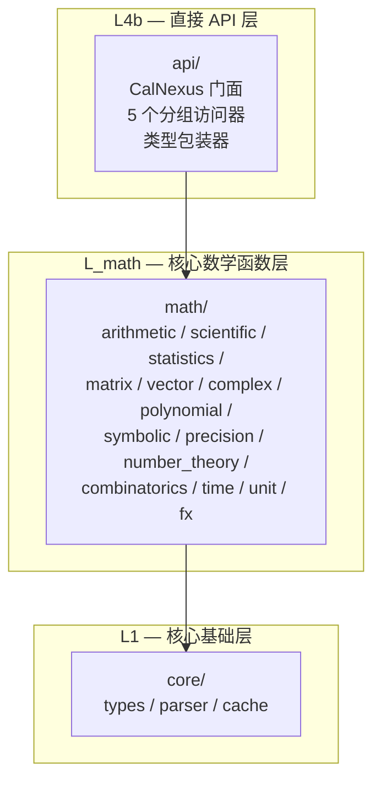

# CalNexus API 使用指南

> 本文档描述 CalNexus 直接 API（`src/api/`）的使用方法。
> 表达式求值 API（`evaluate()`）保持不变，直接 API 是其补充而非替代。

## 1. 快速开始

```rust
use calnexus::CalNexus;

let cn = CalNexus::new();

// 标量运算
let result = cn.scalar().add(2.0, 3.0).unwrap();
assert_eq!(result.as_scalar(), Some(5.0));

// 三角函数
let result = cn.scalar().sin(std::f64::consts::FRAC_PI_2).unwrap();
assert_eq!(result.as_scalar(), Some(1.0));
```

## 2. CalNexus 实例

`CalNexus` 是门面结构体，持有变量上下文，提供 5 个分组访问器：

```rust
let cn = CalNexus::new();   // 创建默认实例
// 或
let cn = CalNexus::default(); // 同上
```

### 2.1 变量绑定

```rust
cn.set_var("x", 10.0);
assert_eq!(cn.get_var("x"), Some(10.0));

cn.clear_vars();
assert_eq!(cn.get_var("x"), None);
```

变量通过 `RwLock<EvalContext>` 管理，支持多线程并发读取、独占写入。

## 3. 分组 API

### 3.1 标量运算 — `cn.scalar()`

| 方法 | 签名 | 说明 |
|------|------|------|
| `add` | `(a: f64, b: f64) → Result<EvalResult, CalcError>` | 加法 |
| `sub` | `(a: f64, b: f64) → Result<EvalResult, CalcError>` | 减法 |
| `mul` | `(a: f64, b: f64) → Result<EvalResult, CalcError>` | 乘法 |
| `div` | `(a: f64, b: f64) → Result<EvalResult, CalcError>` | 除法（除零返回错误） |
| `sin` | `(x: f64) → Result<EvalResult, CalcError>` | 正弦 |
| `cos` | `(x: f64) → Result<EvalResult, CalcError>` | 余弦 |

```rust
let cn = CalNexus::new();
let r = cn.scalar().div(10.0, 3.0).unwrap();
assert!((r.as_scalar().unwrap() - 3.333333).abs() < 1e-4);

// 除零错误
assert!(cn.scalar().div(1.0, 0.0).is_err());
```

### 3.2 线性代数 — `cn.linalg()`

| 方法 | 签名 | 说明 |
|------|------|------|
| `det` | `(m: &Matrix) → Result<EvalResult, CalcError>` | 矩阵行列式 |
| `dot` | `(a: &Vector, b: &Vector) → Result<EvalResult, CalcError>` | 向量点积 |

```rust
use calnexus::{CalNexus, Matrix, Vector};

let cn = CalNexus::new();

// 矩阵行列式
let m = Matrix::from_rows(&[&[1.0, 2.0], &[3.0, 4.0]]);
let r = cn.linalg().det(&m).unwrap();
assert_eq!(r.as_scalar(), Some(-2.0));

// 向量点积
let a = Vector::new(&[1.0, 2.0, 3.0]);
let b = Vector::new(&[4.0, 5.0, 6.0]);
let r = cn.linalg().dot(&a, &b).unwrap();
assert_eq!(r.as_scalar(), Some(32.0));
```

### 3.3 数据分析 — `cn.stats()`

| 方法 | 签名 | 说明 |
|------|------|------|
| `mean` | `(data: &[f64]) → Result<EvalResult, CalcError>` | 均值 |
| `std` | `(data: &[f64]) → Result<EvalResult, CalcError>` | 标准差 |

```rust
let cn = CalNexus::new();
let data = vec![1.0, 2.0, 3.0, 4.0, 5.0];

let r = cn.stats().mean(&data).unwrap();
assert_eq!(r.as_scalar(), Some(3.0));

let r = cn.stats().std(&data).unwrap();
```

### 3.4 符号数学 — `cn.symbolic()`

占位实现，后续版本扩展。

### 3.5 应用数学 — `cn.applied()`

| 方法 | 签名 | Feature | 说明 |
|------|------|---------|------|
| `convert` | `(value: f64, from: &str, to: &str) → Result<EvalResult, CalcError>` | `unit` | 单位换算 |

```rust
let cn = CalNexus::new();
// 1000 米 → 1 千米
let r = cn.applied().convert(1000.0, "m", "km").unwrap();
assert_eq!(r.as_scalar(), Some(1.0));
```

## 4. 类型包装器

直接 API 使用 5 个类型安全包装器，与 `EvalResult` 双向转换：

| 包装器 | 封装类型 | 构造方法 |
|--------|----------|----------|
| `Matrix` | `Vec<Vec<f64>>` | `Matrix::from_rows(&[&[f64]])` |
| `Vector` | `Vec<f64>` | `Vector::new(&[f64])` |
| `Complex` | `Complex64` | `Complex::new(re, im)` |
| `Polynomial` | `Vec<f64>` (升幂) | `Polynomial::new(&[f64])` |
| `BigNumber` | `BigInt` | `BigNumber::from_i64(v)` / `BigNumber::new(bigint)` |

### 转换

```rust
use calnexus::{Matrix, EvalResult};

// 包装器 → EvalResult
let m = Matrix::from_rows(&[&[1.0, 2.0], &[3.0, 4.0]]);
let result: EvalResult = m.into();

// EvalResult → 包装器
let m2 = Matrix::try_from(result).unwrap();
```

## 5. 向后兼容性

直接 API 是表达式 API 的**补充**，不替代现有接口：

| 场景 | 推荐 API | 原因 |
|------|----------|------|
| 用户输入表达式 | `evaluate()` | 需要解析 + 域路由 |
| CLI/REPL/Server | `evaluate()` | 表达式字符串入口 |
| 程序化调用已知运算 | 直接 API | 跳过解析/规范化开销 |
| 嵌入式计算引擎 | 直接 API | 无需表达式解析依赖 |

## 6. Feature Gate 表

| Feature | 启用模块 | 说明 |
|---------|----------|------|
| _(default, 无)_ | `scalar` / `linalg` / `stats` / `symbolic` | 核心 API，零额外依赖 |
| `unit` | `applied.convert()` | 8 量纲物理单位换算 |
| `time` | _(规划中)_ | 时间计算 |
| `fx` | _(规划中)_ | 汇率换算 |

`default = []`：核心库零依赖，可作为嵌入式计算引擎。

## 7. 架构概览



依赖方向：`api/` → `math/` → `core/`，严格单向，不依赖 `domains/`。
