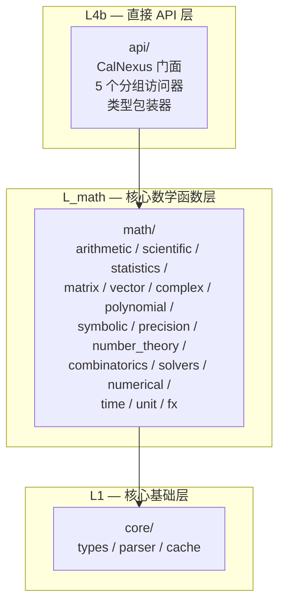

# CalNexus API 使用指南

> 本文档描述 CalNexus 直接 API（`src/api/`）的使用方法。
> 表达式求值 API（`evaluate()`）保持不变，直接 API 是其补充而非替代。

## 1. 快速开始

```rust
use calnexus::CalNexus;

let cn = CalNexus::new();

// 标量运算
let result = cn.scalar().add(2.0, 3.0).unwrap();
assert_eq!(result.as_scalar(), Some(5.0));

// 三角函数
let result = cn.scalar().sin(std::f64::consts::FRAC_PI_2).unwrap();
assert_eq!(result.as_scalar(), Some(1.0));
```

## 2. CalNexus 实例

`CalNexus` 是门面结构体，持有变量上下文，提供 5 个分组访问器：

```rust
let cn = CalNexus::new();   // 创建默认实例
// 或
let cn = CalNexus::default(); // 同上
```

### 2.1 变量绑定

```rust
cn.set_var("x", 10.0);
assert_eq!(cn.get_var("x"), Some(10.0));

cn.clear_vars();
assert_eq!(cn.get_var("x"), None);
```

变量通过 `RwLock<EvalContext>` 管理，支持多线程并发读取、独占写入。

## 3. 分组 API

### 3.1 标量运算 — `cn.scalar()`

#### 算术

| 方法 | 签名 | 说明 |
|------|------|------|
| `add` | `(a: f64, b: f64) → Result<EvalResult, CalcError>` | 加法 |
| `sub` | `(a: f64, b: f64) → Result<EvalResult, CalcError>` | 减法 |
| `mul` | `(a: f64, b: f64) → Result<EvalResult, CalcError>` | 乘法 |
| `div` | `(a: f64, b: f64) → Result<EvalResult, CalcError>` | 除法（除零返回错误） |
| `pow` | `(a: f64, b: f64) → Result<EvalResult, CalcError>` | 幂运算 |
| `rem` | `(a: f64, b: f64) → Result<EvalResult, CalcError>` | 取模 |
| `factorial` | `(n: u64) → Result<EvalResult, CalcError>` | 阶乘 |
| `abs` | `(x: f64) → Result<EvalResult, CalcError>` | 绝对值 |

#### 科学函数

| 方法 | 签名 | 说明 |
|------|------|------|
| `sin` | `(x: f64) → Result<EvalResult, CalcError>` | 正弦 |
| `cos` | `(x: f64) → Result<EvalResult, CalcError>` | 余弦 |
| `tan` | `(x: f64) → Result<EvalResult, CalcError>` | 正切 |
| `asin` | `(x: f64) → Result<EvalResult, CalcError>` | 反正弦 |
| `acos` | `(x: f64) → Result<EvalResult, CalcError>` | 反余弦 |
| `atan` | `(x: f64) → Result<EvalResult, CalcError>` | 反正切 |
| `ln` | `(x: f64) → Result<EvalResult, CalcError>` | 自然对数 |
| `log` | `(x: f64, base: f64) → Result<EvalResult, CalcError>` | 任意底数对数 |
| `exp` | `(x: f64) → Result<EvalResult, CalcError>` | 指数函数 |
| `sinh` | `(x: f64) → Result<EvalResult, CalcError>` | 双曲正弦 |
| `cosh` | `(x: f64) → Result<EvalResult, CalcError>` | 双曲余弦 |
| `tanh` | `(x: f64) → Result<EvalResult, CalcError>` | 双曲正切 |
| `gamma` | `(x: f64) → Result<EvalResult, CalcError>` | Gamma 函数 |
| `erf` | `(x: f64) → Result<EvalResult, CalcError>` | 误差函数 |

#### 精度

| 方法 | 签名 | 说明 |
|------|------|------|
| `precision_eval` | `(digits: usize, expr: &str) → Result<EvalResult, CalcError>` | BigRational 任意精度求值 |

#### 数论

| 方法 | 签名 | 说明 |
|------|------|------|
| `gcd` | `(a: &BigNumber, b: &BigNumber) → Result<EvalResult, CalcError>` | 最大公约数 |
| `lcm` | `(a: &BigNumber, b: &BigNumber) → Result<EvalResult, CalcError>` | 最小公倍数 |
| `is_prime` | `(n: &BigNumber) → Result<EvalResult, CalcError>` | 素数判定 |
| `prime_sieve` | `(n: u64) → Result<EvalResult, CalcError>` | 素数筛 |
| `mod_pow` | `(base: &BigNumber, exp: &BigNumber, m: &BigNumber) → Result<EvalResult, CalcError>` | 模幂运算 |
| `mod_inverse` | `(a: &BigNumber, m: &BigNumber) → Result<EvalResult, CalcError>` | 模逆元 |
| `euler_phi` | `(n: &BigNumber) → Result<EvalResult, CalcError>` | 欧拉函数 |
| `crt` | `(remainders: &[BigNumber], moduli: &[BigNumber]) → Result<EvalResult, CalcError>` | 中国剩余定理 |
| `discrete_log` | `(g: &BigNumber, h: &BigNumber, p: &BigNumber) → Result<EvalResult, CalcError>` | 离散对数（BSGS） |

#### 组合数学

| 方法 | 签名 | 说明 |
|------|------|------|
| `perm` | `(n: u64, k: u64) → Result<EvalResult, CalcError>` | 排列数 P(n,k) |
| `comb` | `(n: u64, k: u64) → Result<EvalResult, CalcError>` | 组合数 C(n,k) |
| `catalan` | `(n: u64) → Result<EvalResult, CalcError>` | Catalan 数 |
| `stirling_first` | `(n: u64, k: u64) → Result<EvalResult, CalcError>` | 第一类 Stirling 数 |
| `stirling_second` | `(n: u64, k: u64) → Result<EvalResult, CalcError>` | 第二类 Stirling 数 |

```rust
use calnexus::{CalNexus, BigNumber};

let cn = CalNexus::new();
// CRT: x≡2(mod 3), x≡3(mod 5), x≡2(mod 7) → x=23
let r = vec![BigNumber::from_i64(2), BigNumber::from_i64(3), BigNumber::from_i64(2)];
let m = vec![BigNumber::from_i64(3), BigNumber::from_i64(5), BigNumber::from_i64(7)];
let result = cn.scalar().crt(&r, &m).unwrap();
// result = BigInt(23)
```

### 3.2 线性代数 — `cn.linalg()`

#### 矩阵运算

| 方法 | 签名 | 说明 |
|------|------|------|
| `det` | `(m: &Matrix) → Result<EvalResult, CalcError>` | 矩阵行列式 |
| `inverse` | `(m: &Matrix) → Result<EvalResult, CalcError>` | 矩阵求逆 |
| `transpose` | `(m: &Matrix) → Result<EvalResult, CalcError>` | 矩阵转置 |
| `identity` | `(n: usize) → Result<EvalResult, CalcError>` | 单位矩阵 |
| `mat_add` | `(a: &Matrix, b: &Matrix) → Result<EvalResult, CalcError>` | 矩阵加法 |
| `mat_sub` | `(a: &Matrix, b: &Matrix) → Result<EvalResult, CalcError>` | 矩阵减法 |
| `mat_mul` | `(a: &Matrix, b: &Matrix) → Result<EvalResult, CalcError>` | 矩阵乘法 |
| `scalar_mul` | `(s: f64, m: &Matrix) → Result<EvalResult, CalcError>` | 标量乘矩阵 |

#### 向量运算

| 方法 | 签名 | 说明 |
|------|------|------|
| `dot` | `(a: &Vector, b: &Vector) → Result<EvalResult, CalcError>` | 向量点积 |
| `cross` | `(a: &Vector, b: &Vector) → Result<EvalResult, CalcError>` | 向量叉积 |
| `normalize` | `(a: &Vector) → Result<EvalResult, CalcError>` | 单位化 |
| `magnitude` | `(a: &Vector) → Result<EvalResult, CalcError>` | 模长 |
| `vector_add` | `(a: &Vector, b: &Vector) → Result<EvalResult, CalcError>` | 向量加法 |
| `vector_sub` | `(a: &Vector, b: &Vector) → Result<EvalResult, CalcError>` | 向量减法 |

#### 数值分解（`numerical` feature）

| 方法 | 签名 | 说明 |
|------|------|------|
| `eig` | `(m: &Matrix) → Result<EvalResult, CalcError>` | 特征值/特征向量 |
| `svd` | `(m: &Matrix) → Result<EvalResult, CalcError>` | 奇异值分解 |
| `lu` | `(m: &Matrix) → Result<EvalResult, CalcError>` | LU 分解 |
| `qr` | `(m: &Matrix) → Result<EvalResult, CalcError>` | QR 分解 |
| `solve` | `(a: &Matrix, b: &Vector) → Result<EvalResult, CalcError>` | 线性方程组求解 |
| `matrix_exp` | `(m: &Matrix) → Result<EvalResult, CalcError>` | 矩阵指数 |

```rust
use calnexus::{CalNexus, Matrix, Vector};

let cn = CalNexus::new();

// 矩阵行列式
let m = Matrix::from_rows(&[&[1.0, 2.0], &[3.0, 4.0]]);
let r = cn.linalg().det(&m).unwrap();
assert_eq!(r.as_scalar(), Some(-2.0));

// 向量点积
let a = Vector::new(&[1.0, 2.0, 3.0]);
let b = Vector::new(&[4.0, 5.0, 6.0]);
let r = cn.linalg().dot(&a, &b).unwrap();
assert_eq!(r.as_scalar(), Some(32.0));

// 特征值分解（需要 numerical feature）
// let r = cn.linalg().eig(&m).unwrap();
```

### 3.3 数据分析 — `cn.stats()`

#### 基础统计

| 方法 | 签名 | 说明 |
|------|------|------|
| `mean` | `(data: &[f64]) → Result<EvalResult, CalcError>` | 均值 |
| `variance` | `(data: &[f64]) → Result<EvalResult, CalcError>` | 方差 |
| `std` | `(data: &[f64]) → Result<EvalResult, CalcError>` | 标准差 |
| `median` | `(data: &[f64]) → Result<EvalResult, CalcError>` | 中位数 |
| `min` | `(data: &[f64]) → Result<EvalResult, CalcError>` | 最小值 |
| `max` | `(data: &[f64]) → Result<EvalResult, CalcError>` | 最大值 |
| `sum` | `(data: &[f64]) → Result<EvalResult, CalcError>` | 求和 |
| `count` | `(data: &[f64]) → Result<EvalResult, CalcError>` | 计数 |

#### 分布函数

| 方法 | 签名 | 说明 |
|------|------|------|
| `norm_pdf` | `(x: f64, mu: f64, sigma: f64) → Result<EvalResult, CalcError>` | 正态分布概率密度 |
| `norm_cdf` | `(x: f64, mu: f64, sigma: f64) → Result<EvalResult, CalcError>` | 正态分布累积分布 |
| `norm_inv` | `(p: f64, mu: f64, sigma: f64) → Result<EvalResult, CalcError>` | 正态分布逆函数 |
| `t_pdf` | `(x: f64, df: f64) → Result<EvalResult, CalcError>` | t 分布概率密度 |
| `t_cdf` | `(x: f64, df: f64) → Result<EvalResult, CalcError>` | t 分布累积分布 |
| `t_inv` | `(p: f64, df: f64) → Result<EvalResult, CalcError>` | t 分布逆函数 |
| `chi2_pdf` | `(x: f64, k: f64) → Result<EvalResult, CalcError>` | 卡方分布概率密度 |
| `chi2_cdf` | `(x: f64, k: f64) → Result<EvalResult, CalcError>` | 卡方分布累积分布 |
| `chi2_inv` | `(p: f64, k: f64) → Result<EvalResult, CalcError>` | 卡方分布逆函数 |
| `f_pdf` | `(x: f64, d1: f64, d2: f64) → Result<EvalResult, CalcError>` | F 分布概率密度 |
| `f_cdf` | `(x: f64, d1: f64, d2: f64) → Result<EvalResult, CalcError>` | F 分布累积分布 |
| `f_inv` | `(p: f64, d1: f64, d2: f64) → Result<EvalResult, CalcError>` | F 分布逆函数 |
| `poisson_pmf` | `(k: f64, lambda: f64) → Result<EvalResult, CalcError>` | 泊松分布概率质量 |
| `poisson_cdf` | `(k: f64, lambda: f64) → Result<EvalResult, CalcError>` | 泊松分布累积分布 |
| `binom_pmf` | `(k: f64, n: f64, p: f64) → Result<EvalResult, CalcError>` | 二项分布概率质量 |
| `binom_cdf` | `(k: f64, n: f64, p: f64) → Result<EvalResult, CalcError>` | 二项分布累积分布 |

#### 假设检验

| 方法 | 签名 | 说明 |
|------|------|------|
| `t_test_one` | `(data: &[f64], mu: f64) → Result<EvalResult, CalcError>` | 单样本 t 检验 |
| `t_test_two` | `(a: &[f64], b: &[f64]) → Result<EvalResult, CalcError>` | 双样本 t 检验 |
| `chi2_test` | `(observed: &[f64], expected: &[f64]) → Result<EvalResult, CalcError>` | 卡方检验 |

#### 相关分析

| 方法 | 签名 | 说明 |
|------|------|------|
| `pearson` | `(x: &[f64], y: &[f64]) → Result<EvalResult, CalcError>` | Pearson 相关系数 |
| `spearman` | `(x: &[f64], y: &[f64]) → Result<EvalResult, CalcError>` | Spearman 秩相关 |

#### 回归分析

| 方法 | 签名 | 说明 |
|------|------|------|
| `lin_reg` | `(x: &[f64], y: &[f64]) → Result<EvalResult, CalcError>` | 线性回归 |
| `poly_reg` | `(x: &[f64], y: &[f64], degree: usize) → Result<EvalResult, CalcError>` | 多项式回归 |
| `multi_reg` | `(x: &[Vec<f64>], y: &[f64]) → Result<EvalResult, CalcError>` | 多元回归 |

```rust
let cn = CalNexus::new();
let data = vec![1.0, 2.0, 3.0, 4.0, 5.0];

let r = cn.stats().mean(&data).unwrap();
assert_eq!(r.as_scalar(), Some(3.0));

// 线性回归
let x = vec![1.0, 2.0, 3.0, 4.0, 5.0];
let y = vec![2.0, 4.0, 6.0, 8.0, 10.0];
let r = cn.stats().lin_reg(&x, &y).unwrap();
// 返回 JSON: {"slope": 2.0, "intercept": 0.0, "r_squared": 1.0}
```

### 3.4 符号数学 — `cn.symbolic()`

#### 符号演算

| 方法 | 签名 | 说明 |
|------|------|------|
| `differentiate` | `(expr: &str, var: &str) → Result<EvalResult, CalcError>` | 符号微分 |
| `integrate` | `(expr: &str, var: &str) → Result<EvalResult, CalcError>` | 符号积分 |
| `simplify` | `(expr: &str) → Result<EvalResult, CalcError>` | 表达式化简 |
| `limit` | `(expr: &str, var: &str, target: f64) → Result<EvalResult, CalcError>` | 极限 |
| `taylor_expand` | `(expr: &str, var: &str, center: f64, order: usize) → Result<EvalResult, CalcError>` | 泰勒展开 |

#### 多项式运算

| 方法 | 签名 | 说明 |
|------|------|------|
| `poly_add` | `(a: &Polynomial, b: &Polynomial) → Result<EvalResult, CalcError>` | 多项式加法 |
| `poly_sub` | `(a: &Polynomial, b: &Polynomial) → Result<EvalResult, CalcError>` | 多项式减法 |
| `poly_mul` | `(a: &Polynomial, b: &Polynomial) → Result<EvalResult, CalcError>` | 多项式乘法 |
| `poly_div` | `(a: &Polynomial, b: &Polynomial) → Result<EvalResult, CalcError>` | 多项式除法 |
| `poly_roots` | `(p: &Polynomial) → Result<EvalResult, CalcError>` | 多项式求根 |
| `poly_eval` | `(p: &Polynomial, x: f64) → Result<EvalResult, CalcError>` | 多项式求值 |

#### 复数运算

| 方法 | 签名 | 说明 |
|------|------|------|
| `complex_add` | `(a: &Complex, b: &Complex) → Result<EvalResult, CalcError>` | 复数加法 |
| `complex_sub` | `(a: &Complex, b: &Complex) → Result<EvalResult, CalcError>` | 复数减法 |
| `complex_mul` | `(a: &Complex, b: &Complex) → Result<EvalResult, CalcError>` | 复数乘法 |
| `complex_div` | `(a: &Complex, b: &Complex) → Result<EvalResult, CalcError>` | 复数除法 |
| `complex_abs` | `(z: &Complex) → Result<EvalResult, CalcError>` | 复数模 |
| `complex_arg` | `(z: &Complex) → Result<EvalResult, CalcError>` | 复数辐角 |
| `complex_conj` | `(z: &Complex) → Result<EvalResult, CalcError>` | 复共轭 |
| `complex_exp` | `(z: &Complex) → Result<EvalResult, CalcError>` | 复指数 |
| `complex_ln` | `(z: &Complex) → Result<EvalResult, CalcError>` | 复对数 |

#### 方程求解

| 方法 | 签名 | 说明 |
|------|------|------|
| `solve_equation` | `(expr: &str, var: &str, method: &str, options: Option<&[f64]>) → Result<EvalResult, CalcError>` | 方程数值求解 |

`solve_equation` 支持三种方法：
- `"newton"`：牛顿法，options = `Some(&[x0])`（初始猜测）
- `"bisection"`：二分法，options = `Some(&[a, b])`（区间）
- `"brent"`：Brent 方法，options = `Some(&[a, b])`（区间）

```rust
let cn = CalNexus::new();
// 求解 x²-2=0，牛顿法，初始猜测 1.5
let r = cn.symbolic().solve_equation("x^2 - 2", "x", "newton", Some(&[1.5])).unwrap();
let root = r.as_scalar().unwrap();
assert!((root - std::f64::consts::SQRT_2).abs() < 1e-10);

// 求解 sin(x)=0，二分法，区间 [3, 4] → π
let r = cn.symbolic().solve_equation("sin(x)", "x", "bisection", Some(&[3.0, 4.0])).unwrap();
let root = r.as_scalar().unwrap();
assert!((root - std::f64::consts::PI).abs() < 1e-10);
```

### 3.5 应用数学 — `cn.applied()`

#### 时间（`time` feature）

| 方法 | 签名 | 说明 |
|------|------|------|
| `date` | `(date_str: &str) → Result<EvalResult, CalcError>` | 日期构造 |
| `datetime` | `(datetime_str: &str, tz: Option<&str>) → Result<EvalResult, CalcError>` | 日期时间构造 |
| `timestamp` | `(datetime_str: &str) → Result<EvalResult, CalcError>` | 日期转时间戳 |
| `from_timestamp` | `(secs: i64, tz: Option<&str>) → Result<EvalResult, CalcError>` | 时间戳转日期 |
| `now` | `(tz: Option<&str>) → Result<EvalResult, CalcError>` | 当前时间 |
| `today` | `(tz: Option<&str>) → Result<EvalResult, CalcError>` | 当前日期 |
| `date_add` | `(date: &str, n: i64, unit: &str) → Result<EvalResult, CalcError>` | 日期加法 |
| `date_diff` | `(a: &str, b: &str, unit: Option<&str>) → Result<EvalResult, CalcError>` | 日期差 |
| `format_date` | `(date: &str, fmt: &str, tz: Option<&str>) → Result<EvalResult, CalcError>` | 日期格式化 |
| `reformat_date` | `(input: &str, from_fmt: &str, to_fmt: &str) → Result<EvalResult, CalcError>` | 日期格式转换 |
| `weekday` | `(date: &str) → Result<EvalResult, CalcError>` | 星期几 |
| `day_of_year` | `(date: &str) → Result<EvalResult, CalcError>` | 年内第几天 |
| `is_leap_year` | `(year: i64) → Result<EvalResult, CalcError>` | 是否闰年 |

#### 单位换算（`unit` feature）

| 方法 | 签名 | 说明 |
|------|------|------|
| `convert` | `(value: f64, from: &str, to: &str) → Result<EvalResult, CalcError>` | 单位换算 |

#### 汇率换算（`fx` feature）

| 方法 | 签名 | 说明 |
|------|------|------|
| `fx` | `(amount: f64, from: &str, to: &str) → Result<EvalResult, CalcError>` | 汇率换算 |
| `fx_rate` | `(from: &str, to: &str) → Result<EvalResult, CalcError>` | 查询汇率 |

```rust
let cn = CalNexus::new();
// 1000 米 → 1 千米
let r = cn.applied().convert(1000.0, "m", "km").unwrap();
assert_eq!(r.as_scalar(), Some(1.0));
```

## 4. 类型包装器

直接 API 使用 5 个类型安全包装器，与 `EvalResult` 双向转换：

| 包装器 | 封装类型 | 构造方法 |
|--------|----------|----------|
| `Matrix` | `Vec<Vec<f64>>` | `Matrix::from_rows(&[&[f64]])` |
| `Vector` | `Vec<f64>` | `Vector::new(&[f64])` |
| `Complex` | `Complex64` | `Complex::new(re, im)` |
| `Polynomial` | `Vec<f64>` (升幂) | `Polynomial::new(&[f64])` |
| `BigNumber` | `BigInt` | `BigNumber::from_i64(v)` / `BigNumber::new(bigint)` |

### 转换

```rust
use calnexus::{Matrix, EvalResult};

// 包装器 → EvalResult
let m = Matrix::from_rows(&[&[1.0, 2.0], &[3.0, 4.0]]);
let result: EvalResult = m.into();

// EvalResult → 包装器
let m2 = Matrix::try_from(result).unwrap();
```

## 5. 向后兼容性

直接 API 是表达式 API 的**补充**，不替代现有接口：

| 场景 | 推荐 API | 原因 |
|------|----------|------|
| 用户输入表达式 | `evaluate()` | 需要解析 + 域路由 |
| CLI/REPL/Server | `evaluate()` | 表达式字符串入口 |
| 程序化调用已知运算 | 直接 API | 跳过解析/规范化开销 |
| 嵌入式计算引擎 | 直接 API | 无需表达式解析依赖 |

## 6. Feature Gate 表

| Feature | 启用模块 | 说明 |
|---------|----------|------|
| _(default, 无)_ | `scalar` / `linalg` / `stats` / `symbolic` | 核心 API，零额外依赖 |
| `numerical` | `linalg.eig/svd/lu/qr/solve/matrix_exp` | 数值线性代数分解（nalgebra f64） |
| `unit` | `applied.convert()` | 8 量纲物理单位换算 |
| `time` | `applied.date/datetime/now/today/...` | 13 个时间函数（jiff 0.2 + IANA tzdb） |
| `fx` | `applied.fx/fx_rate` | 汇率换算（frankfurter.dev API + 三级缓存） |

`default = []`：核心库零依赖，可作为嵌入式计算引擎。

## 7. 架构概览



依赖方向：`api/` → `math/` → `core/`，严格单向，不依赖 `domains/`。
