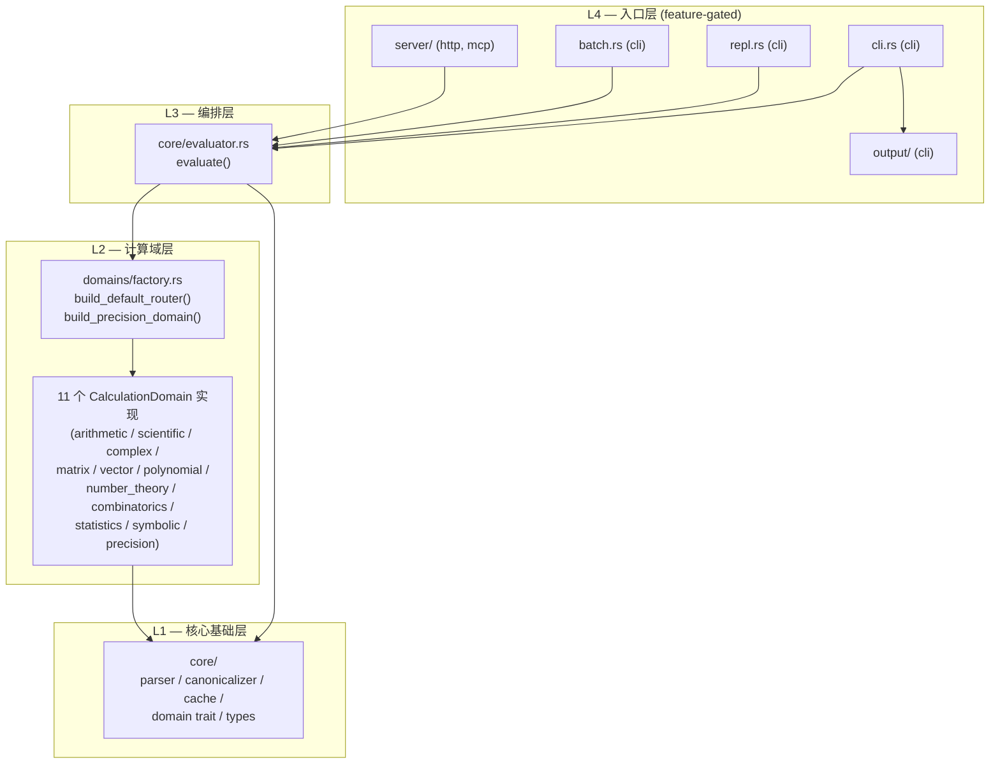
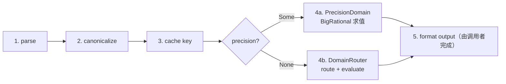
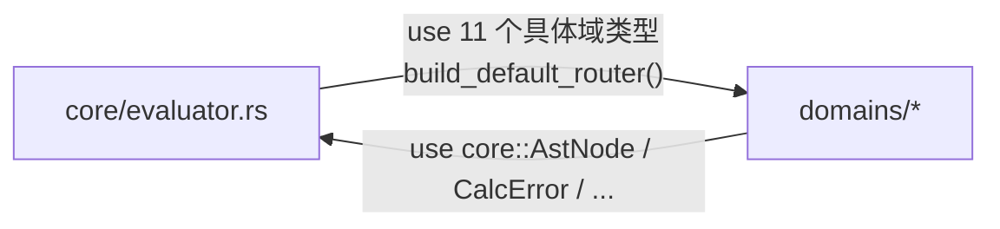
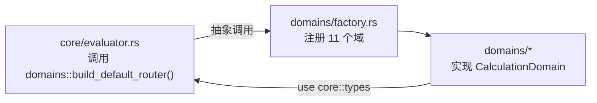
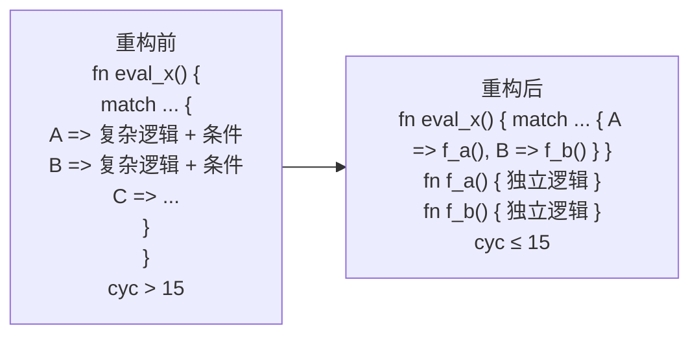

# CalNexus 架构文档

> 本文档描述 CalNexus 的模块层次、依赖方向、循环依赖修复策略与复杂度治理结果。
> 源码变更以代码为准；本文档在每次架构调整后同步更新。

## 1. 模块层次

CalNexus 采用**四层分层架构**，依赖方向严格自上而下（上层依赖下层，下层不感知上层）：

### 1.1 L1 — 核心基础层 (`src/core/`)

无业务逻辑的共享基础设施，所有上层模块共用：

| 模块 | 职责 |
|------|------|
| `types.rs` | `AstNode` / `BinaryOp` / `UnaryOp` / `CalcError` / `EvalResult` / `Span` 等共享类型 |
| `parser.rs` | 表达式字符串 → `AstNode`（递归下降解析器） |
| `canonicalizer.rs` | AST 规范化（交换律排序 + 常量折叠 + 一元归一化）+ S-表达式序列化 |
| `cache.rs` | L1 缓存管理器（Moka + BLAKE3 哈希键） |
| `domain.rs` | `CalculationDomain` trait + `DomainRouter`（11 域优先级路由） |
| `evaluator.rs` | 顶层 `evaluate()` 编排函数（parse → canonicalize → cache → route → evaluate） — **L3 编排层**，但位于 `src/core/` 目录下 |

### 1.2 L2 — 计算域层 (`src/domains/`)

11 个独立计算域，每个域实现 `CalculationDomain` trait，处理特定类别的数学运算（按 priority 升序排列，priority 越高越优先匹配）：

| 域 | priority | 覆盖运算 |
|----|----------|----------|
| `ArithmeticDomain` | 10 | 基础四则运算 + 幂 + 取模 |
| `ScientificDomain` | 20 | 三角/双曲/指数/对数/特殊函数 |
| `StatisticsDomain` | 20 | 统计函数 |
| `NumberTheoryDomain` | 25 | 数论（素数/GCD/LCM/斐波那契） |
| `CombinatoricsDomain` | 25 | 排列/组合/Catalan/Stirling |
| `PolynomialDomain` | 25 | 多项式运算 |
| `PrecisionDomain` | 25 | BigRational 高精度求值（绕过路由器） |
| `ComplexDomain` | 30 | 复数运算 |
| `MatrixDomain` | 30 | 矩阵运算（nalgebra） |
| `VectorDomain` | 30 | 向量运算 |
| `SymbolicDomain` | 30 | 符号微分/积分/化简/极限/泰勒 |

**工厂函数**位于 `domains/factory.rs`（规则 25 合规：`mod.rs` 仅含声明与 re-export）：
- `build_default_router()` — 注册 11 个域到 `DomainRouter`
- `build_precision_domain()` — 构造 `PrecisionDomain` 实例（供 `evaluator.rs` precision 模式使用）

### 1.3 L3 — 编排层 (`src/core/evaluator.rs`)

`evaluate()` 是唯一的顶层入口，编排五阶段流水线：

### 1.4 L4 — 入口层

- **CLI** (`src/cli.rs`)：clap 命令行入口，`--latex`/`--steps`/`--canonical`/`--json`/`--precision` 等标志
- **REPL** (`src/repl.rs`)：rustyline 交互式求值
- **Batch** (`src/batch.rs`)：批处理文件求值
- **Server** (`src/server/`)：HTTP + MCP 双协议服务，`#[forge]` 声明式封装（sdforge）——单个 async fn 同时生成 HTTP `POST /api/v1/evaluate` 路由 + MCP `evaluate` tool，错误响应统一 `ApiError` 契约（`InvalidInput`→400 / `ValidationError`→422 / `ServiceUnavailable`→503）。模块包含：`evaluate.rs`（`#[forge]` 入口）、`http.rs`（HTTP 启动 + 优雅关闭）、`mcp.rs`（MCP stdio 启动）、`types.rs`（请求/响应 DTO + vars 校验）、`cache.rs`（共享服务端缓存）
- **Output** (`src/output/`)：LaTeX / 步骤 / 规范形式三种格式化器

## 2. 循环依赖修复策略（P2 Phase 1-3）

### 2.1 修复前的问题

修复前 `src/core/evaluator.rs` 同时承担**编排职责**与**域注册职责**，直接 `use` 11 个具体域类型，导致 `core ↔ domains` 双向依赖：

### 2.2 修复方案

采用**职责迁移**策略：将域注册职责从 `core` 迁移到 `domains` 层：

1. `build_default_router()` 从 `core/evaluator.rs` 移至 `domains/factory.rs`
2. 新增 `build_precision_domain()` 工厂函数，消除 `evaluator.rs` 对 `PrecisionDomain` 类型的直接依赖
3. `core/evaluator.rs` 改为调用 `crate::domains::build_default_router()`（抽象入口）

### 2.3 修复效果

| 指标 | 修复前 | 修复后 | 变化 |
|------|--------|--------|------|
| `core` → `domains` 类型依赖（生产+测试代码） | 11 | 0 | **-100%** |
| `core` → `domains` 函数依赖 | 1 | 2 | +1（抽象入口不可避免） |
| 总依赖数 | 12 | 2 | **-83%** |
| 循环依赖 | 存在 | 消除 | ✓ |

> **验证方法**：`grep -rn "crate::domains::.*Domain" src/core/` 返回 0 匹配生产代码 import（注释中包含模式名的 2 行不计入）。`core` 仅通过 `build_default_router()` / `build_precision_domain()` 两个工厂函数抽象入口调用 `domains` 层。
> priority 测试位于 `domains/factory.rs` 测试模块（priority 是 domains 层属性，应由 domains 层自测）。

## 3. 复杂度治理（P2 Phase 4-8）

针对 codenexus 识别的 5 个圈复杂度热点（cyc > 15），按 TDD 流程（Red → Green → Commit → Verify）逐个重构。

### 3.1 重构模式

采用**分派提取模式**：将含条件分支的大型 `match` 拆分为按 variant/operation 分组的独立方法，主函数变为纯分派：

### 3.2 重构结果

| 文件 | 函数 | cyc 重构前 | cyc 重构后 | 降幅 | 提取方法数 |
|------|------|-----------|-----------|------|-----------|
| `domains/combinatorics.rs` | `eval_function` | 38 | 4 | -89% | 6 |
| `domains/matrix.rs` | `eval_binary` | 25 | 4 | -84% | 4 |
| `core/evaluator.rs` | `evaluate` | 25 | 7 | -72% | 4 |
| `core/canonicalizer.rs` | `transform_inner` | 24 | 2 | -92% | 5 |
| `domains/symbolic.rs` | `eval_symbolic` | 23 | 15 | -35% | 2 |

**所有提取方法 cyc ≤ 15**，主函数与提取方法均满足复杂度门禁。

### 3.3 测试保障

每个重构遵循严格 TDD：
1. **Red**：先添加覆盖所有 variant/分支的回归测试（含边界条件、错误路径）
2. **Green**：重构实现使测试通过（行为不变）
3. **Verify**：`cargo test` 全套通过 + `cargo clippy -D warnings` 0 告警 + codenexus 复杂度复测

最终测试规模：**1818 passed / 0 failed**。

## 4. 测试与基准结构

### 4.1 测试目录 (`tests/`)

| 文件 | 类型 | 说明 |
|------|------|------|
| `integration.rs` | 集成测试 | 公共 API 端到端验证 |
| `cli_integration.rs` | CLI 集成 | `assert_cmd` 子进程测试 |
| `repl_integration.rs` | REPL 集成 | `expectrl` 交互式测试 |
| `server_http_integration.rs` | HTTP 集成 | sdforge HTTP API 测试 |
| `server_mcp_integration.rs` | MCP 集成 | MCP tool 协议测试 |
| `property_tests.rs` | 属性测试 | `proptest` 随机化验证 |
| `snapshot_tests.rs` | 快照测试 | `insta` 输出快照 |
| `security_tests.rs` | 安全测试 | DoS 向量 + 边界攻击 |
| `performance_tests.rs` | 性能测试 | 基准回归守护 |
| `common/mod.rs` | 共享工具 | 测试辅助函数 |

**设计预期**：`tests/common/` 凝聚力较低（含多种测试辅助工具），这是测试代码的合理设计——它服务于多个测试文件的共享需求，不纳入生产代码复杂度治理范围。

### 4.2 基准目录 (`benches/`)

| 文件 | 基准目标 |
|------|----------|
| `cache_bench.rs` | L1 缓存命中/未命中性能 |
| `domain_bench.rs` | 域路由 + 求值性能 |
| `parser_bench.rs` | 解析器吞吐量 |

**设计预期**：`benches/` 各文件独立测量一个子系统，文件间无共享代码（每个 bench 文件自包含），这是 criterion 基准的惯例结构。

## 5. 模块层次规则

### 5.1 依赖方向铁律

- **L4 → L3 → L2 → L1**：单向依赖，禁止反向
- **L2 → L1**：计算域依赖核心类型，但不依赖编排层
- **L1 内部**：`evaluator.rs` 可调用 `domains/factory.rs` 的抽象入口，但**禁止**直接 `use` 具体域类型

### 5.2 规则 25 合规

所有 `mod.rs` 仅包含：
- `mod` 声明
- `pub use` re-export
- `pub struct` / `pub enum` / `pub trait` / `pub type` 定义

具体实现函数必须拆到独立文件（如 `domains/factory.rs` 承载工厂函数实现）。

### 5.3 Feature Gate 策略

| Feature | 启用模块 | 用途 |
|---------|----------|------|
| `cli` | `cli.rs` / `repl.rs` / `batch.rs` / `output/` | 命令行交互 |
| `http` | `server/http.rs` | HTTP API |
| `mcp` | `server/mcp.rs` | MCP tool |
| `server` | `http` + `mcp` | 聚合特性 |
| `icu` | ICU4X 国际化 | 本地化错误消息 |
| `fx` | 汇率换算（规划中，P2） | 外部数据源 — 当前 `fx = []` 无模块 | | `numerical` | 数值扩展（规划中，P3） | 高级数值方法 — 当前 `numerical = []` 无模块 |

`default = []`：核心库零依赖，可作为嵌入式计算引擎被其他 crate 引用。

## 6. 参考资料

- [P2 优化提案](../specmark/changes/p2-codenexus-optimization/proposal.md)
- [P2 设计文档](../specmark/changes/p2-codenexus-optimization/design.md)
- [变更日志](CHANGELOG.md)
- [贡献指南](CONTRIBUTING.md)
