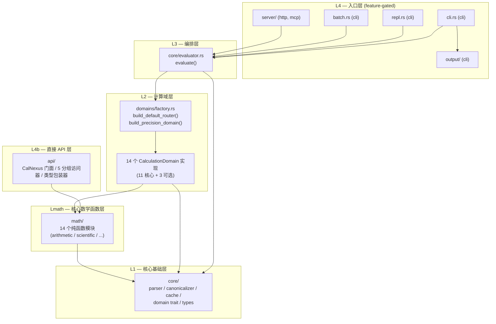
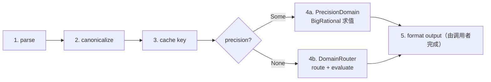
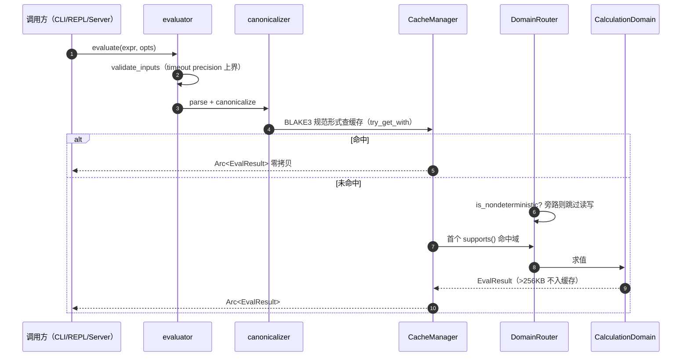
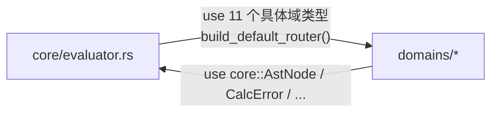
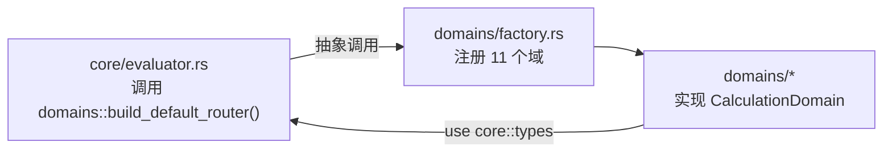
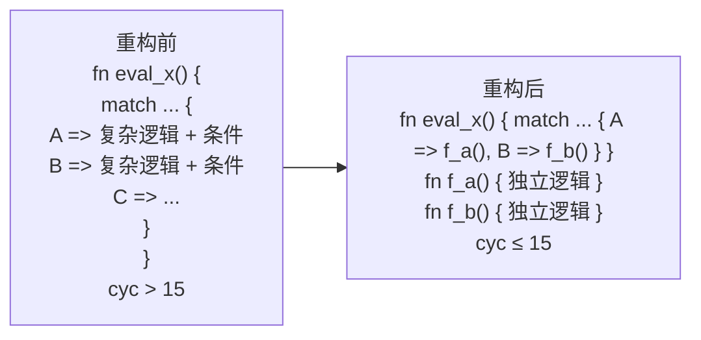

# 🏗️ CalNexus 架构文档

> 本文档描述 CalNexus 的设计原则、模块层次、依赖方向与数据流。
> 源码变更以代码为准；本文档在每次架构调整后同步更新。历史治理记录见附录。

## 📋 目录

- [🎯 概述](#-概述)
- [📐 设计原则](#-设计原则)
- [🏛️ 系统架构](#️-系统架构)
- [🧩 模块划分](#-模块划分)
  - [L1 — 核心基础层](#l1--核心基础层-src/core)
  - [Lmath — 核心数学函数层](#lmath--核心数学函数层-src/math)
  - [L2 — 计算域层](#l2--计算域层-src/domains)
  - [L3 — 编排层](#l3--编排层-srccoreevaluatorrs)
  - [L4b — 直接 API 层](#l4b--直接-api-层-src/api)
  - [L4 — 入口层](#l4--入口层)
  - [仓库目录结构](#仓库目录结构)
  - [Feature Gate 策略](#feature-gate-策略)
- [🌊 数据流](#-数据流)
- [🔒 安全设计](#-安全设计)
- [⚡ 性能设计](#-性能设计)
- [🧭 架构决策记录（ADR）](#-架构决策记录adr)
- [📚 相关文档](#-相关文档)
- [附录 A：循环依赖修复策略（P2 Phase 1-3）](#附录-a循环依赖修复策略p2-phase-1-3)
- [附录 B：复杂度治理（P2 Phase 4-8）](#附录-b复杂度治理p2-phase-4-8)
- [附录 C：v0.1.5 架构变更记录](#附录-cv015-架构变更记录)

---

## 🎯 概述

CalNexus 是一个命令行数学表达式求值器：11 个核心计算域 + 3 个可选计算域统一在单一解析器与按优先级路由的域调度器之后，向上提供单表达式 / REPL / 批量三种 CLI 形态与 HTTP / MCP 双协议服务，向下以零依赖核心库形态支持嵌入式集成。

---

## 📐 设计原则

- **依赖方向铁律**：五层分层，依赖严格自上而下，下层不感知上层；`api/` → `math/` → `core/` 直接 API 路径不经过域路由。
- **单一编排入口**：`core/evaluator.rs` 的 `evaluate()` 是唯一顶层求值入口，编排 parse → canonicalize → cache → route → evaluate 五阶段。
- **规则 25（mod.rs 纪律）**：所有 `mod.rs` 仅含 `mod` 声明、`pub use` re-export 与类型定义；实现函数一律拆到独立文件（如 `domains/factory.rs`、`api/scalar.rs`）。
- **单一事实源**：统一函数目录 `function_catalog` 同时供 REPL 补全、`--list-functions` 与 MCP `list_functions` 消费；HTTP 路由经 `build_router()` 显式挂载。
- **feature 门控**：可选能力（CLI、服务端、可选域、数值分解、国际化）均为独立 feature；`default = []` 时核心库零依赖，可作嵌入式引擎。
- **核心与外部依赖解耦**：缓存直连 moka、解析基于 mathexpr，全部依赖禁用默认特性、按需最小化启用。

---

## 🏛️ 系统架构

```mermaid
flowchart TD
    subgraph L4b["L4b — 直接 API 层"]
        API["api/<br/>CalNexus 门面 / 5 分组访问器 / 类型包装器"]
    end

    subgraph L4["L4 — 入口层 (feature-gated)"]
        CLI["cli.rs (cli)"]
        REPL["repl.rs (cli)"]
        BATCH["batch.rs (cli)"]
        SERVER["server/ (http, mcp)"]
        OUTPUT["output/ (cli)"]
    end

    subgraph L3["L3 — 编排层"]
        EVAL["core/evaluator.rs<br/>evaluate()"]
    end

    subgraph L2["L2 — 计算域层"]
        FACTORY["domains/factory.rs<br/>build_default_router()<br/>build_precision_domain()"]
        DOMAINS["14 个 CalculationDomain 实现<br/>(11 核心 + 3 可选)"]
    end

    subgraph Lmath["Lmath — 核心数学函数层"]
        MATH["math/<br/>14 个纯函数模块<br/>(arithmetic / scientific / ...)"]
    end

    subgraph L1["L1 — 核心基础层"]
        CORE["core/<br/>parser / canonicalizer / cache /<br/>domain trait / types"]
    end

    API --> MATH
    CLI --> EVAL
    REPL --> EVAL
    BATCH --> EVAL
    SERVER --> EVAL
    CLI --> OUTPUT
    EVAL --> FACTORY
    EVAL --> CORE
    FACTORY --> DOMAINS
    DOMAINS --> MATH
    DOMAINS --> CORE
    MATH --> CORE
```

---

## 🧩 模块划分

### L1 — 核心基础层 (`src/core/`)

无业务逻辑的共享基础设施，所有上层模块共用：

| 模块 | 职责 |
|------|------|
| `types.rs` | `AstNode` / `BinaryOp` / `UnaryOp` / `CalcError` / `EvalResult` / `Span` 等共享类型 |
| `parser.rs` | 表达式字符串 → `AstNode`（递归下降解析器） |
| `canonicalizer.rs` | AST 规范化（交换律排序 + 常量折叠 + 一元归一化）+ S-表达式序列化 |
| `cache.rs` | L1 缓存管理器（moka::sync 直连：try_get_with single-flight、字节权重预算、Arc<EvalResult> 零拷贝命中；BLAKE3 单次哈希键） |
| `domain.rs` | `CalculationDomain` trait + `DomainRouter`（14 域优先级路由） |
| `evaluator.rs` | 顶层 `evaluate()` 编排函数（parse → canonicalize → cache → route → evaluate）— **L3 编排层**，但位于 `src/core/` 目录下 |

### Lmath — 核心数学函数层 (`src/math/`)

从计算域层提取的纯数学函数集合，无表达式解析/域路由依赖。17 个模块（18 个文件）对应各计算域的数学核心：

| 模块 | 职责 |
|------|------|
| `arithmetic.rs` | 四则运算 + 幂 + 取模 + 阶乘 + 绝对值 |
| `scientific.rs` | 三角/双曲/指数/对数/特殊函数（gamma/erf） |
| `statistics.rs` | mean/variance/std/median + 分布/检验/相关函数 |
| `number_theory.rs` | GCD/LCM/素数判定/素数筛/模逆/模幂/欧拉函数 |
| `combinatorics.rs` | 排列/组合/Catalan/Stirling |
| `matrix.rs` | det/inverse/transpose/identity/mat_mul（nalgebra DMatrix） |
| `vector.rs` | dot/cross/normalize/magnitude |
| `complex.rs` | 复数四则/模/幅角/共轭/复指数/复对数 |
| `polynomial.rs` | poly_add/sub/mul/div/roots/eval |
| `symbolic.rs` | 符号微分/积分/化简/极限/泰勒展开 |
| `precision.rs` | BigRational 求值 + format_bigrational |
| `solvers.rs` | Newton-Raphson / 二分法 / Brent 方程数值求解 |
| `numerical.rs` | eig/SVD/LU/QR/solve/matrix_exp（feature = "numerical"，nalgebra） |
| `time.rs` | now/today/date_add/date_diff/parse_date（feature = "time"） |
| `unit.rs` + `unit_table.rs` | 8 量纲单位换算 + 温度仿射（feature = "unit"） |
| `fx.rs` | 汇率换算 RateTable + convert/get_rate（feature = "fx"） |

**依赖方向**：`math/` → `core/`（仅依赖 types），不依赖 `domains/`。

### L2 — 计算域层 (`src/domains/`)

11 个核心计算域 + 3 个可选计算域（feature 门控），每个域实现 `CalculationDomain` trait，处理特定类别的数学运算（按 priority 升序排列，priority 越高越优先匹配）：

| 域 | priority | Feature | 覆盖运算 |
|----|----------|---------|----------|
| `ArithmeticDomain` | 10 | — | 基础四则运算 + 幂 + 取模 |
| `ScientificDomain` | 20 | — | 三角/双曲/指数/对数/特殊函数 |
| `StatisticsDomain` | 20 | — | 统计函数 |
| `NumberTheoryDomain` | 25 | — | 数论（素数/GCD/LCM/斐波那契） |
| `CombinatoricsDomain` | 25 | — | 排列/组合/Catalan/Stirling |
| `PolynomialDomain` | 25 | — | 多项式运算 |
| `PrecisionDomain` | 25 | — | BigRational 高精度求值（绕过路由器） |
| `ComplexDomain` | 30 | — | 复数运算 |
| `MatrixDomain` | 30 | — | 矩阵运算（nalgebra） |
| `VectorDomain` | 30 | — | 向量运算 |
| `SymbolicDomain` | 30 | — | 符号微分/积分/化简/极限/泰勒 |
| `TimeDomain` | 30 | `time` | 日期/时间构造、间隔算术、多格式解析（jiff 0.2 + IANA tzdb） |
| `UnitDomain` | 30 | `unit` | 8 量纲物理单位换算 + 温度仿射 |
| `FxDomain` | 30 | `fx` | 汇率换算（frankfurter.dev API + 三级缓存） |

**工厂函数**位于 `domains/factory.rs`（规则 25 合规：`mod.rs` 仅含声明与 re-export）：

- `build_default_router()` — 注册全部 14 个域（含 feature 门控的可选域）到 `DomainRouter`
- `build_precision_domain()` — 构造 `PrecisionDomain` 实例（供 `evaluator.rs` precision 模式使用）

### L3 — 编排层 (`src/core/evaluator.rs`)

`evaluate()` 是唯一的顶层入口，编排五阶段流水线：

```mermaid
flowchart LR
    P["1. parse"] --> C["2. canonicalize"]
    C --> K["3. cache key"]
    K --> R{precision?}
    R -->|Some| PM["4a. PrecisionDomain<br/>BigRational 求值"]
    R -->|None| RM["4b. DomainRouter<br/>route + evaluate"]
    PM --> F["5. format output（由调用者完成）"]
    RM --> F
```

**非确定性函数缓存旁路（R-ncb-003）**：常规模式下，`eval_regular_mode` 在路由前调用 `DomainRouter::is_nondeterministic(canonical_ast)` 检测 AST 是否含 `now` / `today` / `fx` / `fx_rate` 等非确定性函数。命中时**同时跳过** `cache.get` 与 `cache.insert`，避免时间/汇率结果被缓存污染。检测开销为 O(AST 节点数) 的 HashSet 查询。

### L4b — 直接 API 层 (`src/api/`)

`CalNexus` 门面结构体提供绕过表达式解析的直接 API 入口，适用于嵌入式/程序化调用场景：

| 组件 | 职责 |
|------|------|
| `mod.rs` | `CalNexus` 门面（`RwLock<EvalContext>` + 5 个分组访问器） |
| `types.rs` | 5 个类型包装器（Matrix/Vector/Complex/Polynomial/BigNumber）+ From/TryFrom |
| `traits.rs` | 5 个分组 trait 定义（ScalarMath/LinearAlgebra/DataAnalysis/SymbolicMath/AppliedMath） |
| `scalar.rs` | ScalarMathImpl — 算术(8) + 科学函数(14) + 精度(1) + 数论(9) + 组合(5)，共 37 方法 |
| `linalg.rs` | LinearAlgebraImpl — 矩阵(8) + 向量(6) + 数值分解(6)，共 20 方法 |
| `stats.rs` | DataAnalysisImpl — 基础统计(8) + 分布(16) + 假设检验(3) + 相关(2) + 回归(3)，共 32 方法 |
| `symbolic_api.rs` | SymbolicMathImpl — 符号演算(5) + 多项式(6) + 复数(9) + 方程求解(1)，共 21 方法 |
| `applied.rs` | AppliedMathImpl — 时间(13) + 单位(1) + 汇率(2)，共 16 方法（feature-gated） |
| `cache.rs` | build_api_cache_key 基础实现 |

**依赖方向**：`api/` → `math/` → `core/`，不依赖 `domains/`。

### L4 — 入口层

- **CLI** (`src/cli.rs`)：clap 命令行入口，`--latex`/`--steps`/`--canonical`/`--json`/`--precision` 等标志
- **REPL** (`src/repl.rs`)：rustyline 交互式求值
- **Batch** (`src/batch.rs`)：批处理文件求值
- **Server** (`src/server/`)：HTTP + MCP 双协议服务，`#[forge]` 声明式封装（sdforge）——单个 async fn 同时生成 HTTP `POST /api/v1/evaluate` 路由 + MCP `evaluate` tool，错误响应统一 `ApiError` 契约（`InvalidInput`→400 / `ValidationError`→422 / `ServiceUnavailable`→503）。模块包含：`evaluate.rs`（`#[forge]` 入口）、`http.rs`（HTTP 启动 + 优雅关闭）、`mcp.rs`（MCP stdio 启动）、`types.rs`（请求/响应 DTO + vars 校验）、`cache.rs`（共享服务端缓存）、`ratelimit.rs`（固定窗口限流，`ratelimit` feature）
- **Output** (`src/output/`)：LaTeX / 步骤 / 规范形式三种格式化器

### 仓库目录结构

| 目录 | 内容 |
|------|------|
| `tests/` | 集成测试：integration、cli_integration（assert_cmd）、repl_integration（expectrl）、server_http_integration、server_mcp_integration、property_tests（proptest）、snapshot_tests（insta）、security_tests、api_integration、time_unit_fx_integration、common/（共享工具） |
| `benches/` | Criterion 基准：cache_bench、parser_bench、domain_bench、api_bench（各文件自包含，互不共享代码） |
| `fuzz/` | cargo-fuzz 目标 7 个：parser、ast_depth、list_depth、canonicalizer、cache_key、numeric_boundary、matrix_dim |
| `docs/` | 本文档集与 JSON Schema（`schema/result-v1.json`） |

### Feature Gate 策略

| Feature | 启用模块 | 用途 |
|---------|----------|------|
| `cli` | `cli.rs` / `repl.rs` / `batch.rs` / `output/` | 命令行交互 |
| `http` | `server/http.rs` | HTTP API |
| `mcp` | `server/mcp.rs` | MCP tool |
| `server` | `http` + `mcp` | 聚合特性 |
| `icu` | ICU4X 国际化 | 本地化错误消息 |
| `time` | `domains/time.rs` | 时间计算（jiff 0.2 + IANA tzdb，14 函数） |
| `unit` | `math/unit.rs` / `math/unit_table.rs` → `domains/unit.rs` | 8 量纲物理单位换算 + 温度仿射 |
| `fx` | `math/fx.rs` → `domains/fx.rs` / `fx_provider.rs` | 汇率换算（frankfurter.dev API + 三级缓存） |
| `numerical` | `math/numerical.rs` → `domains/numerical.rs` + `api/linalg.rs` | 数值线性代数分解（eig/SVD/LU/QR/solve/matrix_exp，nalgebra f64） |
| `ratelimit` | `server/ratelimit.rs` | HTTP 限流（sdforge ratelimit-http 契约） |
| `docs` | sdforge/docs | OpenAPI + Swagger UI |
| `observability` | tracing-subscriber | 结构化日志（RUST_LOG） |

`default = []`：核心库零依赖，可作为嵌入式计算引擎被其他 crate 引用。

---

## 🌊 数据流

### 求值主流程

```mermaid
sequenceDiagram
    autonumber
    participant App as 调用方（CLI/REPL/Server）
    participant E as evaluator
    participant C as canonicalizer
    participant K as CacheManager
    participant R as DomainRouter
    participant D as CalculationDomain

    App->>E: evaluate(expr, opts)
    E->>E: validate_inputs（timeout precision 上界）
    E->>C: parse + canonicalize
    C->>K: BLAKE3 规范形式查缓存（try_get_with）
    alt 命中
        K-->>App: Arc<EvalResult> 零拷贝
    else 未命中
        R->>R: is_nondeterministic? 旁路则跳过读写
        K->>R: 首个 supports() 命中域
        R->>D: 求值
        D-->>K: EvalResult（>256KB 不入缓存）
        K-->>App: Arc<EvalResult>
    end
```

### 缓存 single-flight 数据流

并发相同表达式的多个请求在 `try_get_with` 处收敛：首个请求执行真实求值并写入缓存，其余等待方直接共享同一 `Arc<EvalResult>`；求值失败则错误原样传播给全部等待方且不污染缓存。

### 服务模式数据流

`#[forge]` 声明的求值入口同时生成 HTTP 路由与 MCP tool；HTTP 路由由 `build_router()` 显式挂载（单一事实源），经 context 中间件注入 `X-Request-ID` / `traceparent`，经限流层（可选）后进入 evaluator；错误统一映射 `ApiError`（400 / 422 / 503 + `Retry-After`），探针（`/live` `/ready` `/health`）语义分离，优雅关闭 drain 最长 30s。

---

## 🔒 安全设计

- **递归深度防护闭环**：`MAX_AST_DEPTH=256` + mathexpr 前迭代括号预检 + 括号字面量递归 thread-local RAII 守卫 + canonicalizer 深度守卫，堵住嵌套列表/矩阵字面量绕过（历史 DoS 缺口已修复）。
- **请求资源上限**：expr ≤ 4096 字符、vars ≤ 1024 键、precision ≤ 10000 位；`--timeout` 兜底累积慢操作。
- **错误信息脱敏**：解析错误不泄漏 winnow 内部 Debug 结构；错误文案经 i18n 清洗。
- **fx 上游加固**：ureq `https_only`、响应体 1MB 上限、磁盘缓存原子写（temp+rename+0600）、拉取 single-flight、网络三态熔断。
- **错误语义分级**：`DependencyUnavailable`（503）与客户端输入错误（400）严格区分，SLO 友好。

安全配置最佳实践与漏洞处理流程见 [🔒 安全文档](SECURITY.md)。

---

## ⚡ 性能设计

- **缓存热路径零开销**：命中返回 `Arc<EvalResult>`，无序列化与临时 runtime；single-flight 消除并发重复求值。
- **缓存有界**：字节权重预算（默认 64MB）+ 256KB 大结果准入阈值。
- **键构建低成本**：规范化 S-表达式单次 BLAKE3 哈希；规范化器亚微秒级（基准数据见 [📈 性能指南](PERFORMANCE.md)）。
- **编译期裁剪**：全部可选能力 feature 门控，控制编译时间与二进制体积；依赖禁用默认特性。

---

## 🧭 架构决策记录（ADR）

> 源自原架构设计文档（ADD，已归档至 `docs/archive/`）的决策记录，按 ADR 现状修订。

| 决策ID | 决策内容 | 状态 | 上下文 | 决策 | 后果 | 日期 |
|--------|----------|:----:|--------|------|------|------|
| **ADR-001** | 进程内 L1-only 缓存 | ✅ 已采纳（v0.1.5 修订实现） | 库场景无 Redis，进程内缓存足够 | 仅 Moka，TTL=进程生命周期 | 失去跨进程共享，但零运维 | 2026-06-28 |
| **ADR-002** | 统一 trait 接口 | ✅ 已采纳 | 14 个计算域需标准化接入 | CalculationDomain trait | 学习成本低，扩展性高 | 2026-06-28 |
| **ADR-003** | AST 规范化去重 | ✅ 已采纳 | `3+2` 与 `2+3` 需统一缓存 | 交换律排序+常量折叠 | 规范化开销亚微秒级（v0.1.5 实测 45~430 ns），可接受 | 2026-06-28 |
| **ADR-004** | mathexpr 解析器 | ✅ 已采纳 | 需安全高性能表达式解析 | mathexpr 或自研 Pratt | 不支持复数/矩阵，需扩展 | 2026-06-28 |
| **ADR-005** | 内置符号计算引擎 | ✅ 已采纳 | rssn 社区争议 + 转向 FFI | 内置符号计算实现 | 无第三方依赖风险 | 2026-06-28 |
| **ADR-006** | 单 crate 分层架构 | ✅ 已采纳 | 库与 CLI 统一发布 | 单 crate + 分层模块（core/domains/math/api） | 简化构建，降低复杂度 | 2026-06-28 |

### ADR-001：进程内 L1-only 缓存（v0.1.5 修订）

**上下文**：v0.1 采用 L1(Moka) + L2(Redis) 两级缓存支撑微服务共享。v0.2 重构为单进程库 + CLI，无 Redis 依赖，进程间无需共享缓存。候选方案为 L1+L2（复杂度高，库场景无意义）、L1-only（简单、零依赖）、无缓存（性能差）。

**决策**：L1-only 进程内缓存。理由：库场景下进程间共享缓存无意义；AST 规范化去重已能实现高命中率；去除 Redis 依赖实现零运维。

**修订（v0.1.5）**：原实现为 oxcache 封装，现退役为 `moka::sync` 直连——`try_get_with` single-flight、字节权重预算、`Arc<EvalResult>` 零拷贝命中（详见附录 C 第 1 条）。决策本身（L1-only）不变。

### ADR-005：内置符号计算引擎

**上下文**：rssn 出现社区争议（维护方向不明）且转向 FFI 路线，违背纯 Rust 跨平台编译目标。候选为内置实现、symbolica（商业许可）、symb_anafis（无积分/极限）。

**决策**：内置符号计算引擎。理由：纯 Rust、无 C FFI 拖累、完全控制符号逻辑；覆盖符号求导/积分/化简/极限/泰勒展开需求。后果：自行维护引擎，功能范围限于大学本科以下数学，高级符号计算可经 feature 扩展。

### ADR-006：单 crate 分层架构

**上下文**：需同时交付 Rust 库与 CLI 二进制，并以 feature gate 控制可选模块。

**决策**：单 crate + 分层模块（`core/`、`math/`、`domains/`、`api/`、`cli.rs`、`repl.rs`、`batch.rs`、`server/`、`output/`）。理由：单一 crate 简化构建发布；feature gate 保证 `cargo add calnexus` 不引入 CLI 依赖；分层保持清晰依赖方向。后果：全部模块共享版本号，分层规则靠代码审查保证（`mod.rs` 纪律）。

---

## 📚 相关文档

- [变更日志](CHANGELOG.md)
- [贡献指南](CONTRIBUTING.md)
- [用户指南](USER_GUIDE.md) · [API 参考](API_REFERENCE.md) · [性能指南](PERFORMANCE.md) · [安全文档](SECURITY.md) · [服务模式指南](SERVER.md)

---

## 附录 A：循环依赖修复策略（P2 Phase 1-3）

### 修复前的问题

修复前 `src/core/evaluator.rs` 同时承担**编排职责**与**域注册职责**，直接 `use` 11 个具体域类型，导致 `core ↔ domains` 双向依赖：

```mermaid
flowchart LR
    CORE["core/evaluator.rs"]
    DOMAINS["domains/*"]
    CORE -- "use 11 个具体域类型<br/>build_default_router()" --> DOMAINS
    DOMAINS -- "use core::AstNode / CalcError / ..." --> CORE
```

### 修复方案

采用**职责迁移**策略：将域注册职责从 `core` 迁移到 `domains` 层：

1. `build_default_router()` 从 `core/evaluator.rs` 移至 `domains/factory.rs`
2. 新增 `build_precision_domain()` 工厂函数，消除 `evaluator.rs` 对 `PrecisionDomain` 类型的直接依赖
3. `core/evaluator.rs` 改为调用 `crate::domains::build_default_router()`（抽象入口）

```mermaid
flowchart LR
    CORE["core/evaluator.rs<br/>调用 domains::build_default_router()"]
    FACTORY["domains/factory.rs<br/>注册 11 个域"]
    DOMAINS["domains/*<br/>实现 CalculationDomain"]
    CORE -- "抽象调用" --> FACTORY
    FACTORY --> DOMAINS
    DOMAINS -- "use core::types" --> CORE
```

### 修复效果

| 指标 | 修复前 | 修复后 | 变化 |
|------|--------|--------|------|
| `core` → `domains` 类型依赖（生产+测试代码） | 11 | 0 | **-100%** |
| `core` → `domains` 函数依赖 | 1 | 2 | +1（抽象入口不可避免） |
| 总依赖数 | 12 | 2 | **-83%** |
| 循环依赖 | 存在 | 消除 | ✓ |

> **验证方法**：`grep -rn "crate::domains::.*Domain" src/core/` 返回 0 匹配生产代码 import（注释中包含模式名的 2 行不计入）。`core` 仅通过 `build_default_router()` / `build_precision_domain()` 两个工厂函数抽象入口调用 `domains` 层。
> priority 测试位于 `domains/factory.rs` 测试模块（priority 是 domains 层属性，应由 domains 层自测）。

---

## 附录 B：复杂度治理（P2 Phase 4-8）

针对 codenexus 识别的 5 个圈复杂度热点（cyc > 15），按 TDD 流程（Red → Green → Commit → Verify）逐个重构。

### 重构模式

采用**分派提取模式**：将含条件分支的大型 `match` 拆分为按 variant/operation 分组的独立方法，主函数变为纯分派：

```mermaid
flowchart LR
    BEFORE["重构前<br/>fn eval_x() {<br/>  match ... {<br/>    A => 复杂逻辑 + 条件<br/>    B => 复杂逻辑 + 条件<br/>    C => ...<br/>  }<br/>}<br/>cyc > 15"]
    AFTER["重构后<br/>fn eval_x() { match ... { A => f_a(), B => f_b() } }<br/>fn f_a() { 独立逻辑 }<br/>fn f_b() { 独立逻辑 }<br/>cyc ≤ 15"]
    BEFORE --> AFTER
```

### 重构结果

| 文件 | 函数 | cyc 重构前 | cyc 重构后 | 降幅 | 提取方法数 |
|------|------|-----------|-----------|------|-----------|
| `domains/combinatorics.rs` | `eval_function` | 38 | 4 | -89% | 6 |
| `domains/matrix.rs` | `eval_binary` | 25 | 4 | -84% | 4 |
| `core/evaluator.rs` | `evaluate` | 25 | 7 | -72% | 4 |
| `core/canonicalizer.rs` | `transform_inner` | 24 | 2 | -92% | 5 |
| `domains/symbolic.rs` | `eval_symbolic` | 23 | 15 | -35% | 2 |

**所有提取方法 cyc ≤ 15**，主函数与提取方法均满足复杂度门禁。

### 测试保障

每个重构遵循严格 TDD：

1. **Red**：先添加覆盖所有 variant/分支的回归测试（含边界条件、错误路径）
2. **Green**：重构实现使测试通过（行为不变）
3. **Verify**：`cargo test` 全套通过 + `cargo clippy -D warnings` 0 告警 + codenexus 复杂度复测

最终测试规模：**2820 个测试函数（2432 lib 内联 + 388 集成），CI 矩阵覆盖 cli / cli,time,unit,fx / cli,server / cli,server,fx / cli,numerical / all 六条腿，全部绿色；行覆盖 90.4%（llvm-cov，门禁 ≥90%）**。

---

## 附录 C：v0.1.5 架构变更记录

v015-comprehensive-optimization（2026-09）：

1. **缓存引擎重构**：oxcache 封装退役，`CacheManager` 直连 `moka::sync`——`try_get_with` 生产级 single-flight（并发相同键恰一次求值、错误原样传播），字节权重预算（默认 64MB）+ 256KB 大结果准入阈值，`Arc<EvalResult>` 命中零拷贝，单次 BLAKE3 键。连带消除 JSON 序列化存储、临时 tokio runtime 与 hex 键分配。
2. **HTTP 路由显式注册**：`#[forge]` inventory 注册在 rlib/测试二进制下会被链接器 GC 静默丢弃（生产 404），HTTP 路由改为 `build_router()` 显式挂载（单一事实源）；`#[forge]` 保留 MCP tool 注册与 schema 推导职责。
3. **递归深度防护闭环**：括号字面量递归 thread-local RAII 守卫、mathexpr 前迭代括号预检、canonicalizer 深度守卫；fuzz 目标覆盖真实深度域。
4. **错误语义服务化**：`ErrorKind::DependencyUnavailable`（exit_code=3）→ HTTP 503，与客户端 400 严格区分；`/ready`/`/live`/`/health` 三探针语义分离。
5. **可观测性**：request-id/traceparent 中间件、`calnexus_http_requests_total`、observability feature 接入 tracing-subscriber（RUST_LOG）。
6. **公共 API**：`evaluate_with_router` 路由器可注入；`pub use server::*` 具名化；math/domains 标注内部 API 边界；统一函数目录 `function_catalog`（REPL 补全 / `--list-functions` / MCP `list_functions` 单一事实源）。
7. **规格流程**：openspec/ 已收敛并入 `specmark/specs/`（27 个能力域），**specmark 为唯一 SDD 流程**。
8. **sdforge 基座吸收（手写基础设施迁移）**：优雅关闭切换 `sdforge::http::serve_with_graceful_shutdown` + `default_shutdown_signal`；`/health` `/ready` 切换 `sdforge::health::readyz_handler`（checks 数组契约，cache 经 `register_readiness_check_fn` 注册）、`/live` 切换 `healthz_handler`；请求标识切换 `sdforge::context::context_middleware`（+W3C traceparent 提取 trace_id 回写 `X-Trace-ID`，task-local 上下文）。`ratelimit` feature 接通：`src/server/ratelimit.rs` 固定窗口 per-IP 策略实现 sdforge `HttpRequestRateLimiter` 契约，经 Clone 桥接层挂载，`CALNEXUS_RATELIMIT_LIMIT/WINDOW_SECS` 可配，探针/metrics 豁免限流。
