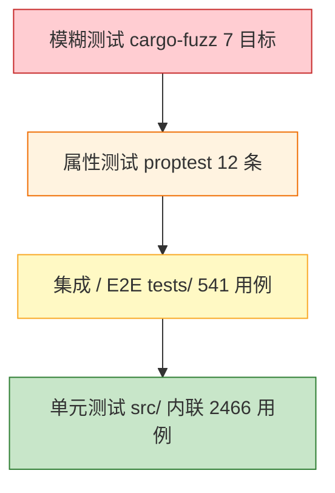

# 🧪 CalNexus 测试场景矩阵

> 适用版本：calnexus **0.1.4 + [Unreleased]**（Rust 1.97.1 / edition 2024）
> 用途：穷举现有测试套件的场景矩阵，作为回归验收与覆盖对照的单一事实源。原《测试方案》（`docs/TEST.md` v0.2.0，2026-06-28）中仍然有效的方法论（测试策略、覆盖率目标、通过标准、缺陷分级）已合并至本文档，原文已归档为 [docs/archive/TEST.md](archive/TEST.md)。
> 编写依据（只读核对）：`Cargo.toml` 的 `[features]` 与 `[[test]]` 注册表、`src/` 内联 `#[cfg(test)]` 模块、`tests/` 12 个集成测试文件、`tests/e2e/` 9 个场景模块、`fuzz/` 7 个目标、`benches/` 4 组基准、`.github/workflows/ci.yml`。
> 所有引用的测试名均经 grep 核实存在；数量口径：`grep -rE "#\[(tokio::)?test\]" src/ tests/ --include="*.rs" | wc -l`（截至本文档更新时为 **3007**）。

## 📋 目录

- [🎯 阅读约定](#-阅读约定)
- [🗺️ 总览：功能域 × 测试位置](#️-总览功能域--测试位置)
- [🔬 测试策略与覆盖率目标](#-测试策略与覆盖率目标)
- [🧱 单元测试（`src/` 内联，2466）](#-单元测试src-内联2466)
- [🔧 集成测试（`tests/`，396）](#-集成测试tests396)
  - [核心流水线集成（integration.rs，132）](#核心流水线集成integrationrs132)
  - [CLI 集成（cli_integration.rs，133）](#cli-集成cli_integrationrs133)
  - [REPL 交互集成（repl_integration.rs，8）](#repl-交互集成repl_integrationrs8)
  - [门面 API 集成（api_integration.rs，17）](#门面-api-集成api_integrationrs17)
  - [可选域集成（time_unit_fx / numerical，16）](#可选域集成time_unit_fx--numerical16)
  - [服务端集成（server_http / server_mcp，32）](#服务端集成server_http--server_mcp32)
- [🌐 E2E 场景套件（`tests/e2e/`，145）](#-e2e-场景套件testse2e145)
  - [S1 正常路径（happy_path.rs，29）](#s1-正常路径happy_pathrs29)
  - [S2 边界条件（edge_cases.rs，25）](#s2-边界条件edge_casesrs25)
  - [S3 异常路径（error_paths.rs，13）](#s3-异常路径error_pathsrs13)
  - [S4 fx 域离线全链路（fx_mock.rs，14）](#s4-fx-域离线全链路fx_mockrs14)
  - [S5 特性组合矩阵（feature_gates.rs，17）](#s5-特性组合矩阵feature_gatesrs17)
  - [S6 缓存与路由（cache_router.rs，18）](#s6-缓存与路由cache_routerrs18)
  - [S7 安全与健壮性（security.rs，9）](#s7-安全与健壮性securityrs9)
  - [S8 HTTP/MCP/ratelimit/docs（server_e2e.rs，9）](#s8-httpmcpratelimitdocsserver_e2ers9)
  - [S9 CLI/批处理缺口（cli_e2e.rs，11）](#s9-cli批处理缺口cli_e2ers11)
- [⚡ 属性测试（proptest，12）](#-属性测试proptest12)
- [📸 快照测试（insta，22）](#-快照测试insta22)
- [🛡️ 安全测试（security_tests.rs，18）](#️-安全测试security_testsrs18)
- [⏱️ 性能回归测试（performance_tests.rs，6）](#️-性能回归测试performance_testsrs6)
- [🎲 模糊测试（`fuzz/`，7 目标）](#-模糊测试fuzz7-目标)
- [📈 基准测试（`benches/`，4 组）](#-基准测试benches4-组)
- [▶️ 执行命令（与 CI 一致）](#️-执行命令与-ci-一致)
- [✅ 测试通过标准](#-测试通过标准)
- [🚦 缺陷分级](#-缺陷分级)
- [📚 相关文档](#-相关文档)

---

## 🎯 阅读约定

- **场景类型**：`正常`（合法输入下的预期行为）/ `边界`（极限值与临界组合）/ `异常`（错误输入与故障注入，须给出明确错误）/ `安全`（DoS 与攻击向量）/ `性能`（耗时与回归阈值）。
- **既有覆盖**：直接引用 `文件::测试名`；测试名均来自当前工作区真实代码，可 grep 复核。
- **特性门控**：`tests/e2e/` 套件**无 `required-features`**（`Cargo.toml` `[[test]]` 显式注册），目标在一切 feature 组合下编译，模块内部以 `#[cfg(feature = ...)]` 门控启用/禁用两侧用例——`--all-features` 跑启用侧，`default` 跑禁用侧。
- **离线约束**：`tests/e2e/` 套件不发起出网请求（fx 走 mock 域 + 容忍冒烟，见 `tests/e2e/common/fx_mock.rs`）。

---

## 🗺️ 总览：功能域 × 测试位置

| 层级 | 位置 | 数量 | 说明 |
|------|------|-----:|------|
| 单元测试 | `src/core/` 内联 | 398 | evaluator、canonicalizer、cache、router 等核心 |
| 单元测试 | `src/domains/` 内联 | 1261 | 11 核心域 + 可选域求值 |
| 单元测试 | `src/math/` 内联 | 471 | 数学函数层 |
| 单元测试 | `src/server/` 内联 | 86 | http / mcp / ratelimit |
| 单元测试 | `src/output/` 内联 | 130 | 文本 / JSON / LaTeX / 规范形式 / 步骤输出 |
| 单元测试 | `src/api/` 内联 | 12 | `CalNexus` 门面与直接 API |
| 单元测试 | 入口层（`src/*.rs`：cli / repl / batch / i18n / function_catalog / lib） | 108 | CLI 解析、REPL、批量、双语消息 |
| 集成测试 | `tests/`（12 个文件，`[[test]]` 显式注册） | 396 | 子进程（assert_cmd）、交互（expectrl）、tower oneshot |
| E2E 场景 | `tests/e2e/`（9 个场景模块） | 145 | 五类核心场景 + 缓存/安全/服务端/CLI 缺口 |
| 属性测试 | `tests/property_tests.rs` | 12 | proptest 不变量 |
| 快照测试 | `tests/snapshot_tests.rs` | 22 | insta，全部 CLI 可达输出变体 |
| 安全测试 | `tests/security_tests.rs` | 18 | DoS 向量与边界攻击 |
| 性能回归 | `tests/performance_tests.rs` | 6 | criterion 基线对比与阈值 |
| 合计 | `grep -rE "#\[(tokio::)?test\]" src/ tests/` | **3007** | 另有模糊目标 7 个、criterion 基准 4 组、doctest 随 `cargo test` 执行 |

> `tests/` 内 396 = 顶层集成 251 + E2E 145；各文件 `[[test]]` 的 `required-features` 声明见 `Cargo.toml`（如 `server_http_integration` 需 `server`，`time_unit_fx_integration` 需 `cli,time,unit,fx`）。

---

## 🔬 测试策略与覆盖率目标



| 模块分类 | 模块 | 行覆盖目标 |
| :--- | :--- | :--- |
| **核心域** | Parser、Canonicalizer、DomainRouter、Cache、Arithmetic、Scientific、NumberTheory、Combinatorics | **100%** |
| **其他域** | Complex、Matrix、Statistics、Symbolic、Precision、Vector、Polynomial | **≥ 80%** |
| **整体** | crate 全量 | **≥ 90%**（CI `cargo llvm-cov --fail-under-lines 90` 门禁；最近实测 90.4%） |

- 覆盖率工具为 **cargo-llvm-cov**（唯一门禁；tarpaulin 配置已删除，见 `docs/CHANGELOG.md` [Unreleased] Removed）。
- 相对 v0.1（HTTP 微服务形态）的策略变化：删除 Docker Compose / k6 / K8s 压测，回到 Rust 生态本位的「单元 + 属性 + 模糊」三件套，并叠加进程级 CLI/REPL 集成与纯进程内 E2E 场景套件。

---

## 🧱 单元测试（`src/` 内联，2466）

单元测试位于各模块 `#[cfg(test)] mod tests`，随特性门控编译。按目录统计：

| 目录 | 用例数 | 覆盖重点 |
|------|-------:|----------|
| `src/domains/` | 1261 | 11 核心计算域 + 时间/单位/汇率/数值域的函数级行为、错误分类、域路由 `supports()` |
| `src/math/` | 471 | 数学函数层实现（ gamma/erf/组合数/多项式/数值分解等底层纯函数） |
| `src/core/` | 398 | evaluator 五阶段流水线、AST 规范化（常量折叠/交换律排序）、缓存键与 single-flight、路由优先级 |
| `src/output/` | 130 | 文本 / JSON（`"v":1` 契约）/ LaTeX / 规范形式 / 步骤五种格式化器 |
| `src/server/` | 86 | HTTP 路由与错误映射、限流固定窗口、语言协商、指标导出 |
| 入口层 `src/*.rs` | 108 | CLI 参数解析与互斥、REPL 命令、批量文件读取、i18n 消息目录、函数目录 |
| `src/api/` | 12 | `CalNexus` 门面（直接 API）与变量绑定状态 |
| **合计** | **2466** | 口径：`grep -rE "#\[(tokio::)?test\]" src/ --include="*.rs" \| wc -l` |

---

## 🔧 集成测试（`tests/`，396）

### 核心流水线集成（integration.rs，132）

| 场景组 | 数量 | 用例（前缀 / 列举） |
|--------|-----:|---------------------|
| 全流水线算术与科学函数 | 11 | `test_full_pipeline_arithmetic_basic`、`test_full_pipeline_scientific_trig`、`test_full_pipeline_scientific_gamma_erf`、`test_full_pipeline_constant_folding_in_pipeline` 等 `test_full_pipeline_*` |
| 缓存去重与键等价 | 10 | `test_cache_dedup_commutative_addition`、`test_cache_get_or_compute_dedup`、`test_cache_does_not_store_errors`、`test_cache_dedup_complex_equivalent`、`test_v08_cache_dedup_same_expression` 等 |
| 错误路径与错误分类 | 24 | `test_error_parse_error`、`test_error_depth_exceeded`、`test_all_seven_error_variants_covered`、`test_error_matrix_dimension_mismatch`、`test_v08_error_non_polynomial_expression` 等 `test_error_*` / `test_v08_error_*` |
| 冷启动与缓存命中冒烟 | 2 | `test_cold_start_performance`、`test_cache_hit_performance` |
| 复数流水线 | 6 | `test_complex_pipeline_literal`、`test_complex_pipeline_conj`、`test_complex_pipeline_route_by_function` 等 |
| 矩阵流水线 | 6 | `test_matrix_pipeline_determinant`、`test_matrix_pipeline_transpose` 等 |
| 统计流水线 | 9 | `test_statistics_pipeline_median_odd`、`test_statistics_pipeline_empty_list_error` 等 |
| 任意精度流水线 | 10 | `test_precision_pipeline_bigrational_reduction`、`test_precision_pipeline_route_by_function` 等 |
| 数论流水线 | 7 | `test_number_theory_gcd_pipeline`、`test_number_theory_euler_phi_pipeline` 等 |
| 组合流水线 | 6 | `test_combinatorics_P_pipeline`、`test_combinatorics_C_large_bigint` 等 |
| 向量流水线 | 8 | `test_vector_dot_pipeline`、`test_vector_dimension_mismatch_error` 等 |
| 多项式流水线 | 10 | `test_polynomial_add_pipeline`、`test_polynomial_roots_complex_pipeline`、`test_polynomial_factor_pipeline` 等 |
| 符号演算（v0.1 回归） | 8 | `test_v10_symbolic_diff_chain_rule`、`test_v10_symbolic_limit_lhopital`、`test_v10_symbolic_taylor_exp` 等 |
| 大数路由（v0.1 回归） | 3 | `test_v10_bignumber_is_prime_routes_to_number_theory` 等 |
| 隐式乘法（v0.1 回归） | 3 | `test_v10_implicit_mult_2x`、`test_v10_implicit_mult_paren` 等 |
| 多项式除法与求根（v0.1 回归） | 6 | `test_v10_poly_div_exact`、`test_v10_roots_quartic_repeated` 等 |
| 公共 API 稳定性 | 3 | `test_public_api_unchanged_after_move`、`test_all_ten_domains_routed`、`test_symbolic_domain_accessible_via_domains` |

### CLI 集成（cli_integration.rs，133）

assert_cmd 子进程调用真实二进制，重点验证输出契约与退出码（0 成功 / 1 计算错误 / 2 用法错误 / 3 超时或依赖不可用）。

| 场景组 | 数量 | 用例（前缀 / 列举） |
|--------|-----:|---------------------|
| 基础求值与 stdin | 8 | `test_basic_addition`、`test_stdin_scientific_expression`、`test_no_args_piped_stdin`、`test_empty_stdin_exit_code` 等 |
| JSON 输出契约 | 15 | `test_json_arithmetic`、`test_json_error_output_exit_1`、`test_json_mode_var_error_output_format` 等 `test_json_*` / `test_json_mode_*` |
| 变量绑定 | 8 | `test_single_var_arithmetic`、`test_three_variables`、`test_invalid_var_missing_equals_exit_code` 等 |
| 用法 / 帮助 / 退出码 | 11 | `test_unknown_flag_exit_code`、`test_long_help_flag`、`test_success_exit_0`、`test_lang_invalid_value_exit_2` 等 |
| 精度旗标 | 5 | `test_precision_flag_zero_decimals`、`test_precision_function_call_json` 等 |
| 大数与有理数输出 | 5 | `test_bigint_addition_output`、`test_bigrational_output_fraction_form` 等 |
| 复数 / 矩阵输出 | 4 | `test_complex_output_standard`、`test_matrix_output_1x3` 等 |
| 统计 CLI | 5 | `test_statistics_mean_cli`、`test_statistics_stdin_pipeline` 等 |
| 数论 / 组合 CLI | 7 | `test_cli_number_theory_prime_sieve`、`test_cli_combinatorics_stdin` 等 |
| 向量 CLI | 4 | `test_cli_vector_dot`、`test_cli_vector_dimension_mismatch_error` 等 |
| 多项式 CLI | 9 | `test_cli_polynomial_roots_real`、`test_polynomial_general_coef_high_degree` 等 |
| REPL（子进程形态） | 12 | `test_cli_repl_let_and_use`、`test_repl_complex_format_result`、`test_repl_polynomial_format_result` 等 |
| 批量处理 | 5 | `test_cli_batch_basic`、`test_cli_batch_comment_skipped`、`test_cli_batch_nonexistent_file` 等 |
| 格式化输出与互斥 | 8 | `it_cli_003_latex_output`、`it_cli_009_canonical_output`、`it_cli_010_steps_output`、`it_cli_latex_json_conflict_exit_2`、`test_batch_precision_conflict_exit_2` 等 |
| 格式化错误路径 | 5 | `it_cli_latex_parse_error_exit_1`、`it_cli_steps_div_zero_exit_1` 等 |
| `--explain` 与 `--lang` | 7 | `test_explain_div_zero_hint`、`test_explain_domain_hint`、`test_lang_zh_parse_error` 等 |
| 符号演算 CLI | 4 | `test_cli_symbolic_diff_power`、`test_cli_symbolic_limit` 等 |
| serve 旗标冲突与门控 | 5 | `test_serve_http_conflicts_serve_mcp`、`test_serve_http_without_server_feature` 等 |
| `--timeout` / `--cache-size` / `--bind` | 4 | `timeout_flag_slow_expression_exits_3`、`timeout_env_var_fallback_and_validation`、`cache_size_flag_accepted_and_validated`、`bind_flag_serve_http_listens_on_custom_port` |
| 输出体验（caret / hint） | 2 | `parse_error_text_mode_shows_caret`、`undefined_symbol_hint_suggests_cli_var_flag` |

### REPL 交互集成（repl_integration.rs，8）

expectrl 驱动伪终端交互（`it_cli_017`~`it_cli_023` 沿用测试方案用例编号）：

| 用例 | 场景 |
|------|------|
| `it_cli_017_basic_eval` | REPL 内基础求值 |
| `it_cli_018_variable_binding` | `:let x = 3.14` 后引用变量 |
| `it_cli_019_view_vars` | `:vars` 列出已绑定变量 |
| `it_cli_020_history_recall` | ↑ 键调出上一条输入 |
| `it_cli_021_quit_exit_zero` | `:quit` 退出码 0 |
| `it_cli_022_tab_completion` | Tab 补全函数名 |
| `it_cli_023_error_recovery` | 出错后继续求值 |
| `repl_infrastructure_present` | 基础设施自检 |

### 门面 API 集成（api_integration.rs，17）

直接 API（`CalNexus` 门面，绕过 CLI）的程序化调用验证：

| 场景组 | 用例 |
|--------|------|
| 标量运算 | `test_scalar_add` / `test_scalar_sub` / `test_scalar_mul` / `test_scalar_div` / `test_scalar_div_by_zero` |
| 科学函数 | `test_scalar_sin_pi_over_2`、`test_scalar_cos_zero` |
| 线性代数 | `test_linalg_det_2x2`、`test_linalg_det_3x3`、`test_linalg_dot` |
| 统计 | `test_stats_mean`、`test_stats_std` |
| 变量状态 | `test_set_var_get_var`、`test_clear_vars`、`test_default_instance` |

### 可选域集成（time_unit_fx / numerical，16）

`time_unit_fx_integration.rs`（10，`required-features = ["cli","time","unit","fx"]`）：

| 用例 | 场景 |
|------|------|
| `test_time_date_diff_days_end_to_end` | 日期差端到端 |
| `test_time_date_multi_format_equality` | 多日期格式等价解析 |
| `test_time_reformat_date_end_to_end` | 日期重排格式 |
| `test_unit_convert_length_end_to_end` | 长度换算 |
| `test_unit_convert_temperature_end_to_end` | 温度仿射换算 |
| `test_unit_arithmetic_wrapping_end_to_end` | 带单位算术 |
| `test_unit_cross_domain_function_rejected_end_to_end` | 跨域函数拒绝 |
| `test_fx_expression_end_to_end_network_tolerant` | fx 表达式（网络容忍冒烟） |
| `test_now_cache_bypass_end_to_end` | 非确定性函数缓存旁路 |
| `test_str_in_binary_op_returns_domain_error` | 字符串参与二元运算报域错误 |

`numerical_linalg_test.rs`（6，`required-features = ["cli","numerical"]`）：

| 用例 | 场景 |
|------|------|
| `lu_end_to_end_returns_json_with_lup` | LU 分解（含行交换） |
| `qr_end_to_end_returns_json_with_qr` | QR 分解 |
| `eig_end_to_end_returns_json_with_values_and_vectors` | 特征值 / 特征向量 |
| `svd_end_to_end_returns_json_with_usvt` | SVD 分解 |
| `solve_end_to_end_returns_vector_satisfying_ax_eq_b` | 线性方程组求解 |
| `precision_wrapping_numerical_end_to_end_errors` | 精度模式包裹数值分解报错 |

### 服务端集成（server_http / server_mcp，32）

`server_http_integration.rs`（19，`required-features = ["server"]`，tower oneshot）：

| 场景组 | 用例 |
|--------|------|
| 求值端点 | `test_http_evaluate_scalar`、`test_http_evaluate_with_vars`、`test_http_evaluate_precision`、`test_http_evaluate_cache_miss` |
| 错误映射 | `test_http_evaluate_calc_error_invalid_input`（400）、`test_http_evaluate_validation_error_oversized_precision`（422）、`test_http_evaluate_validation_error_oversized_vars`（422） |
| 运维端点 | `test_health_endpoint_healthy`、`test_liveness_endpoint_healthy`、`test_readiness_endpoint_healthy` |
| 指标 | `test_metrics_prometheus_format`、`test_metrics_json_format`、`test_metrics_http_requests_total` |
| 请求标识 | `test_request_id_generated`、`test_request_id_passthrough` |
| 语言协商 | `test_http_evaluate_default_lang_english_error`、`test_http_evaluate_zh_lang_localized_error`、`test_http_evaluate_explicit_en_matches_default`、`test_http_evaluate_unknown_lang_falls_back_to_english` |

`server_mcp_integration.rs`（13，`required-features = ["server"]`）：

| 场景组 | 用例 |
|--------|------|
| 工具目录 | `test_mcp_tool_list_contains_evaluate`、`test_evaluate_tool_description_self_contained` |
| evaluate 工具 | `test_mcp_tool_evaluate_scalar`、`test_mcp_tool_evaluate_with_vars`、`test_mcp_tool_evaluate_precision`、`test_mcp_tool_evaluate_invalid_input_null` |
| 错误与校验 | `test_mcp_tool_evaluate_calc_error_invalid_input`、`test_mcp_tool_evaluate_validation_error_oversized_precision`、`test_mcp_tool_evaluate_validation_error_oversized_vars` |
| list_functions 工具 | `test_list_functions_tool_callable`、`test_list_functions_feature_gated_domains` |
| 语言协商 | `test_mcp_evaluate_zh_lang_localized_error`、`test_mcp_evaluate_default_lang_english_error` |

---

## 🌐 E2E 场景套件（`tests/e2e/`，145）

按九类场景组织（见 `tests/e2e/main.rs` 模块表），套件无 `required-features`，一切 feature 组合下编译；提交记录见 git log `f247fd9`。

### S1 正常路径（happy_path.rs，29）

| 用例 | 场景 |
|------|------|
| `facade_scalar_arithmetic_inherent` | 门面标量算术（固有方法） |
| `facade_scalar_arithmetic_via_trait_generic` | 门面标量算术（trait 泛型分发） |
| `facade_scientific_functions` | 科学函数族 |
| `facade_number_theory` | 数论函数族 |
| `facade_combinatorics` | 组合函数族 |
| `facade_precision_eval` | 任意精度求值 |
| `facade_matrix_ops` | 矩阵运算 |
| `facade_vector_ops` | 向量运算 |
| `facade_linalg_numerical` | 数值分解（`numerical` 门控） |
| `facade_stats_basic` | 基础统计 |
| `facade_distributions` | 分布函数 |
| `facade_hypothesis_and_correlation` | 假设检验与相关系数 |
| `facade_symbolic_calculus` | 符号微积分 |
| `facade_symbolic_polynomial` | 符号多项式 |
| `facade_symbolic_complex` | 符号复数 |
| `facade_symbolic_solve_equation` | 方程求解 |
| `symbolic_via_trait_generic_dispatch` | 符号 trait 泛型分发 |
| `facade_time_construction_and_arithmetic` | 时间构造与算术（`time` 门控） |
| `facade_time_format_and_calendar` | 时间格式与日历（`time` 门控） |
| `facade_unit_convert` | 单位换算（`unit` 门控） |
| `pipeline_variant_scalar_and_matrix_and_vector` | 流水线：标量/矩阵/向量变体 |
| `pipeline_variant_complex_and_complex_list` | 流水线：复数/复数列表变体 |
| `pipeline_variant_polynomial_and_symbolic` | 流水线：多项式/符号变体 |
| `pipeline_variant_bigint_and_bigrational` | 流水线：大整数/有理数变体 |
| `pipeline_variant_datetime` | 流水线：日期时间变体 |
| `pipeline_variant_json` | 流水线：JSON 输出变体 |
| `pipeline_time_expressions` | 流水线：时间表达式（`time` 门控） |
| `pipeline_unit_expressions` | 流水线：单位表达式（`unit` 门控） |
| `pipeline_numerical_expressions` | 流水线：数值分解表达式（`numerical` 门控） |

### S2 边界条件（edge_cases.rs，25）

| 用例 | 场景 |
|------|------|
| `edge_factorial_limits` | 阶乘上限 |
| `edge_pow_boundaries` | 幂运算边界 |
| `edge_number_theory_boundaries` | 数论边界（0/1/2、负数） |
| `edge_combinatorics_boundaries_via_facade` | 组合数边界（k>n、n<0） |
| `edge_scientific_domain_boundaries` | 科学函数定义域边界 |
| `edge_sqrt_not_registered` | sqrt 未注册于算术域的路由语义 |
| `edge_empty_collections_rejected_by_pipeline` | 空集合被流水线拒绝 |
| `edge_empty_collections_via_facade_passthrough` | 空集合经门面透传语义 |
| `edge_single_element_stats` | 单元素统计 |
| `edge_even_length_median` | 偶数长度中位数 |
| `edge_zero_division_and_mod` | 除零与模零 |
| `edge_zero_vector` | 零向量 |
| `edge_zero_matrix` | 零矩阵 |
| `edge_zero_unit_conversion` | 零量单位换算 |
| `edge_precision_limits` | 精度上限 |
| `edge_precision_formatting` | 精度格式化 |
| `edge_bigint_precision_preserved` | 大整数精度保持 |
| `edge_f64_representation_quirks` | f64 表示怪癖 |
| `edge_date_boundaries` | 日期边界 |
| `edge_date_diff_zero_span_regression` | date_diff 零跨度回归（对应 fix `3f9df33`） |
| `edge_date_diff_signed_and_month_clamp` | date_diff 符号与月份截断 |
| `edge_unknown_timezone_and_chinese_date` | 未知时区与中文日期 |
| `edge_unit_case_sensitivity` | 单位大小写敏感 |
| `edge_unit_dimension_mismatch` | 单位量纲不匹配 |
| `edge_unit_average_calendar_units` | 平均历年类单位 |

### S3 异常路径（error_paths.rs，13）

| 用例 | 场景 |
|------|------|
| `error_all_eleven_kinds_covered` | 11 类 `ErrorKind` 全覆盖 |
| `error_exit_code_contract` | 退出码契约（0/1/2/3） |
| `error_fx_dependency_unavailable_deterministic` | fx 依赖不可用确定性映射（503 语义） |
| `error_fx_real_domain_offline_tolerant` | 真实 fx 域离线容忍（`fx` 门控） |
| `error_hints_and_source` | 错误 hint 与错误链 |
| `error_i18n_friendly_bilingual` | 双语错误消息 |
| `error_i18n_key_mapping` | 错误码 → i18n 键映射 |
| `error_to_json_contract` | 错误 JSON 契约 |
| `i18n_lang_resolution` | 语言解析回退 |
| `i18n_message_lookup` | 消息查找 |
| `error_string_operand_rejected_outside_function_args` | 字符串操作数拒绝 |
| `error_cross_domain_function_rejected` | 跨域函数拒绝 |
| `error_valid_after_error_recovery` | 出错后可继续求值 |

### S4 fx 域离线全链路（fx_mock.rs，14，`#[cfg(feature = "fx")]`）

基于 `common/fx_mock.rs` 的 mock `RateProvider`，不出网：

| 用例 | 场景 |
|------|------|
| `fx_pipeline_expression_conversion` | fx 表达式换算 |
| `fx_pipeline_rate_expression` | fx 汇率查询表达式 |
| `fx_pipeline_arithmetic_wrapping` | fx 结果参与算术 |
| `fx_pipeline_variables_in_amount` | 金额变量 |
| `fx_pipeline_errors` | fx 错误三分类 |
| `fx_pipeline_nondeterministic_bypasses_cache` | fx 非确定性缓存旁路 |
| `fx_math_layer_convert_and_rate` | math 层换算与汇率 |
| `fx_math_layer_unknown_currency` | 未知币种 |
| `fx_rate_provider_trait_objects` | RateProvider trait 对象 |
| `fx_scenario_budget_happy` | fx_budget 场景：正常路径 |
| `fx_scenario_budget_validation` | fx_budget 场景：参数校验 |
| `fx_scenario_pricing_happy` | fx_pricing 场景：正常路径 |
| `fx_scenario_pricing_validation` | fx_pricing 场景：参数校验 |
| `fx_rate_table_public_fields` | 汇率表公开字段 |

### S5 特性组合矩阵（feature_gates.rs，17）

每个可选特性验证「启用侧路由生效 + 禁用侧回退路由错误」两侧：

| 用例 | 场景 |
|------|------|
| `gate_time_enabled_routes_to_time_domain` / `gate_time_disabled_falls_back_to_routing_error` | `time` 启用/禁用 |
| `gate_unit_enabled_routes_to_unit_domain` / `gate_unit_disabled_falls_back_to_routing_error` | `unit` 启用/禁用 |
| `gate_fx_enabled_default_router_includes_fx` / `gate_fx_disabled_falls_back_to_routing_error` | `fx` 启用/禁用 |
| `gate_numerical_enabled_trait_has_decompositions` / `gate_numerical_disabled_expression_unrouted` | `numerical` 启用/禁用 |
| `gate_icu_common_tags_agree`、`gate_icu_strict_bcp47_rejects_trailing_separator`、`gate_icu_simple_split_tolerates_trailing_separator` | `icu` 语言标签解析 |
| `gate_server_implies_http_and_mcp`、`gate_http_without_mcp_builds_router` | `server`/`http` 聚合关系 |
| `gate_format_bigrational_reachable` | 有理数格式可达 |
| `gate_facade_accessors_all_constructible` | 门面访问器全可构造 |
| `gate_core_domains_always_available` | 核心域恒可用 |
| `gate_eval_ok_smoke_for_gated_combos` | 门控组合求值冒烟 |

### S6 缓存与路由（cache_router.rs，18）

| 用例 | 场景 |
|------|------|
| `cache_insert_get_and_entry_count` | 缓存插入/读取/计数 |
| `cache_errors_never_stored` | 错误结果不入缓存 |
| `cache_stats_counts_hits_and_misses` | 命中/未命中统计 |
| `cache_get_or_compute_single_compute` | single-flight 单次计算 |
| `cache_capacity_eviction_bounds_entries` | 容量逐出上限 |
| `cache_oversized_results_bypass_storage` | 大结果（>256KB）不入缓存 |
| `cache_key_gen_stable_and_discriminating` | 缓存键稳定且可区分 |
| `cache_evaluate_hit_on_repeat` | 重复求值命中 |
| `cache_canonical_dedup_across_spellings` | 规范形式跨写法去重 |
| `cache_vars_change_forces_miss` | 变量变化强制未命中 |
| `cache_precision_mode_bypasses_router` | 精度模式旁路路由 |
| `cache_nonexistent_expr_not_cached` | 不存在的键不误读 |
| `pipeline_canonical_folds_constants` | 流水线常量折叠 |
| `router_empty_rejects_everything` | 空路由器全拒绝 |
| `router_register_dedups_by_name` | 注册按名去重 |
| `router_priority_descending_and_resolution` | 优先级降序与冲突消解 |
| `router_is_nondeterministic_respects_registration` | 非确定性函数登记 |
| `router_full_pipeline_with_custom_domain` | 自定义域接入完整流水线 |

### S7 安全与健壮性（security.rs，9）

| 用例 | 场景 |
|------|------|
| `sec_shell_metacharacters_inert` | shell 元字符惰性 |
| `sec_control_and_unicode_chars_rejected_gracefully` | 控制字符与异常 Unicode 优雅拒绝 |
| `sec_expression_length_limit` | 表达式长度上限（4096） |
| `sec_depth_guard_exact_boundary` | 深度守卫精确边界（256） |
| `sec_deep_nested_containers_rejected_gracefully` | 深嵌套容器优雅拒绝 |
| `sec_integer_boundary_no_panic` | 整数边界不 panic |
| `sec_nonfinite_inputs_rejected` | 非有限值显式拒绝 |
| `sec_timeout_bounds_evaluation` | 超时约束求值 |
| `sec_combined_vectors_survive` | 组合攻击向量存活 |

### S8 HTTP/MCP/ratelimit/docs（server_e2e.rs，9，`#[cfg(feature = "server")]`）

| 用例 | 场景 |
|------|------|
| `http_evaluate_and_list_functions` | 求值与函数目录端点 |
| `http_health_and_metrics_endpoints` | 健康与指标端点 |
| `http_error_contract_and_validation` | 错误契约与 422 校验 |
| `http_request_id_and_lang` | 请求标识与语言协商 |
| `http_fx_endpoints_network_tolerant` | fx 相关端点离线容忍 |
| `http_docs_feature_serves_swagger_ui` | `docs` feature Swagger UI |
| `mcp_tool_catalog_and_evaluate` | MCP 工具目录与求值 |
| `mcp_fx_tools_network_tolerant` | fx_budget / fx_pricing 工具 |
| `ratelimit_fixed_window_returns_429_via_subprocess` | 限流固定窗口 429（子进程形态，`ratelimit` 门控） |

### S9 CLI/批处理缺口（cli_e2e.rs，11，`#[cfg(feature = "cli")]`）

| 用例 | 场景 |
|------|------|
| `cli_batch_all_success_exit_0` | 批量全成功退出 0 |
| `cli_batch_partial_failure_exit_1` | 批量部分失败退出 1 |
| `cli_batch_json_mixed_success_and_error_entries` | 批量 JSON 混合成败条目 |
| `cli_batch_over_1000_entries_exit_2` | 批量超 1000 行退出 2 |
| `cli_batch_line_too_long_exit_2` | 批量行超长退出 2 |
| `cli_batch_var_binding_applies` | 批量模式变量绑定生效 |
| `cli_env_cache_size_accepted` | `CALNEXUS_CACHE_SIZE` 接受 |
| `cli_env_bind_addr_only_affects_serve_mode` | `CALNEXUS_BIND_ADDR` 仅服务模式生效 |
| `cli_precision_flag_contracts` | `--precision` 契约 |
| `cli_usage_exit_2_for_unrecognized_flag` | 未识别旗标退出 2 |
| `cli_usage_exit_2_for_invalid_var_format` | 非法变量格式退出 2 |

---

## ⚡ 属性测试（proptest，12）

`tests/property_tests.rs`（`required-features = ["cli"]`），每个属性默认 256 case 随机化：

| 属性 | 断言 |
|------|------|
| `prop_001_addition_commutative` | `a+b == b+a` |
| `prop_002_multiplication_commutative` | `a*b == b*a` |
| `prop_003_addition_associative` | `(a+b)+c == a+(b+c)` |
| `prop_004_multiplication_associative` | `(a*b)*c == a*(b*c)` |
| `prop_005_distributive_law` | `a*(b+c) == a*b + a*c` |
| `prop_006_constant_folding_equivalence` | 常量折叠前后求值等价 |
| `prop_007_canonical_form_equivalence_for_commutative` | 交换律变形规范形式等价（缓存键相同） |
| `prop_008_canonicalize_idempotent` | 规范化幂等 |
| `prop_009_subtraction_as_addition_of_negation` | `a-b == a+(-b)` |
| `prop_010_division_then_multiplication_restores` | `(a/b)*b == a`（b≠0） |
| `prop_011_cache_hit_on_second_eval` | 同表达式二次求值命中缓存 |
| `prop_012_pythagorean_trig_identity` | `sin²x + cos²x ≈ 1` |

---

## 📸 快照测试（insta，22）

`tests/snapshot_tests.rs`（`required-features = ["cli"]`），快照存放于 `tests/snapshots/`，随 `cargo test` 执行；新增/变更快照用 `cargo insta review` 人工审阅后 accept。

| 快照 | 触发 |
|------|------|
| `snap_001_symbolic_diff_text` | `diff(x^2, x)` 文本输出 |
| `snap_002_latex_diff` | `--latex` 求导输出 |
| `snap_003_canonical_3plus2` | `--canonical` 规范形式 |
| `snap_004_parse_error_unbalanced` | 括号不匹配错误文本 |
| `snap_005_json_2plus3` | `--json` 基础输出 |
| `snap_006_steps_complex` | `--steps` 求解步骤 |
| `snap_007_latex_matrix` | `--latex` 矩阵 |
| `snap_008_batch_summary` | `--batch` 汇总 |
| `snap_j01_json_scalar` ~ `snap_j12_json_error_parse` | JSON 契约全变体：标量 / 复数 / 矩阵 / 向量 / 多项式 / 符号 / 复数列表 / 大整数 / 精度有理数 / `--precision` 有理数 / 求值错误 / 解析错误 |
| `snap_insta_dependency_compiles`、`test_span_multibyte_char_position` | 基础设施与多字节字符 span 位置 |

---

## 🛡️ 安全测试（security_tests.rs，18）

`tests/security_tests.rs`（`required-features = ["cli"]`）：

| 用例 | 攻击向量 | 预期防御 |
|------|----------|----------|
| `sec_001_expression_injection_rejected` | 表达式注入（shell 元字符） | 不进入 shell 解释 |
| `sec_002_deep_nesting_no_overflow` / `sec_002b_257_level_nesting_depth_exceeded` | 括号炸弹（>256 层） | 深度限制返回 `DepthExceeded`，不栈溢出 |
| `sec_003_factorial_dos_rejected` | 阶乘资源耗尽 | 上限拒绝 |
| `sec_004_matrix_dimension_dos_rejected` / `sec_004b_combinatorics_dos_rejected` | 矩阵/组合数资源耗尽 | 维度/数值上限拒绝 |
| `sec_005_integer_overflow_no_panic` | 整数溢出 | `checked_*` 或升级 BigInt，不 panic |
| `sec_006_nan_inf_explicit_errors` | NaN/Inf | 显式 `CalcError` |
| `sec_007_symbolic_timeout_bounded` | 符号计算死循环 | 超时有界 |
| `sec_008_no_path_traversal_via_cli` | 路径穿越 | 无文件写面 |
| `sec_009_control_chars_sanitized_or_rejected` | 控制字符注入缓存键 | 清洗或拒绝 |
| `sec_010_overlong_input_rejected` | 4097 字符超长输入 | 长度限制拒绝 |
| `sec_011_nested_list_depth_exceeded` / `sec_012_nested_matrix_depth_exceeded` | 嵌套列表/矩阵字面量绕过（历史 DoS 缺口回归） | 深度预检拒绝 |
| `sec_013_deep_paren_prescan_rejects_before_mathexpr` | 深括号在 mathexpr 前预检拦截 | 前置拒绝 |
| `sec_014_legal_nested_literals_still_parse` | 合法嵌套字面量不受误伤 | 正常解析 |
| `sec_015_depth_hint_references_constant` | 深度错误 hint 引用常量 | 提示一致 |
| `sec_infrastructure_present` | 基础设施自检 | — |

---

## ⏱️ 性能回归测试（performance_tests.rs，6）

`tests/performance_tests.rs`（`required-features = ["cli"]`）：

| 用例 | 场景 | 阈值 |
|------|------|------|
| `perf_001_criterion_baseline_comparison` | criterion 基线对比 | 与 `target/criterion` 基线比较 |
| `perf_002_regression_threshold_10pct` | 回归阈值 | 单基准退化 > 10% 失败 |
| `perf_003_cold_start_under_100ms` | 冷启动 | < 100ms |
| `perf_004_batch_1000_under_1s` | 批量 1000 条 | < 1s（rayon 并行） |
| `perf_005_valgrind_dhat_memory_check` | 内存检查（环境可用时） | 无泄漏 |
| `perf_infrastructure_present` | 基础设施自检 | — |

---

## 🎲 模糊测试（`fuzz/`，7 目标）

cargo-fuzz 目标（`fuzz/fuzz_targets/`，目标名见 `fuzz/Cargo.toml` `[[bin]]`），运行方式 `cargo fuzz run <target>`（在 `fuzz/` 目录下）：

| 目标 | 输入策略 | 不变式 |
|------|----------|--------|
| `parser_fuzz` | 任意 UTF-8 字符串 | 不 panic、不栈溢出，错误优雅返回 |
| `ast_depth_fuzz` | 超深嵌套表达式 | 深度限制生效，不栈溢出 |
| `list_depth_fuzz` | 深嵌套列表/矩阵字面量 | RAII 守卫 + 预检拦截（对应历史 DoS 缺口） |
| `canonicalizer_fuzz` | 任意合法 AST | 规范化幂等，不 panic |
| `cache_key_fuzz` | 任意合法表达式 | 键生成无碰撞 panic |
| `numeric_boundary_fuzz` | 极大/极小/NaN/Inf | 显式 `CalcError`，不 panic |
| `matrix_dim_fuzz` | 任意维度矩阵 | 维度校验生效，无内存爆炸 |

---

## 📈 基准测试（`benches/`，4 组）

criterion 基准（`harness = false`；`parser_bench` / `cache_bench` / `domain_bench` 需 `cli` feature），运行 `cargo bench --features cli`：

| 文件 | 基准函数 |
|------|----------|
| `parser_bench.rs` | `bench_parser_throughput`、`bench_parser_large_expression`、`bench_canonicalizer` |
| `cache_bench.rs` | `bench_cache_hit`、`bench_cache_miss` |
| `domain_bench.rs` | `bench_arithmetic`、`bench_scientific`、`bench_matrix_100x100` |
| `api_bench.rs` | `bench_scalar_add`、`bench_scalar_sin`、`bench_stats_mean`、`bench_linalg_det`、`bench_linalg_dot`、`bench_batch_direct` |

基线数据与口径见 [⚡ 性能指南](PERFORMANCE.md)。

---

## ▶️ 执行命令（与 CI 一致）

以下命令逐条对照 `.github/workflows/ci.yml`：

```bash
# 全量测试（CI 测试矩阵六条腿：cli / cli,time,unit,fx / cli,server / cli,server,fx / cli,numerical / all）
cargo test --all-features
cargo test --features "cli,time,unit,fx"
cargo test --features "cli,server"
cargo test --features "cli,server,fx"
cargo test --features "cli,numerical"
cargo test --features "cli"

# 单 feature 编译检查（CI test 作业附加步骤）
cargo check --features time
cargo check --features unit
cargo check --features fx
cargo check --features numerical

# Lint 与格式门禁（clippy 矩阵三条腿：cli / cli,server / all）
cargo clippy --features "cli" --all-targets -- -D warnings
cargo clippy --features "cli,server" --all-targets -- -D warnings
cargo clippy --all-features --all-targets -- -D warnings
cargo fmt --all -- --check

# MSRV（Rust 1.97.1 下）
cargo check --all-features

# 发布构建（CI build 作业）
cargo build --release --features cli

# 覆盖率门禁：行覆盖率不低于 90%（llvm-cov）
cargo llvm-cov --features "cli,time,unit,fx" --fail-under-lines 90 --summary-only

# 运行单个测试文件（本地调试）
cargo test --all-features --test e2e
cargo test --features "cli,time,unit,fx" --test time_unit_fx_integration

# 基准测试
cargo bench --features cli

# 模糊测试（在 fuzz/ 目录下）
cargo fuzz run parser_fuzz
```

依赖安全门禁（`.github/workflows/audit.yml`，每周一 03:00 UTC 定时）：`cargo audit --deny warnings`、`cargo deny check`；静态安全分析（`.github/workflows/codeql.yml`）：CodeQL Rust。

---

## ✅ 测试通过标准

| 维度 | 通过标准 |
| :--- | :--- |
| **单元 / 集成 / E2E** | 全部通过（CI 六条 feature 腿全绿） |
| **覆盖率** | 整体行覆盖率 ≥ 90%（llvm-cov 门禁，`--features cli,time,unit,fx` 口径） |
| **属性测试** | 全部属性在默认 case 数下不变式成立 |
| **快照测试** | 全部快照匹配；新增/变更经 `cargo insta review` 人工 accept |
| **CLI 退出码** | 符合 0 成功 / 1 计算错误 / 2 用法错误 / 3 超时或依赖不可用约定 |
| **模糊测试** | 目标运行无 panic、无栈溢出 |
| **安全测试** | 全部 SEC 用例通过，无高危漏洞 |
| **JSON 契约** | `--json` 输出符合 `docs/schema/result-v1.json`（Draft 2020-12） |

---

## 🚦 缺陷分级

| 级别 | 定义 | 修复时限 | 阻塞发布 |
| :--- | :--- | :--- | :---: |
| **P0 - 致命** | 核心功能不可用 / panic / 数据错误 / 安全漏洞 | 4h | ✅ |
| **P1 - 严重** | 主要功能异常 / 性能不达标 / 覆盖率回退 | 24h | ✅ |
| **P2 - 一般** | 次要功能异常 / 体验问题 / 文档错误 | 3d | ❌ |
| **P3 - 轻微** | 提示文案 / 建议优化 | 下次迭代 | ❌ |

---

## 📚 相关文档

| 文档 | 说明 |
|------|------|
| [📖 用户指南](USER_GUIDE.md) | CLI 完整使用教程 |
| [🏗️ 架构文档](ARCHITECTURE.md) | 模块划分与数据流（被测系统） |
| [⚡ 性能指南](PERFORMANCE.md) | 基准口径与基线数据 |
| [🔒 安全文档](SECURITY.md) | 漏洞报告与安全设计 |
| [📋 更新日志](CHANGELOG.md) | 版本变更记录 |
| [🗄️ 历史测试方案](archive/TEST.md) | v0.2 测试方案原文（已归档，方法论并入本文档） |
