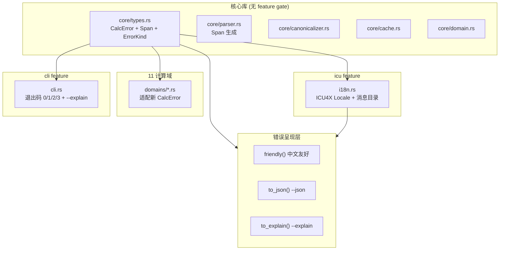
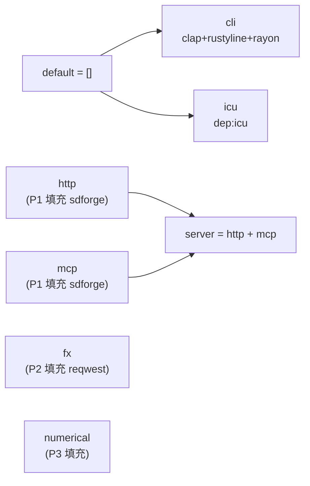

# P0 设计文档 — 地基层

> change: `p0-foundation`
> 状态: proposed
> 依据: proposal.md + EXTENSION_PLAN ④ + clarify 决策

## 1. 架构总览



## 2. Feature Gate 依赖图



### P0 Cargo.toml `[features]` 节

```toml
[features]
default = []
# === 现有 ===
cli = ["dep:clap", "dep:rustyline", "dep:rayon"]
# === P0 新增 ===
icu = ["dep:icu"]
# === P1-P3 占位（P0 仅声明，无依赖）===
http = []
mcp = []
fx = []
numerical = []
server = ["http", "mcp"]
```

> 占位 feature 允许 `#[cfg(feature = "http")]` 条件编译骨架先就位，P1-P3 填充依赖时改为 `http = ["dep:sdforge", "sdforge/http"]`。

## 3. 依赖更新清单

| Crate | 当前版本 | 目标 | 说明 |
|---|---|---|---|
| `oxcache` | 0.2 | ^0.3 | user_profile 要求；API 可能有变，需适配 |
| `blake3` | 1 | ^1 | minor 升级 |
| `serde` | 1 | ^1 | 保持 |
| `tokio` | 1 | ^1 | 保持（仅 rt feature） |
| `regex` | 1 | ^1 | 保持 |
| `num-complex` | 0.4 | ^0.4 | 保持 |
| `nalgebra` | 0.33 | ^0.33 | 保持（P3 可能加 lapack feature） |
| `num-bigint` | 0.4 | ^0.4 | 保持 |
| `num-rational` | 0.4 | ^0.4 | 保持 |
| `num-integer` | 0.1 | ^0.1 | 保持 |
| `num-traits` | 0.2 | ^0.2 | 保持 |
| `clap` | 4 | ^4 | 保持 |
| `rustyline` | 14 | ^14 | 保持 |
| `rayon` | 1 | ^1 | 保持 |
| `mathexpr` | 0.1 | ^0.1 | 保持（外部 crate，不修改） |
| **新增** `thiserror` | — | ^2 | D2: 统一错误派生，no_std 友好 |
| **新增** `icu` | — | ^2 | D8: ICU4X 国际化 |

### 更新策略

1. 逐个升级，每升一个跑 `cargo test --features cli`
2. `oxcache` 0.2→0.3 可能有 API 变更，优先处理
3. 新增 `thiserror`/`icu` 同步加入
4. 全部 `default-features = false`（遵循 user_profile 规则）

## 4. ICU4X 国际化设计

### 4.1 范围（P0 仅错误消息）

P0 的 icu 集成仅做**错误消息中英双语**。数字/日期/货币格式化留到 P2（汇率功能时落地 `icu::decimal`）。

### 4.2 模块结构

```rust
// src/i18n.rs (#[cfg(feature = "icu")])
use icu::locid::{Locale, langid};

pub enum Lang { En, Zh }

pub struct I18n {
    lang: Lang,
}

impl I18n {
    pub fn new(lang: Lang) -> Self { ... }
    
    /// 翻译错误消息键
    pub fn t(&self, key: &str) -> &str {
        match (self.lang, key) {
            (Lang::En, "error.parse.unexpected_token") => "unexpected token",
            (Lang::Zh, "error.parse.unexpected_token") => "意外的符号",
            // ...
        }
    }
}
```

### 4.3 设计权衡

- **为何不用 ICU MessageFormat**：ICU4X 的 `MessageData` 需要 data provider 加载 .json 资源文件，对 P0 仅做错误双语是过度工程。用 `icu::locid` 做 locale 解析 + match 表做消息目录，P2 再引入完整 MessageFormat。
- **为何 match 而非 HashMap**：编译期已知所有消息键，match 表零分配、可穷举、编译器检查完整性。
- **icu crate 的实际使用**：`icu::locid::Locale` 解析 BCP-47 语言标签（如 `zh-CN`），`icu::locid::langid!` 宏构造。

### 4.4 CLI 集成

```rust
// cli.rs 新增 --lang flag
#[arg(long, default_value = "en")]
lang: String,  // "en" | "zh"

// 错误呈现时
let i18n = I18n::new(Lang::from_str(&lang));
eprintln!("{}", error.friendly(&i18n));
```

## 5. 结构化错误 ④ 设计

### 5.1 Span 类型

```rust
/// 源代码跨度（字节偏移）
#[derive(Debug, Clone, Copy, PartialEq, Eq, Default)]
pub struct Span {
    pub start: usize,  // 起始字节偏移（含）
    pub end: usize,    // 结束字节偏移（不含）
}

impl Span {
    pub fn new(start: usize, end: usize) -> Self { ... }
    pub fn point(pos: usize) -> Self { Self { start: pos, end: pos + 1 } }
    pub fn is_empty(&self) -> bool { self.start >= self.end }
}
```

### 5.2 ErrorKind 枚举

```rust
/// 错误分类，决定退出码和呈现策略
#[derive(Debug, Clone, PartialEq, Eq)]
pub enum ErrorKind {
    Parse,            // 语法错误 → exit 1
    Eval,             // 求值错误 → exit 1
    Overflow,         // 整数溢出 → exit 1
    DivisionByZero,   // 除零 → exit 1
    Domain,           // 定义域错误 → exit 1
    Depth,            // AST 深度超限 → exit 1
    NaNOrInf,         // NaN/Inf → exit 1
    UndefinedSymbol,  // 未定义符号 → exit 1（D3 剥离）
    Timeout,          // 超时 → exit 3（D1 新增）
    Usage,            // 用法错误 → exit 2
}

impl ErrorKind {
    pub fn exit_code(&self) -> i32 {
        match self {
            Self::Timeout => 3,
            Self::Usage => 2,
            _ => 1,
        }
    }
}
```

### 5.3 CalcError 结构体（thiserror）

```rust
#[derive(Debug, Clone, thiserror::Error)]
#[error("{message}")]
pub struct CalcError {
    pub kind: ErrorKind,
    pub message: String,
    pub span: Option<Span>,
    pub hint: Option<String>,
}
```

**为何用 struct 而非 enum**：
- 三态呈现（friendly/json/explain）需要统一接口，struct 的方法投影更自然
- 新增 ErrorKind 变体不需改 enum 变体签名
- thiserror 在 struct 上也支持 `#[error]`

### 5.4 构造器（向后兼容迁移路径）

```rust
impl CalcError {
    pub fn new(kind: ErrorKind, message: impl Into<String>) -> Self {
        Self { kind, message: message.into(), span: None, hint: None }
    }
    pub fn with_span(mut self, span: Span) -> Self { self.span = Some(span); self }
    pub fn with_hint(mut self, hint: impl Into<String>) -> Self { self.hint = Some(hint.into()); self }

    // 便捷构造器（替代旧 enum 变体）
    pub fn parse(msg: impl Into<String>) -> Self { Self::new(ErrorKind::Parse, msg) }
    pub fn eval(msg: impl Into<String>) -> Self { Self::new(ErrorKind::Eval, msg) }
    pub fn overflow() -> Self { Self::new(ErrorKind::Overflow, "integer overflow") }
    pub fn nan_or_inf() -> Self { Self::new(ErrorKind::NaNOrInf, "result is NaN or infinity") }
    pub fn domain(msg: impl Into<String>) -> Self { Self::new(ErrorKind::Domain, msg) }
    pub fn depth_exceeded() -> Self { Self::new(ErrorKind::Depth, "AST depth exceeded limit") }
    pub fn division_by_zero() -> Self { Self::new(ErrorKind::DivisionByZero, "division by zero") }
    pub fn undefined_symbol(name: &str) -> Self {
        Self::new(ErrorKind::UndefinedSymbol, format!("undefined symbol: {}", name))
            .with_hint(format!("try defining it first: :let {} = <value>", name))
    }
    pub fn timeout() -> Self { Self::new(ErrorKind::Timeout, "evaluation timed out") }
    pub fn usage(msg: impl Into<String>) -> Self { Self::new(ErrorKind::Usage, msg) }
}
```

### 5.5 三态呈现

```rust
impl CalcError {
    /// 中文友好文本（终端默认）
    pub fn friendly(&self, i18n: &I18n) -> String {
        let mut s = format!("{}", i18n.t(&self.kind.i18n_key()));
        if let Some(span) = self.span {
            s.push_str(&format!(" (位置 {}:{})", span.start, span.end));
        }
        s.push_str(&format!(": {}", self.message));
        if let Some(hint) = &self.hint {
            s.push_str(&format!("\n  提示: {}", hint));
        }
        s
    }

    /// JSON 机器可读（--json）
    pub fn to_json(&self) -> serde_json::Value {
        serde_json::json!({
            "error": {
                "kind": format!("{:?}", self.kind),
                "message": self.message,
                "span": self.span.map(|s| serde_json::json!({"start": s.start, "end": s.end})),
                "hint": self.hint,
                "exit_code": self.kind.exit_code(),
            }
        })
    }

    /// 教育模式（--explain）
    pub fn to_explain(&self, i18n: &I18n) -> String {
        let mut s = self.friendly(i18n);
        s.push_str(&format!("\n\n  错误类别: {:?}", self.kind));
        s.push_str(&format!("\n  退出码: {}", self.kind.exit_code()));
        if let Some(hint) = &self.hint {
            s.push_str(&format!("\n  建议: {}", hint));
        }
        s
    }
}
```

### 5.6 退出码契约

| 退出码 | ErrorKind | 含义 |
|---|---|---|
| 0 | — | 成功 |
| 1 | Parse / Eval / Overflow / DivisionByZero / Domain / Depth / NaNOrInf / UndefinedSymbol | 计算错误 |
| 2 | Usage | 用法错误（clap 冲突等） |
| 3 | Timeout | 超时 |

### 5.7 迁移策略

当前 1650 个测试中有错误断言。迁移分三步：

1. **Phase 0.4a**：引入新 `CalcError` struct + 便捷构造器，保持旧 enum 作为 `type OldCalcError = ...` 别名（或直接替换，因为构造器签名兼容）
2. **Phase 0.4b**：全局替换 `CalcError::ParseError("x".to_string())` → `CalcError::parse("x")`
3. **Phase 0.4c**：在 parser 预处理层生成 Span，在关键错误路径添加 hint

## 6. 横切关注点

### 6.1 测试策略

| 层级 | 测试内容 | 验收标准 |
|---|---|---|
| 单元 | Span 构造/point/empty | 边界值 |
| 单元 | ErrorKind exit_code 映射 | 全 10 种 kind |
| 单元 | CalcError 便捷构造器 | 全 10 种 |
| 单元 | friendly/to_json/to_explain 三态 | 有/无 span+hint |
| 单元 | I18n 中英双语 | 全消息键 |
| 集成 | parser 生成 Span | 语法错误位置精确 |
| 集成 | CLI 退出码 0/1/2/3 | 端到端 |
| 集成 | --explain flag | 教育输出 |
| 集成 | --lang zh/en | 中英切换 |
| 回归 | 1650 现有测试不破 | 全绿 |

### 6.2 向后兼容

- 现有 `calnexus '2+3*4'` 行为不变
- 现有 `--json` 输出结构兼容（新增 `error` 对象，`result`/`domain`/`cache` 不变）
- 现有 `--repl` / `--batch` 行为不变
- `--explain` / `--lang` 为新增 opt-in flag

### 6.3 不做的事（反过度工程）

- 不引入 ICU MessageFormat 资源文件系统（P0 用 match 表）
- 不给 AST 节点挂 Span（parser 预处理层生成即可，AST 改动爆炸半径太大）
- 不实现真正的超时执行机制（P0 仅定义 Timeout 错误类型 + 退出码，真正的时间追踪留 P3）
- 不重构 domain trait 签名（保持 `evaluate(&AstNode, &EvalContext) -> Result<EvalResult, CalcError>`）
