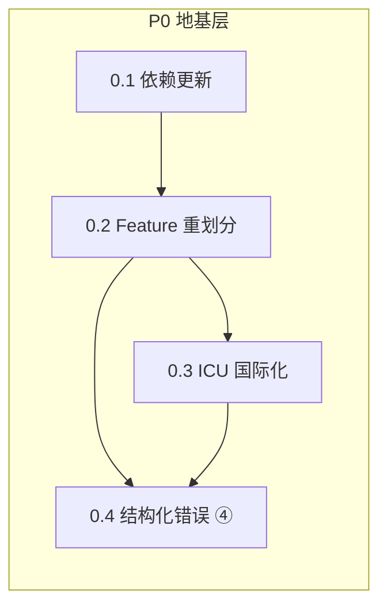

# P0: 地基层 — 依赖更新 + Feature 重划分 + ICU 国际化 + 结构化错误

> specmark change: `p0-foundation`
> 阶段: v0.2.0 Phase 0（地基）
> 前置依赖: 无（首个 phase）
> 后续: P1(sdforge 接口) / P2(汇率) / P3(EXTENSION_PLAN) 均依赖 P0

## 1. 摘要

P0 是 v0.2.0 的横切地基，包含四项互不耦合但后续所有 phase 都受益的工作：
1. **依赖更新**：所有 crate 升级到最新稳定版，`oxcache` 0.2→0.3，新增 `thiserror`/`icu`
2. **Feature 细粒度重划分**：从 `default=[]+cli` 扩展为 7 个可组合特性
3. **ICU4X 国际化**：错误消息中英双语，为后续 fx 货币格式化铺路
4. **结构化错误 ④**：`CalcError` 增 `Span`+`ErrorKind`+`hint`+`thiserror`+`UndefinedSymbol`+`Timeout`，三态呈现

## 2. 动机

### 为什么 P0 先做

EXTENSION_PLAN 的推荐序是 ④→①→②∥③，④（错误诊断）是横切地基。同时用户需求 #4（依赖更新）、#7（feature 重划分）、#8（icu）都是后续 phase 的前置条件：

- P1 的 sdforge 需要 feature gate 已就位
- P2 的汇率需要 icu 做货币格式化 + 结构化错误做 API 失败诊断
- P3 的用户函数需要 `UndefinedSymbol` 错误类型

### 当前痛点（实测）

| 痛点 | 证据 | 影响 |
|---|---|---|
| 错误无位置信息 | [types.rs:285](../../../src/core/types.rs#L285) `ParseError(String)` 只有消息 | 用户无法定位语法错误位置 |
| 无 thiserror | [types.rs:302-316](../../../src/core/types.rs#L302-L316) 手写 Display+Error | 样板代码，维护成本高 |
| UndefinedSymbol 混在 EvalError | 无独立变体 | P3 用户函数无法区分"未定义符号"与"求值错误" |
| Timeout 未实现 | CHANGELOG 标注 SEC-007 `#[ignore]` | PRD 承诺的退出码 3 缺失 |
| feature 过粗 | [Cargo.toml:14-16](../../../Cargo.toml#L14-L16) 仅 `default=[]+cli` | 无法独立启用 http/mcp/fx |
| oxcache 版本落后 | Cargo.toml `oxcache=0.2`，最新 0.3 | user_profile 要求 0.3 |
| 错误仅英文 | 所有 Display 实现为英文 | 与 icu 国际化目标冲突 |

## 3. 设计概览

- **0.1 依赖更新**：机械性升级，先做以避免后续 phase 二次调整
- **0.2 Feature 重划分**：建立 feature 骨架，P1-P3 填充内容
- **0.3 ICU 国际化**：在 0.4 错误消息上落地，为 P2 货币格式化铺路
- **0.4 结构化错误**：EXTENSION_PLAN ④ 的完整实现（D1+D2+D3）

## 4. 范围

### In Scope

- Cargo.toml 依赖版本升级（全部 crate）
- Feature gate 重划分：`default=[]` / `cli` / `http` / `mcp` / `fx` / `numerical` / `icu` / `server`
- `icu` crate 集成 + 错误消息 i18n 基础设施（中英双语）
- `CalcError` 重构：`Span` + `ErrorKind` + `hint` + `thiserror` + `UndefinedSymbol` + `Timeout`
- 退出码契约：0 成功 / 1 计算错误 / 2 用法错误 / 3 超时
- 三态错误呈现：友好文本 / `--json` 机器 / `--explain` 教育
- 测试覆盖率 ≥ 95%（错误类型 + icu + feature 组合）

### Out of Scope

- sdforge 集成（P1）
- 汇率功能（P2）
- 用户自定义函数 / 数值方法域 / 管道闭环（P3）
- wasm32 支持（延期 v0.3）
- 模块工业级 review（P4）
- 文档重构（P5，但 CHANGELOG 会记录 P0 变更）

## 5. 决策记录

| 决策 | 选择 | 理由 |
|---|---|---|
| D1 退出码 3 | ✅ 补 Timeout 退出码 | PRD 承诺，SEC-007 测试需解除 ignore |
| D2 thiserror | ✅ 引入 | no_std 友好，消除样板代码 |
| D3 UndefinedSymbol | ✅ 独立剥离 | P3 用户函数需区分未定义符号 |
| D4 eig/SVD | 默认 nalgebra lapack feature gate | wasm32 已延期 v0.3，开发效率优先 |
| D5 持久化位置 | ~/.config/calnexus/ | 用户级配置，跨项目共享 |
| icu 版本 | ^2 | sdforge 已用 icu 2.2，版本对齐 |
| 错误呈现 | 三态投影 | 同一结构化字段 → 友好/JSON/explain |

## 6. NEEDS CLARIFICATION

- **D4 默认决策**：propose 默认选 nalgebra lapack feature gate（因 wasm32 延期）。若你要求 v0.3 前就自实现 eig/SVD，请在 analyze 前指出。
- **icu 范围**：propose 默认仅做错误消息 i18n（中英双语）。若你要求同时做数字/日期格式化，请指出（会扩大 P0 范围）。

## 7. 影响分析

| 模块 | 改动类型 | 风险 |
|---|---|---|
| Cargo.toml | 依赖版本 + feature 重写 | 低（机械性） |
| core/types.rs | CalcError 重构（破坏性） | 中（所有域的 error 路径需适配） |
| core/parser.rs | 生成 Span（预处理层已有字符索引） | 低（增量） |
| cli.rs | 退出码 3 + --explain flag | 低（增量） |
| 所有 domains/*.rs | 错误构造适配新 CalcError | 中（机械性但量大） |
| output/ | 错误 JSON 呈现 | 低（增量） |

**回归风险**：CalcError 是核心类型，重构会影响 1650 个测试中的错误断言。策略：先加新字段（span/kind/hint 为 Option），再逐步填充，保持旧构造路径兼容。
